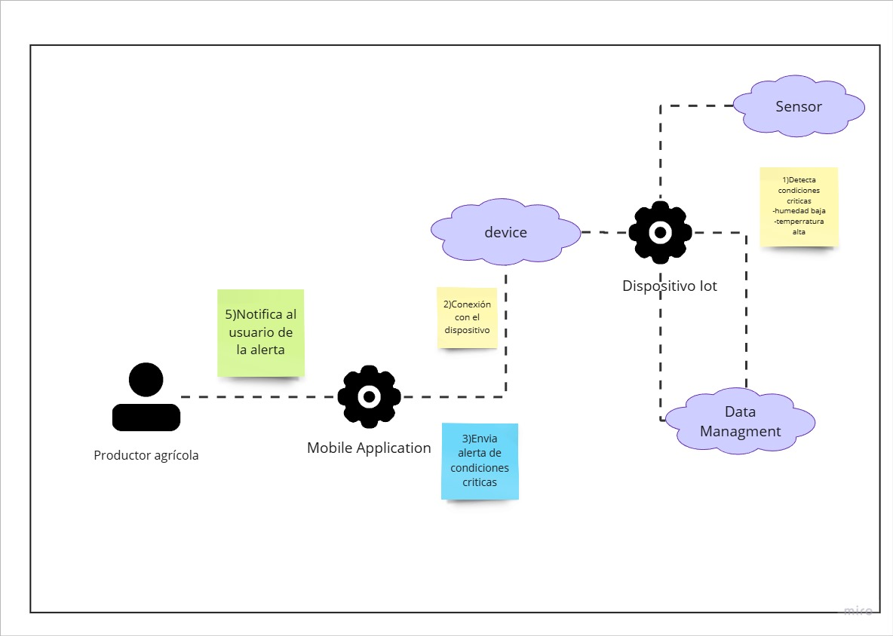
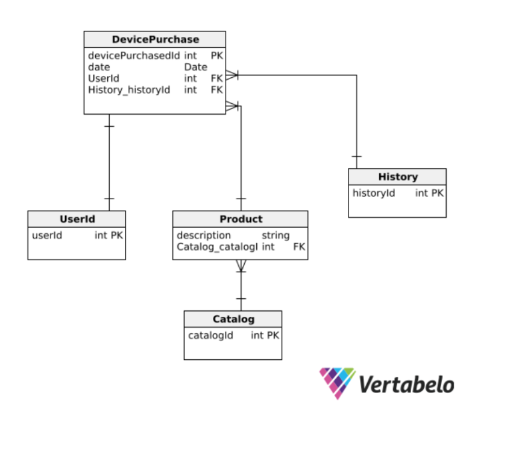
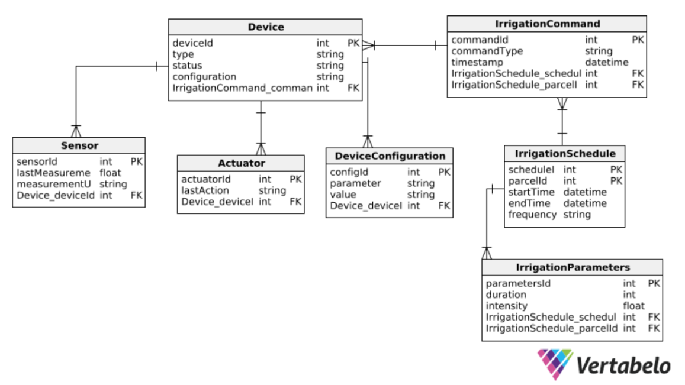
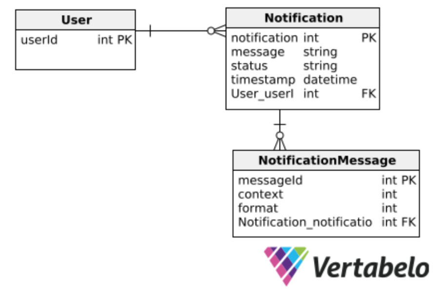

# **CAPÍTULO IV: SOLUTION SOFTWARE DESIGN**
## 4.1. Strategic-Level Domain-Driven Design
### 4.1.1. EventStorming
**Domain Events:** Detecta los sucesos más relevantes que ocurren en el sistema y que generan un impacto significativo en el negocio. Estos eventos reflejan cambios clave en el dominio.

**Correction-Alternative Escenarios:** Considera casos donde el flujo del sistema puede desviarse o tener excepciones, y ajusta estos escenarios para alinearlos con los requerimientos del negocio.

**Paint Points:** Identifica las áreas problemáticas o ineficiencias dentro del proceso, como puntos de fricción o obstáculos que dificultan el correcto funcionamiento del sistema.

**Pivotal Points:** Localiza los momentos más críticos o decisivos que marcan un cambio importante en el flujo del sistema, ya que estos eventos influyen directamente en la dirección del proceso.

**Commands:** Determina las acciones o instrucciones que los actores del sistema (como usuarios o servicios) ejecutan para iniciar los eventos dentro del proceso.

**Policies:** Establece las directrices o reglas de negocio que controlan cuándo y cómo deben activarse los comandos o eventos en función de las condiciones establecidas.

**Read Models:** Define las vistas o consultas que los usuarios necesitan para obtener información sobre el estado actual del sistema, basándose en los eventos registrados.

**External Systems:**  Identifica las interacciones con otros sistemas que no pertenecen directamente al dominio, pero que influyen en el flujo de trabajo o en los eventos del sistema.

**Aggregates:** Agrupa eventos y comandos bajo una entidad clave que garantiza la consistencia de las reglas del dominio y el control de las operaciones asociadas a esa entidad.

**Bounded context:** Define los límites que separan diferentes áreas del dominio, agrupando eventos, comandos y agregados que tienen sentido en un contexto específico para mantener la cohesión y modularidad del sistema.

#### 4.1.1.1 Candidate Context Discovery
#### 4.1.1.2 Domain Message Flows Modeling

Escenario: Inicio de sesión (Móvil)

Escenario: Inicio de sesión (Web)

Escenario: Registro de usuario (Móvil)

Escenario: Registro de usuario (Web)

Escenario: Monitoreo de humedad del suelo y ajuste del riego

Escenario: Visualización de Reportes de Humedad y Temperatura

Escenario: Recepción de Alertas de Condiciones Críticas

Escenario: Actualización de Configuraciones del Sistema de Riego

#### 4.1.1.3 Bounded Context Canvases

User:

Inventory:

Device:

Notifications:

Data Management:

### 4.1.2. Context Mapping

### 4.1.3. Software Architecture
#### 4.1.3.1. Software Architecture System Landscape Diagram
El diagrama de System Landscape muestra el ecosistema completo del sistema Thirsty Seed, incluyendo los actores externos y los sistemas con los que interactúa. Este diagrama ofrece una visión general de las relaciones clave entre los diferentes elementos de la plataforma.

#### 4.1.3.2. Software Architecture Context Level Diagrams
Este diagrama contextualiza el sistema Thirsty Seed dentro de su entorno operativo, mostrando cómo interactúa con los actores principales, como el Productor Agrícola, el Proveedor de Riego, y el Técnico IoT, además de destacar los contenedores involucrados.

#### 4.1.3.3. Software Architecture Container Level Diagrams
El diagrama de contenedores detalla los subsistemas clave del sistema Thirsty Seed, como la API, el servidor embebido, la aplicación web y la aplicación móvil. Muestra cómo se conectan e interactúan entre sí y con las bases de datos, proporcionando una visión técnica de la arquitectura del sistema.

#### 4.1.3.4. Software Architecture Deployment Diagrams
Este diagrama de despliegue muestra cómo los diferentes componentes y contenedores del sistema Thirsty Seed se implementan en entornos físicos y virtuales, como servidores de borde, dispositivos IoT y servidores en la nube. Ilustra la estructura de despliegue necesaria para su operación.

## 4.2. Tactical-Level Domain-Driven Design

### 4.2.1 Bounded Context: Inventory

<table><tr><th colspan="2" valign="top">Nombre</th><th colspan="2" valign="top">Inventory </th><th valign="top"></th></tr>
<tr><td colspan="2" valign="top">Descripción</td><td colspan="2" valign="top">Representa la compra de productos</td><td valign="top"></td></tr>
<tr><td colspan="2" valign="top">Atributos</td><td colspan="2" valign="top">Relaciones</td><td rowspan="1" valign="top">Métodos   </td></tr>
<tr><td valign="top">Nombre </td><td valign="top">Tipo de Dato</td><td valign="top">Tipo</td><td valign="top">Clases/Enums</td></tr>
<tr><td valign="top">devicePurchaseId   </td><td valign="top">DevicePurchaseId</td><td valign="top">Composición</td><td valign="top">DevicePurchaseId   </td><td valign="top">purchase()  </td></tr>
<tr><td valign="top">userId   </td><td valign="top">
	   

UserId   

</td><td valign="top">Composición</td><td valign="top">UserId</td><td valign="top">cancelPurchase ()  </td></tr>
<tr><td valign="top">title   </td><td valign="top">string   </td><td valign="top">Composición</td><td valign="top">Catalog   </td><td valign="top">track()   </td></tr>
<tr><td valign="top">description  </td><td valign="top">string</td><td valign="top">Composición</td><td valign="top">History </td><td valign="top"></td></tr>
<tr><td valign="top">date   </td><td valign="top">date</td><td valign="top"></td><td valign="top"></td><td valign="top"></td></tr>
<tr><td valign="top">catalog   </td><td valign="top">catalog</td><td valign="top"></td><td valign="top"></td><td valign="top"></td></tr>
<tr><td valign="top">history   </td><td valign="top">history</td><td valign="top"></td><td valign="top"></td><td valign="top"></td></tr>
</table>

|Nombre|Catalog|||
| :- | :- | :- | :- |
|Descripción|Representar el catálogo de productos|||
|Atributos|Relaciones|||
|` `Nombre|Tipo de Dato|||
|product|Product|Composición|Product|

|Nombre|Product|
| :- | :- |
|Descripción|Representar un producto|
|Atributos||
|Nombre|Tipo de Dato|
|description|String|

|Nombre|History|
| :- | :- |
|Descripción|Representar el historial de compras|
|Valores||
|LessThanTwoPurchase   ||
|MoreThanTwoPurchase   ||

|Nombre|UserId|
| :- | :- |
|Descripción|Representa el identificador del usuario  |
|Atributos||
|Nombre|Tipo de Dato|
|userId   |long   |

|Nombre|DevicePurchaseId |
| :- | :- |
|Descripción|Representar el identificador   de la compra |
|Atributos||
|Nombre|Tipo de Dato|
|devicePurchaseId   |long   |

#### 4.2.1.1. Domain Layer
Se identificó que la única clase central en el negocio es la clase **Device Purchase**, la cual representa la compra de productos como sensores o válvulas. Según las reglas de negocio, el productor agrícola tiene la posibilidad de solicitar una o más sensores o válvulas, según sea necesario para su situación particular.

**Entities**:

- **DevicePurchase (Aggregate)**: Representa la compra de una válvula o sensor.

**ValueObjects**:

- **UserId (Aggregate)**: Representa el identificador único del usuario.
- **DevicePurchaseId (Aggregate)**: Representa el identificador único de la compra.
- **Product**: Representa un sensor o una válvula.
- **Catalog (Aggregate)**: Representa el catálogo disponible.

**Enums**:

- **History (Aggregate)**: Representa el historial de compras.

**Factories**:

- **DevicePurchaseFactory**: Facilita la creación de órdenes de compra.

**Interfaces**:

- **IDevicePurchaseRepository:** Interfaz para la clase **DevicePurchaseRepository**, que ayuda a mantener un bajo nivel de acoplamiento.

|Nombre   |IDevicePurchaseRepository   |
| :- | :- |
|Descripción   |Permite la conexión con la base de datos  |
|Métodos||
|findAll()   ||
|findById()||
|findByUserId()||
|create()   ||
|update()  ||
|delete()   ||

- IDevicePurchaseServices: Interfaz de la clase DevicePurchaseService, ayuda a mantener un bajo acoplamiento

|Nombre   |IDevicePurchaseService|
| :- | :- |
|Descripción   |Declara las funciones que contiene las reglas de   negocio|
|Métodos||
|getAll()   ||
|getById() ||
|getByUserId() ||
|create()   ||
|delete()   ||
|purchase()   ||
|cancelPurchase ()   ||
|track()   ||

#### 4.2.1.2. Interface Layer
**Controllers** 

|**Class Name** |**Purpose** |**Methods** |
| :- | :- | :- |
|DataController |Maneja las solicitudes relacionadas con datos y reportes. |getDataRecords(request: DataRequest): Response, generateReport(request: ReportRequest): Response |

**Consumers** 

|**Class Name** |**Purpose** |**Methods** |
| :- | :- | :- |
|DataEventConsumer |Escucha y procesa eventos relacionados con datos. |consumeDataEvent(event: DataEvent): void |

#### 4.2.1.3. Application Layer
**Command Handlers** 

|**Class Name** |**Purpose** |**Methods** |
| :- | :- | :- |
|GenerateReportHandler |Maneja el comando para generar un reporte de análisis de datos. |handle(command: GenerateReportCommand): void |
|SaveDataRecordHandler |Maneja el comando para guardar un nuevo registro de datos. |handle(command: SaveDataRecordCommand): void |

**Event Handlers** 

|**Class Name** |**Purpose** |**Methods** |
| :- | :- | :- |
|DataRecordSavedEventHandler |Maneja eventos relacionados con la creación de registros de datos. |handle(event: DataRecordSavedEvent): void |

#### 4.2.1.4. Infrastructure Layer
**Repositories Implementations** 

|**Class Name** |**Purpose** |**Methods** |
| :- | :- | :- |
|DataRecordRepositoryImpl |Implementación concreta de DataRecordRepository para acceder a datos persistidos. |findByDateRange(dateRange: DateRange): List<DataRecord>, save(record: DataRecord): void, delete(recordId: String): void |
|AnalysisReportRepositoryImpl |Implementación concreta de AnalysisReportRepository para acceder a reportes persistidos. |findById(reportId: String): AnalysisReport, save(report: AnalysisReport): void |

**Messaging Systems** 

|**Class Name** |**Purpose** |**Methods** |
| :- | :- | :- |
|DataEventPublisher |Publica eventos relacionados con datos y reportes. |publish(event: DataEvent): void |

**External Services** 

|**Class Name** |**Purpose** |**Methods** |
| :- | :- | :- |
|ExternalAnalysisService |Servicio para interactuar con APIs externas para análisis avanzado. |performExternalAnalysis(data: List<DataRecord>): AnalysisReport, getExternalData(deviceId: String): List<DataRecord> |

#### 4.2.1.6. Bounded Context Software Architecture Component Level Diagrams

#### 4.2.1.7. Bounded Context Software Architecture Code Level Diagrams
##### 4.2.1.7.1. Bounded Context Domain Layer Class Diagrams
Representa las clases y entidades que permiten la gestión de la asignación de dispositivos dentro del contexto de **Inventory**.

##### 4.2.1.7.2. Bounded Context Database Design Diagram
El diseño de la base de datos para este contexto gestiona las tablas necesarias para almacenar el estado del inventario y la información de los dispositivos asignados a los productores.

### 4.2.2. Bounded Context: Device Management
#### 4.2.2.1. Domain Layer
El dominio de **Device Management** se encarga de la configuración y monitoreo de los dispositivos IoT, incluyendo sensores y actuadores.
### Entities

| Class Name         | Purpose                                                       | Attributes                                                                                                     | Methods                                                                                                  |
|--------------------|---------------------------------------------------------------|----------------------------------------------------------------------------------------------------------------|----------------------------------------------------------------------------------------------------------|
| Device             | Representa un dispositivo IoT en la plataforma.               | `deviceId: String`, `type: String`, `status: String`, `configuration: Map<String, String>`                     | `activate(): void`, `deactivate(): void`, `updateConfiguration(config: Map<String, String>): void`       |
| Sensor             | Especialización de Device para sensores que miden datos como la humedad. | `lastMeasurement: Float`, `measurementUnit: String`                                                            | `measure(): Float`, `updateLastMeasurement(value: Float): void`                                          |
| Actuator           | Especialización de Device para actuadores que controlan el riego. | `lastAction: String`                                                                                           | `executeAction(action: String): void`, `updateLastAction(action: String): void`                          |
| IrrigationSchedule | Representa un horario o plan de riego para una parcela específica. | `scheduleId: String`, `parcelId: String`, `startTime: DateTime`, `endTime: DateTime`, `frequency: String`       | `updateSchedule(startTime: DateTime, endTime: DateTime, frequency: String): void`, `getScheduleDetails(): String` |
| IrrigationCommand  | Representa un comando de riego emitido por el sistema.        | `commandId: String`, `deviceId: String`, `commandType: String`, `timestamp: DateTime`                          | `executeCommand(): void`, `getCommandDetails(): String`                                                   |

### Value Objects

| Class Name           | Purpose                                        | Attributes                               | Methods                                 |
|----------------------|------------------------------------------------|------------------------------------------|-----------------------------------------|
| DeviceConfiguration  | Representa la configuración de un dispositivo. | `parameter: String`, `value: String`     | `toMap(): Map<String, String>`          |
| IrrigationParameters | Define los parámetros para realizar un riego específico. | `duration: Int`, `intensity: Float`      | `toMap(): Map<String, Any>`             |

### Aggregates

| Class Name           | Purpose                                                            | Root Entity         | Methods                                                                                                  |
|----------------------|--------------------------------------------------------------------|---------------------|----------------------------------------------------------------------------------------------------------|
| DeviceAggregate       | Agrega Device, Sensor, y Actuator para operaciones coherentes.      | Device              | `getDeviceStatus(deviceId: String): String`, `performMeasurement(deviceId: String): Float`, `controlActuator(deviceId: String, action: String): void` |
| IrrigationAggregate   | Agrega IrrigationSchedule e IrrigationCommand para operaciones coherentes. | IrrigationSchedule  | `getScheduleByParcel(parcelId: String): IrrigationSchedule`, `createIrrigationCommand(schedule: IrrigationSchedule, parameters: IrrigationParameters): IrrigationCommand` |

### Domain Services

| Class Name         | Purpose                                                            | Methods                                                                                                  |
|--------------------|--------------------------------------------------------------------|----------------------------------------------------------------------------------------------------------|
| DeviceService      | Proporciona lógica de negocio para la gestión de dispositivos.      | `registerDevice(device: Device): void`, `unregisterDevice(deviceId: String): void`, `getDeviceDetails(deviceId: String): Device` |
| IrrigationService  | Proporciona lógica de negocio para la gestión de horarios de riego y comandos. | `getCurrentSchedule(parcelId: String): IrrigationSchedule`, `executeIrrigationCommand(deviceId: String): void` |

### Repositories

| Class Name                    | Purpose                                                       | Methods                                                                                                  |
|-------------------------------|---------------------------------------------------------------|----------------------------------------------------------------------------------------------------------|
| DeviceRepository               | Interfaz para acceder a datos persistidos de dispositivos.     | `findById(deviceId: String): Device`, `save(device: Device): void`, `delete(deviceId: String): void`      |
| IrrigationScheduleRepositoryImpl | Implementación concreta de IrrigationScheduleRepository para acceder a horarios de riego persistidos. | `findByParcel(parcelId: String): IrrigationSchedule`, `save(schedule: IrrigationSchedule): void`, `delete(scheduleId: String): void` |
| IrrigationCommandRepositoryImpl | Implementación concreta de IrrigationCommandRepository para acceder a comandos de riego persistidos.  | `findById(commandId: String): IrrigationCommand`, `save(command: IrrigationCommand): void`                 |

#### 4.2.2.2. Interface Layer
Expone interfaces API para configurar dispositivos IoT, recolectar datos de sensores y controlar los actuadores de riego.

### Controllers

| Class Name       | Purpose                                               | Methods                                                                                                                                                   |
|------------------|-------------------------------------------------------|-----------------------------------------------------------------------------------------------------------------------------------------------------------|
| DeviceController | Maneja las solicitudes relacionadas con dispositivos y riego | `getDeviceStatus(deviceId: String): Response`, `registerDevice(request: RegisterDeviceRequest): Response`, `controlDevice(request: ControlDeviceRequest): Response`, `getIrrigationSchedule(parcelId: String): Response`, `createIrrigationCommand(request: CommandRequest): Response` |

### Consumers

| Class Name          | Purpose                                               | Methods                                                                                           |
|---------------------|-------------------------------------------------------|---------------------------------------------------------------------------------------------------|
| DeviceEventConsumer | Escucha y procesa eventos relacionados con dispositivos y comandos de riego | `consumeDeviceEvent(event: DeviceEvent): void`, `consumeIrrigationEvent(event: IrrigationEvent): void` |

### Command Handlers

| Class Name            | Purpose                                           | Methods                                                                                                   |
|-----------------------|---------------------------------------------------|-----------------------------------------------------------------------------------------------------------|
| RegisterDeviceHandler  | Maneja el comando para registrar un nuevo dispositivo. | `handle(command: RegisterDeviceCommand): void`                                                             |
| ControlDeviceHandler   | Maneja el comando para controlar un dispositivo y ejecutar riegos | `handle(command: ControlDeviceCommand): void`, `handle(command: CreateIrrigationCommand): void`            |

### Event Handlers

| Class Name                        | Purpose                                                        | Methods                                                                                           |
|-----------------------------------|----------------------------------------------------------------|---------------------------------------------------------------------------------------------------|
| DeviceMeasurementEventHandler     | Maneja eventos relacionados con la medición de sensores.        | `handle(event: DeviceMeasurementEvent): void`                                                      |
| IrrigationCommandCreatedEventHandler | Maneja eventos relacionados con la creación de comandos de riego. | `handle(event: IrrigationCommandCreatedEvent): void`                                               |

#### 4.2.2.3. Application Layer
Incluye servicios como **Device Configuration Service** y **Actuator Control Service**, que manejan la lógica para configurar y controlar dispositivos.

### Command Handlers

| Class Name            | Purpose                                           | Methods                                                                                                   |
|-----------------------|---------------------------------------------------|-----------------------------------------------------------------------------------------------------------|
| RegisterDeviceHandler  | Maneja el comando para registrar un nuevo dispositivo. | `handle(command: RegisterDeviceCommand): void`                                                             |
| ControlDeviceHandler   | Maneja el comando para controlar un dispositivo y ejecutar riegos | `handle(command: ControlDeviceCommand): void`, `handle(command: CreateIrrigationCommand): void`            |

### Event Handlers

| Class Name                        | Purpose                                                        | Methods                                                                                           |
|-----------------------------------|----------------------------------------------------------------|---------------------------------------------------------------------------------------------------|
| DeviceMeasurementEventHandler     | Maneja eventos relacionados con la medición de sensores.        | `handle(event: DeviceMeasurementEvent): void`                                                      |
| IrrigationCommandCreatedEventHandler | Maneja eventos relacionados con la creación de comandos de riego. | `handle(event: IrrigationCommandCreatedEvent): void`                                               |

#### 4.2.2.4. Infrastructure Layer
Utiliza un repositorio JPA para almacenar la configuración y estado de los dispositivos IoT.
### Repositories Implementations

| Class Name           | Purpose                                                       | Methods                                                                                              |
|----------------------|---------------------------------------------------------------|------------------------------------------------------------------------------------------------------|
| DeviceRepositoryImpl | Implementación concreta de DeviceRepository para acceder a datos persistidos. | `findById(deviceId: String): Device`, `save(device: Device): void`, `delete(deviceId: String): void`   |

### Messaging Systems

| Class Name            | Purpose                                        | Methods                                  |
|-----------------------|------------------------------------------------|------------------------------------------|
| DeviceEventPublisher  | Publica eventos relacionados con dispositivos. | `publish(event: DeviceEvent): void`      |

### External Services

| Class Name              | Purpose                                                    | Methods                                                                                     |
|-------------------------|------------------------------------------------------------|---------------------------------------------------------------------------------------------|
| ExternalDeviceService    | Servicio para interactuar con APIs externas relacionadas con dispositivos. | `getDeviceStatusFromExternalApi(deviceId: String): DeviceStatus`, `sendCommandToDevice(deviceId: String, command: String): void` |

#### 4.2.2.6. Bounded Context Software Architecture Component Level Diagrams
En el siguiente diagrama se desplieguen los componentes que implican este bounded en el API Application:

Asimismo, se incluye el diagrama de componentes que comprende la configuración del Embedded Application:

#### 4.2.2.7. Bounded Context Software Architecture Code Level Diagrams
##### 4.2.2.7.1. Bounded Context Domain Layer Class Diagrams
Representa las clases que manejan la configuración y el estado de los dispositivos IoT en el sistema.

##### 4.2.2.7.2. Bounded Context Database Design Diagram
El diagrama de diseño de la base de datos gestiona las tablas necesarias para la configuración y monitoreo de los dispositivos IoT.

### 4.2.3. Bounded Context: User Management
#### 4.2.3.1. Domain Layer
El contexto de **User Management** gestiona los usuarios, sus perfiles y roles dentro de la plataforma, proporcionando autenticación y autorización.
### Entities

| Class Name  | Purpose                                | Attributes                                                                                           | Methods                                                                                                  |
|-------------|----------------------------------------|------------------------------------------------------------------------------------------------------|----------------------------------------------------------------------------------------------------------|
| User        | Representa a un usuario de la plataforma. | `userId: String`, `name: String`, `email: String`, `passwordHash: String`, `role: UserRole`           | `authenticate(password: String): Boolean`, `updateProfile(name: String, email: String): void`             |
| UserProfile | Contiene detalles adicionales sobre el perfil del usuario. | `profileId: String`, `userId: String`, `address: String`, `phoneNumber: String`                      | `updateAddress(address: String): void`, `updatePhoneNumber(phoneNumber: String): void`                    |

### Value Objects

| Class Name | Purpose                                | Attributes                     | Methods                                        |
|------------|----------------------------------------|---------------------------------|------------------------------------------------|
| UserRole   | Define el rol del usuario en la plataforma. | `roleName: String`              | `isAdmin(): Boolean`, `isRegularUser(): Boolean` |

### Aggregates

| Class Name     | Purpose                                         | Root Entity | Methods                                                                                                 |
|----------------|-------------------------------------------------|-------------|---------------------------------------------------------------------------------------------------------|
| UserAggregate  | Agrega User y UserProfile para operaciones coherentes. | User        | `getUserProfile(userId: String): UserProfile`, `updateUserProfile(userId: String, profile: UserProfile): void` |

### Domain Services

| Class Name  | Purpose                                | Methods                                                                                                  |
|-------------|----------------------------------------|----------------------------------------------------------------------------------------------------------|
| UserService | Proporciona lógica de negocio para la gestión de usuarios. | `registerUser(user: User): void`, `changePassword(userId: String, newPassword: String): void`, `getUserDetails(userId: String): User` |

### Repositories

| Class Name     | Purpose                                | Methods                                                                                                  |
|----------------|----------------------------------------|----------------------------------------------------------------------------------------------------------|
| UserRepository | Interfaz para acceder a datos persistidos de usuarios. | `findById(userId: String): User`, `save(user: User): void`, `delete(userId: String): void`                 |

#### 4.2.3.2. Interface Layer
Existen interfaces API para manejar la autenticación de usuarios, la creación de perfiles y la asignación de roles.
### Controllers

| Class Name     | Purpose                                      | Methods                                                                                                                                  |
|----------------|----------------------------------------------|------------------------------------------------------------------------------------------------------------------------------------------|
| UserController | Maneja las solicitudes relacionadas con usuarios. | `registerUser(request: RegisterUserRequest): Response`, `updateUserProfile(request: UpdateUserProfileRequest): Response`, `authenticateUser(request: AuthenticateUserRequest): Response` |

### Consumers

| Class Name        | Purpose                                      | Methods                                                |
|-------------------|----------------------------------------------|--------------------------------------------------------|
| UserEventConsumer | Escucha y procesa eventos relacionados con usuarios. | `consumeUserEvent(event: UserEvent): void`              |

#### 4.2.3.3. Application Layer
Incluye servicios como **User Service** y **Authentication Service**, responsables de la gestión de usuarios y la validación de autenticaciones.

### Command Handlers

| Class Name               | Purpose                                             | Methods                                                |
|--------------------------|-----------------------------------------------------|--------------------------------------------------------|
| RegisterUserHandler       | Maneja el comando para registrar un nuevo usuario.  | `handle(command: RegisterUserCommand): void`            |
| UpdateUserProfileHandler  | Maneja el comando para actualizar el perfil del usuario. | `handle(command: UpdateUserProfileCommand): void`       |
| AuthenticateUserHandler   | Maneja el comando para autenticar un usuario.       | `handle(command: AuthenticateUserCommand): void`        |

### Event Handlers

| Class Name                       | Purpose                                                     | Methods                                                |
|----------------------------------|-------------------------------------------------------------|--------------------------------------------------------|
| UserProfileUpdatedEventHandler   | Maneja eventos relacionados con la actualización del perfil de usuario. | `handle(event: UserProfileUpdatedEvent): void`         |

#### 4.2.3.4. Infrastructure Layer
Los repositorios JPA permiten el almacenamiento de la información de los usuarios y sus perfiles.

### Repositories Implementations

| Class Name           | Purpose                                                       | Methods                                                                                              |
|----------------------|---------------------------------------------------------------|------------------------------------------------------------------------------------------------------|
| UserRepositoryImpl    | Implementación concreta de UserRepository para acceder a datos persistidos. | `findById(userId: String): User`, `save(user: User): void`, `delete(userId: String): void`             |

### Messaging Systems

| Class Name          | Purpose                                        | Methods                                  |
|---------------------|------------------------------------------------|------------------------------------------|
| UserEventPublisher  | Publica eventos relacionados con usuarios.      | `publish(event: UserEvent): void`        |

### External Services

| Class Name              | Purpose                                                    | Methods                                                                                                     |
|-------------------------|------------------------------------------------------------|-------------------------------------------------------------------------------------------------------------|
| ExternalUserService      | Servicio para interactuar con APIs externas relacionadas con usuarios. | `verifyUserIdentity(userId: String): Boolean`, `sendEmailNotification(userId: String, message: String): void` |

#### 4.2.3.6. Bounded Context Software Architecture Component Level Diagrams
A continuación se presentan los diagrama de componentes que abarcan la gestión de usuarios, esto se gestiona en el API Application, aunque se reciben datos de los contenedores del web app y el mobile app.

#### 4.2.3.7. Bounded Context Software Architecture Code Level Diagrams
##### 4.2.3.7.1. Bounded Context Domain Layer Class Diagrams
Representa las clases que gestionan los perfiles de usuarios, autenticación y autorización.

##### 4.2.3.7.2. Bounded Context Database Design Diagram
Este diseño gestiona las tablas que contienen los usuarios, sus roles y la información relacionada con su autenticación.

### 4.2.4. Bounded Context: Data Management
#### 4.2.4.1. Domain Layer
El dominio de **Data Management** se encarga de almacenar, analizar y reportar los datos recolectados de los dispositivos IoT.

### Entities

| Class Name   | Purpose                                                    | Attributes                                                                                                        | Methods                                                                                                      |
|--------------|------------------------------------------------------------|-------------------------------------------------------------------------------------------------------------------|--------------------------------------------------------------------------------------------------------------|
| DataRecord   | Representa un registro de datos de humedad o riego.         | `recordId: String`, `timestamp: DateTime`, `deviceId: String`, `humidityLevel: Float`, `irrigationCommand: String` | `updateRecord(humidityLevel: Float, irrigationCommand: String): void`, `getRecordDetails(): String`           |
| AnalysisReport | Representa un reporte de análisis sobre los datos de riego y humedad. | `reportId: String`, `dateRange: DateRange`, `summary: String`, `details: Map<String, Any>`                         | `generateReport(): void`, `getReportDetails(): String`                                                        |

### Value Objects

| Class Name              | Purpose                                          | Attributes                                 | Methods                                    |
|-------------------------|--------------------------------------------------|--------------------------------------------|--------------------------------------------|
| DateRange               | Define un rango de fechas para consultas o reportes. | `startDate: DateTime`, `endDate: DateTime` | `isWithinRange(date: DateTime): Boolean`   |
| DataAnalysisParameters  | Define los parámetros para realizar análisis de datos. | `threshold: Float`, `period: Int`          | `toMap(): Map<String, Any>`                |

### Aggregates

| Class Name            | Purpose                                                | Root Entity   | Methods                                                                                                       |
|-----------------------|--------------------------------------------------------|---------------|---------------------------------------------------------------------------------------------------------------|
| DataManagementAggregate | Agrega DataRecord y AnalysisReport para operaciones coherentes. | DataRecord    | `getRecordsByDateRange(dateRange: DateRange): List<DataRecord`, `generateAnalysisReport(parameters: DataAnalysisParameters): AnalysisReport` |

### Domain Services

| Class Name          | Purpose                                                | Methods                                                                                                       |
|---------------------|--------------------------------------------------------|---------------------------------------------------------------------------------------------------------------|
| DataAnalysisService | Proporciona lógica de negocio para el análisis de datos. | `performDataAnalysis(records: List<DataRecord>, parameters: DataAnalysisParameters): AnalysisReport`, `getHistoricalData(deviceId: String, dateRange: DateRange): List<DataRecord` |

### Repositories

| Class Name             | Purpose                                                | Methods                                                                                                       |
|------------------------|--------------------------------------------------------|---------------------------------------------------------------------------------------------------------------|
| DataRecordRepository    | Interfaz para acceder a datos persistidos de registros de datos. | `findByDateRange(dateRange: DateRange): List<DataRecord`, `save(record: DataRecord): void`, `delete(recordId: String): void` |
| AnalysisReportRepository | Interfaz para acceder a reportes de análisis persistidos. | `findById(reportId: String): AnalysisReport`, `save(report: AnalysisReport): void`                              |

#### 4.2.4.2. Interface Layer
Existen interfaces API que permiten acceder y gestionar los datos históricos de riego y humedad.

### Controllers

| Class Name     | Purpose                                             | Methods                                                                                                                                   |
|----------------|-----------------------------------------------------|-------------------------------------------------------------------------------------------------------------------------------------------|
| DataController | Maneja las solicitudes relacionadas con datos y reportes. | `getDataRecords(request: DataRequest): Response`, `generateReport(request: ReportRequest): Response`                                       |

### Consumers

| Class Name        | Purpose                                              | Methods                                                  |
|-------------------|------------------------------------------------------|----------------------------------------------------------|
| DataEventConsumer | Escucha y procesa eventos relacionados con datos.    | `consumeDataEvent(event: DataEvent): void`                |

#### 4.2.4.3. Application Layer
Incluye servicios como **Data Analysis Service** y **Report Generation Handler** para analizar los datos y generar reportes.

### Command Handlers

| Class Name              | Purpose                                                   | Methods                                                     |
|-------------------------|-----------------------------------------------------------|-------------------------------------------------------------|
| GenerateReportHandler    | Maneja el comando para generar un reporte de análisis de datos. | `handle(command: GenerateReportCommand): void`               |
| SaveDataRecordHandler    | Maneja el comando para guardar un nuevo registro de datos. | `handle(command: SaveDataRecordCommand): void`               |

### Event Handlers

| Class Name                | Purpose                                                   | Methods                                                     |
|---------------------------|-----------------------------------------------------------|-------------------------------------------------------------|
| DataRecordSavedEventHandler | Maneja eventos relacionados con la creación de registros de datos. | `handle(event: DataRecordSavedEvent): void`                  |

#### 4.2.4.4. Infrastructure Layer
Los repositorios JPA permiten el almacenamiento y consulta de grandes volúmenes de datos históricos.

### Repositories Implementations

| Class Name                    | Purpose                                                              | Methods                                                                                                      |
|-------------------------------|----------------------------------------------------------------------|--------------------------------------------------------------------------------------------------------------|
| DataRecordRepositoryImpl       | Implementación concreta de DataRecordRepository para acceder a datos persistidos. | `findByDateRange(dateRange: DateRange): List<DataRecord`, `save(record: DataRecord): void`, `delete(recordId: String): void` |
| AnalysisReportRepositoryImpl   | Implementación concreta de AnalysisReportRepository para acceder a reportes persistidos. | `findById(reportId: String): AnalysisReport`, `save(report: AnalysisReport): void`                             |

### Messaging Systems

| Class Name         | Purpose                                         | Methods                                    |
|--------------------|-------------------------------------------------|--------------------------------------------|
| DataEventPublisher | Publica eventos relacionados con datos y reportes. | `publish(event: DataEvent): void`          |

### External Services

| Class Name              | Purpose                                                              | Methods                                                                                                              |
|-------------------------|----------------------------------------------------------------------|----------------------------------------------------------------------------------------------------------------------|
| ExternalAnalysisService  | Servicio para interactuar con APIs externas para análisis avanzado.  | `performExternalAnalysis(data: List<DataRecord>): AnalysisReport`, `getExternalData(deviceId: String): List<DataRecord` |

#### 4.2.4.6. Bounded Context Software Architecture Component Level Diagrams
Para el gestión de datos se han establecido los siguientes componentes, estos parten con el API Application:

Una para la gestion de datos desde el edge server:

Por otro lado, para la presentación de estos datos se tiene lo siguiente de los componentes de la aplicación web:

Y el siguiente para la aplicación movil:

#### 4.2.4.7. Bounded Context Software Architecture Code Level Diagrams
##### 4.2.4.7.1. Bounded Context Domain Layer Class Diagrams
Representa las clases encargadas de almacenar, analizar y generar reportes basados en los datos de riego.

##### 4.2.4.7.2. Bounded Context Database Design Diagram
Este diseño de la base de datos gestiona las tablas de datos históricos de riego y análisis.

### 4.2.5. Bounded Context: Notification Management
#### 4.2.5.1. Domain Layer
El contexto de **Notification Management** maneja la generación y envío de notificaciones basadas en eventos de riego y datos analizados.

#### Entities

| Class Name   | Purpose                                                 | Attributes                                                                                 | Methods                                          |
|--------------|---------------------------------------------------------|--------------------------------------------------------------------------------------------|-------------------------------------------------|
| Notification | Representa una notificación que se envía a los usuarios. | `notificationId: String`, `userId: String`, `message: String`, `status: String`, `timestamp: DateTime` | `markAsSent(): void`, `updateStatus(status: String): void` |

#### Value Objects

| Class Name          | Purpose                                      | Attributes                   | Methods               |
|---------------------|----------------------------------------------|------------------------------|-----------------------|
| NotificationMessage | Define el contenido y formato de una notificación. | `content: String`, `format: String` | `toString(): String`   |

#### Aggregates

| Class Name            | Purpose                                                   | Root Entity   | Methods                                                                                                  |
|-----------------------|-----------------------------------------------------------|---------------|----------------------------------------------------------------------------------------------------------|
| NotificationAggregate  | Agrega Notification y NotificationMessage para operaciones coherentes. | Notification  | `createNotification(userId: String, message: NotificationMessage): Notification`, `getNotification(notificationId: String): Notification` |

#### Domain Services

| Class Name            | Purpose                                                   | Methods                                                                                                  |
|-----------------------|-----------------------------------------------------------|----------------------------------------------------------------------------------------------------------|
| NotificationService    | Proporciona lógica de negocio para la gestión y envío de notificaciones. | `sendNotification(notification: Notification): void`, `getPendingNotifications(): List<Notification>` |

#### Repositories

| Class Name            | Purpose                                                   | Methods                                                                                                  |
|-----------------------|-----------------------------------------------------------|----------------------------------------------------------------------------------------------------------|
| NotificationRepository | Interfaz para acceder a notificaciones persistidas.        | `findById(notificationId: String): Notification`, `save(notification: Notification): void`, `delete(notificationId: String): void` |

#### 4.2.5.2. Interface Layer
Proporciona una API para gestionar el envío de notificaciones a los usuarios a través de diferentes canales.
#### Controllers

| Class Name            | Purpose                                                   | Methods                                                                                                  |
|-----------------------|-----------------------------------------------------------|----------------------------------------------------------------------------------------------------------|
| NotificationController | Maneja las solicitudes relacionadas con la creación y gestión de notificaciones. | `createNotification(request: NotificationRequest): Response`, `getNotification(request: NotificationRequest): Response` |

#### Consumers

| Class Name            | Purpose                                                   | Methods                                                                                                  |
|-----------------------|-----------------------------------------------------------|----------------------------------------------------------------------------------------------------------|
| NotificationEventConsumer | Escucha y procesa eventos relacionados con el envío de notificaciones. | `consumeNotificationEvent(event: NotificationEvent): void` |

#### 4.2.5.3. Application Layer
Incluye servicios como **Notification Generation Handler** y **Notification Delivery Service** para generar y enviar notificaciones.

#### Command Handlers

| Class Name                   | Purpose                                                   | Methods                                                                                                  |
|------------------------------|-----------------------------------------------------------|----------------------------------------------------------------------------------------------------------|
| CreateNotificationCommandHandler | Maneja el comando para crear una nueva notificación.       | `handle(command: CreateNotificationCommand): void`                                                       |
| UpdateNotificationStatusHandler  | Maneja el comando para actualizar el estado de una notificación. | `handle(command: UpdateNotificationStatusCommand): void`                                                  |

#### Event Handlers

| Class Name                      | Purpose                                                   | Methods                                                                                                  |
|---------------------------------|-----------------------------------------------------------|----------------------------------------------------------------------------------------------------------|
| NotificationCreatedEventHandler | Maneja eventos relacionados con la creación de notificaciones. | `handle(event: NotificationCreatedEvent): void`                                                           |

#### 4.2.5.4. Infrastructure Layer
Utiliza repositorios JPA para almacenar el historial de notificaciones.

#### Repositories Implementations

| Class Name                    | Purpose                                                   | Methods                                                                                                  |
|-------------------------------|-----------------------------------------------------------|----------------------------------------------------------------------------------------------------------|
| NotificationRepositoryImpl     | Implementación concreta de NotificationRepository para acceder a notificaciones persistidas. | `findById(notificationId: String): Notification`, `save(notification: Notification): void`, `delete(notificationId: String): void` |

#### Messaging Systems

| Class Name                    | Purpose                                                   | Methods                                                                                                  |
|-------------------------------|-----------------------------------------------------------|----------------------------------------------------------------------------------------------------------|
| NotificationEventPublisher     | Publica eventos relacionados con la creación y envío de notificaciones. | `publish(event: NotificationEvent): void`                                                                |

#### External Services

| Class Name                      | Purpose                                                   | Methods                                                                                                  |
|---------------------------------|-----------------------------------------------------------|----------------------------------------------------------------------------------------------------------|
| ExternalNotificationService     | Servicio para interactuar con APIs externas para el envío de notificaciones. | `sendNotificationToExternalService(notification: Notification): void`, `retrieveNotificationStatus(notificationId: String): String` |

#### 4.2.5.6. Bounded Context Software Architecture Component Level Diagrams

#### 4.2.5.7. Bounded Context Software Architecture Code Level Diagrams
##### 4.2.5.7.1. Bounded Context Domain Layer Class Diagrams
Representa las clases que gestionan la lógica de generación y envío de notificaciones.

##### 4.2.5.7.2. Bounded Context Database Design Diagram
El diseño de la base de datos gestiona las tablas necesarias para almacenar el historial de notificaciones y los eventos que las generan.

