# **CAPÍTULO V: SOLUTION UI/UX DESIGN**
## 5.1. Style Guidelines
Este punto abarca los estilos que se usarán para diseñar el sitio web y la aplicación web.
### 5.1.1. General Style Guidelines
<table border="1" style="width: 100%;">
  <thead>
    <tr>
      <th colspan="2" style="text-align: center;">BRAND OVERVIEW</th>
    </tr>
  </thead>
  <tbody>
    <tr>
      <td colspan="2" style="text-align: justify;">
        Thirsty Seed no es simplemente una herramienta más; es la solución definitiva para que los agricultores maximicen el rendimiento de sus cultivos, garanticen la calidad de los alimentos para sus animales y reduzcan los costos operativos. Nuestra aplicación automatiza el proceso de riego, eliminando las dudas y asegurando que cada gota de agua se utilice de la manera más eficiente posible. Además, los usuarios reciben notificaciones en tiempo real cuando es necesario rellenar los depósitos, manteniendo el flujo de trabajo sin interrupciones.
      </td>
    </tr>
    <tr>
      <th colspan="2" style="text-align: center;">BRAND NAME</th>
    </tr>
    <tr>
      <td style="text-align: justify;">
        El nombre de nuestra aplicación es Thirsty Seed (Semilla Sedienta). <strong>"Thirsty"</strong> (Sedienta - Traducido al español) hace referencia a la necesidad constante de agua para que las plantas crezcan saludables, y <strong>"Seed"</strong> (Semilla - Traducido al español) simboliza el inicio del crecimiento de los cultivos. Con esta combinación, buscamos representar la importancia de un riego eficiente y oportuno para maximizar el rendimiento agrícola, asegurando que cada gota de agua sea utilizada de manera óptima.
      </td>
      <td>
        
      </td>
    </tr>
    <tr>
      <th colspan="2" style="text-align: center;">SPACE</th>
    </tr>
    <tr>
      <td colspan="2" style="text-align: justify;">
        El espaciado se usará para que haya división entre imágenes, cuadros de textos, botones, etc., para que el usuario vea organizada la aplicación web. Se usará para cada componente múltiplos de 8 píxeles (8px-24px-40px-56px-72px-96px).
      </td>
    </tr>
    <tr>
      <th colspan="2" style="text-align: center;">TONO DE LENGUAJE DE COMUNICACIÓN Y LENGUAJE APLICADO</th>
    </tr>
    <tr>
      <td colspan="2" style="text-align: justify;">
        El lenguaje tanto de la aplicación web como el sitio web, es formal, serio, confiable y entusiasta. Debido a que se desea potenciar una confianza y tranquilidad al usuario y dar a entender que la aplicación es seria.
      </td>
    </tr>
  </tbody>
</table>

<table border="1">
  <thead>
    <tr>
      <th colspan="2" style="text-align: center; font-weight: bold;"><strong>LANDING PAGE</strong></th>
    </tr>
  </thead>
  <tbody>
    <tr>
      <td style="text-align: center; font-weight: bold;"><strong>LOGO</strong></td>
      <td style="text-align: center; font-weight: bold;"><strong>TYPOGRAPHY</strong></td>
    </tr>
    <tr>
      <td style="text-align: justify;">Hemos elegido una paleta de colores en tonos verdes para representar el crecimiento, la naturaleza y la sostenibilidad, valores que están en el corazón de nuestra marca. El logotipo simboliza el cuidado y la protección que ofrecemos a cada semilla, reflejando nuestro compromiso con el medio ambiente y el futuro.</td>
      <td style="text-align: justify;">Se ha seleccionado la tipografía Candara para el logotipo debido a su estilo moderno y distintivo, optimizando la identidad visual de la marca. Para el desarrollo de la landing page, se ha utilizado Changa, por su alta legibilidad y diseño amigable, mejorando la experiencia del usuario.</td>
    </tr>
    <tr>
      <td style="text-align: center;">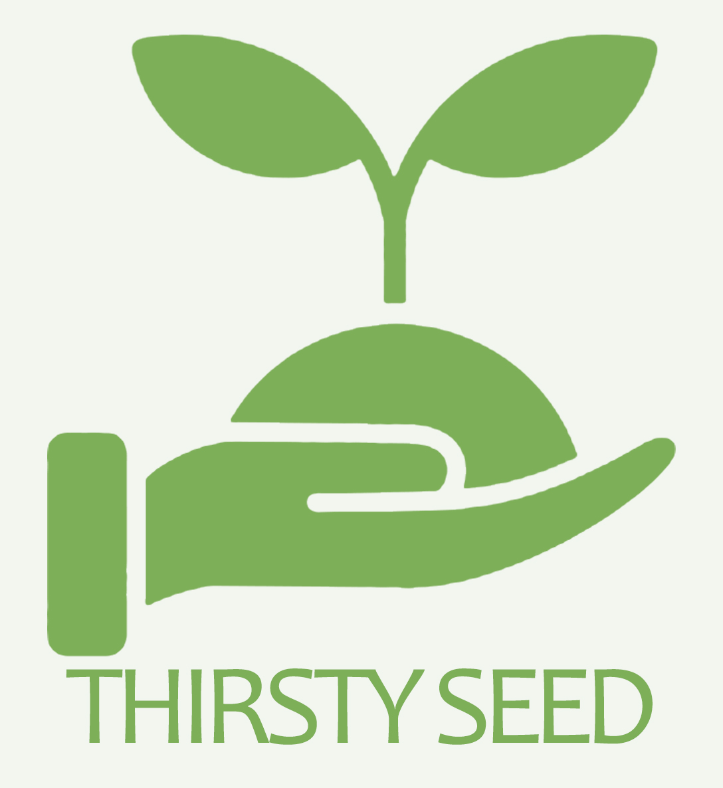</td>
      <td style="text-align: center;">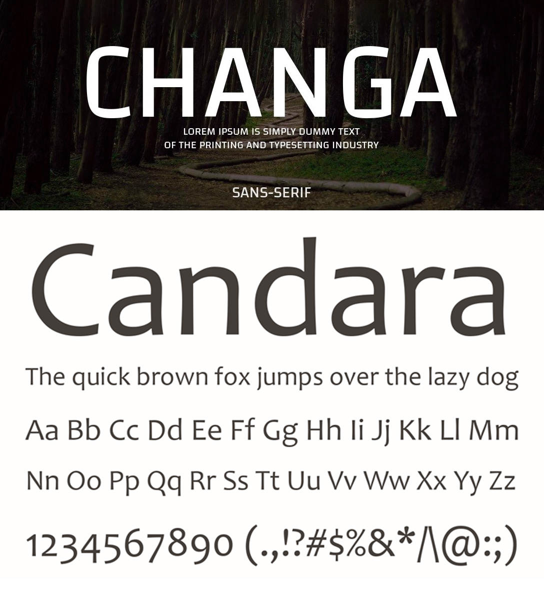</td>
    </tr>
    <tr>
      <td colspan="2" style="text-align: center; font-weight: bold;"><strong>COLOR</strong></td>
    </tr>
    <tr>
      <td style="text-align: center; font-weight: bold;"><strong>COLOR PRINCIPAL</strong></td>
      <td style="text-align: center; font-weight: bold;"><strong>COLOR SECUNDARIO</strong></td>
    </tr>
    <tr>
      <td style="text-align: justify;">El verde es el color predominante en nuestra landing page, simbolizando vida y crecimiento. Los tonos seleccionados <strong>(#144B00 y #8CAC60)</strong> refuerzan nuestra conexión con la naturaleza, aportando una sensación de frescura y vitalidad que refleja la esencia de nuestro contenido.</td>
      <td style="text-align: justify;">El marrón, utilizado en el footer de nuestra página, simboliza la tierra y la estabilidad. Los tonos seleccionados <strong>(#66280A, #874421, #A55730)</strong> evocan la solidez del suelo que nutre las plantas, aportando calidez y un equilibrio orgánico. Colocado en la raíz del diseño, refuerza nuestra intención de conectar con los fundamentos de la naturaleza.</td>
    </tr>
    <tr>
      <td style="text-align: center;">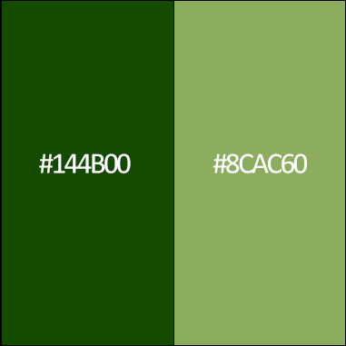</td>
      <td style="text-align: center;">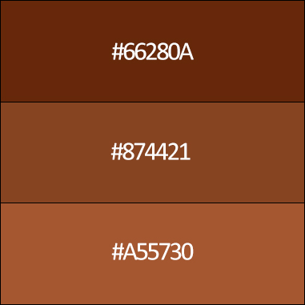</td>
    </tr>
  </tbody>
</table>

<table border="1">
  <thead>
    <tr>
      <th colspan="2" style="text-align: center; font-weight: bold;"><strong>WEB APPLICATION</strong></th>
    </tr>
  </thead>
  <tbody>
    <tr>
      <td style="text-align: center; font-weight: bold;"><strong>LOGO</strong></td>
      <td style="text-align: center; font-weight: bold;"><strong>TYPOGRAPHY</strong></td>
    </tr>
    <tr>
      <td style="text-align: justify;">Hemos elegido colores brillantes como el naranja, verde y azul para transmitir energía, crecimiento y frescura. El diseño refleja nuestra visión innovadora y optimista, enfocada en el desarrollo y la creatividad, con un toque moderno y dinámico.</td>
      <td style="text-align: justify;">En el desarrollo del web aplicattion, se ha utilizado la tipografía Poppins por su versatilidad y legibilidad, lo que optimiza la navegación y mejora la experiencia del usuario dentro de la interfaz.</td>
    </tr>
    <tr>
      <td style="text-align: center;">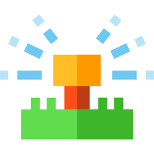</td>
      <td style="text-align: center;">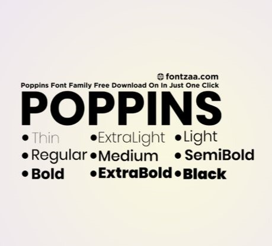</td>
    </tr>
    <tr>
      <td colspan="2" style="text-align: center; font-weight: bold;"><strong>COLOR</strong></td>
    </tr>
    <tr>
      <td style="text-align: center; font-weight: bold;"><strong>COLOR PRINCIPAL</strong></td>
      <td style="text-align: center; font-weight: bold;"><strong>COLOR SECUNDARIO</strong></td>
    </tr>
    <tr>
      <td style="text-align: justify;">El verde es el color predominante en nuestra aplicación web, simbolizando vida y crecimiento. Los tonos seleccionados <strong>(#3d703b, #12723d, y #389f51)</strong> refuerzan nuestra conexión con la naturaleza, aportando una sensación de frescura y vitalidad que refleja la esencia de nuestra plataforma. Además, los tonos suaves de verde claro <strong>(#def6d9, #95cba2, y #b2ffb7)</strong> crean un ambiente equilibrado y relajante, brindando una experiencia visual agradable y armoniosa para los usuarios.</td>
      <td style="text-align: justify;">Los colores seleccionados para nuestra aplicación web incluyen tonos de gris, naranja y rojo, que predominan especialmente en los botones de acción. El gris claro <strong>(#c5c5c5)</strong> y el gris oscuro <strong>(#7a7676)</strong> aportan neutralidad y balance visual, mientras que el vibrante naranja <strong>(#fe8539)</strong> y el rojo intenso <strong>(#c91010)</strong> destacan en los botones de acción, atrayendo la atención del usuario y fomentando la interacción. Estos colores combinan modernidad y funcionalidad, asegurando que los elementos clave sean fáciles de localizar y utilizar.</td>
    </tr>
    <tr>
      <td style="text-align: center;">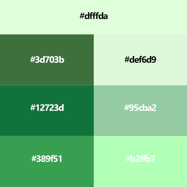</td>
      <td style="text-align: center;">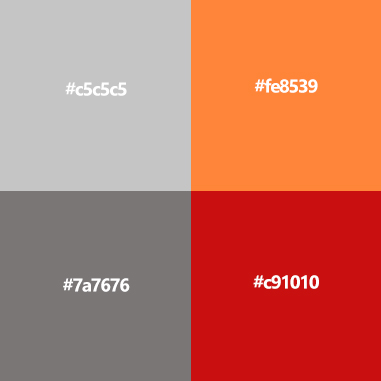</td>
    </tr>
  </tbody>
</table>

<table border="1">
  <thead>
    <tr>
      <th colspan="2" style="text-align: center; font-weight: bold;"><strong>MOBILE</strong></th>
    </tr>
  </thead>
  <tbody>
    <tr>
      <td style="text-align: center; font-weight: bold;"><strong>LOGO</strong></td>
      <td style="text-align: center; font-weight: bold;"><strong>TYPOGRAPHY</strong></td>
    </tr>
    <tr>
      <td style="text-align: justify;">Hemos elegido colores brillantes como el naranja, verde y azul para transmitir energía, crecimiento y frescura. El diseño refleja nuestra visión innovadora y optimista, enfocada en el desarrollo y la creatividad, con un toque moderno y dinámico.</td>
      <td style="text-align: justify;">En el desarrollo del aplicativo móvil, se ha utilizado la tipografía Poppins por su versatilidad y legibilidad, lo que optimiza la navegación y mejora la experiencia del usuario dentro de la interfaz.</td>
    </tr>
    <tr>
      <td style="text-align: center;"></td>
      <td style="text-align: center;"></td>
    </tr>
    <tr>
      <td colspan="2" style="text-align: center; font-weight: bold;"><strong>COLOR</strong></td>
    </tr>
    <tr>
      <td style="text-align: center; font-weight: bold;"><strong>COLOR PRINCIPAL</strong></td>
      <td style="text-align: center; font-weight: bold;"><strong>COLOR SECUNDARIO</strong></td>
    </tr>
    <tr>
      <td style="text-align: justify;">El verde es el color predominante en nuestra aplicación móvil, simbolizando vida y crecimiento. Los tonos seleccionados <strong>(#12723d, #269642)</strong> refuerzan nuestra conexión con la naturaleza, aportando una sensación de frescura y energía a la plataforma. Además, los tonos suaves de verde claro <strong>(#b2ffb7, #def6d9)</strong> crean un ambiente equilibrado y relajante, ofreciendo una experiencia visual agradable y armónica para los usuarios. Estos colores están cuidadosamente elegidos para reflejar los valores de sostenibilidad y vitalidad que queremos transmitir.</td>
      <td style="text-align: justify;">Los colores seleccionados para nuestra aplicación móvil incluyen tonos de naranja, gris y coral, que predominan en los botones de acción y elementos interactivos. El naranja vibrante <strong>(#fe8539)</strong> y el coral suave <strong>(#f75e5e)</strong> se utilizan para destacar las acciones clave, atrayendo la atención del usuario hacia las interacciones principales. Los tonos grises <strong>(#5c5d5d y #c5c5c5)</strong> aportan neutralidad y equilibrio visual, proporcionando una base sólida y clara para el diseño general. Estos colores combinan dinamismo y funcionalidad, garantizando una experiencia de usuario atractiva y eficiente.</td>
    </tr>
    <tr>
      <td style="text-align: center;">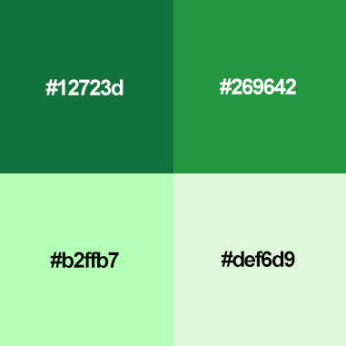</td>
      <td style="text-align: center;">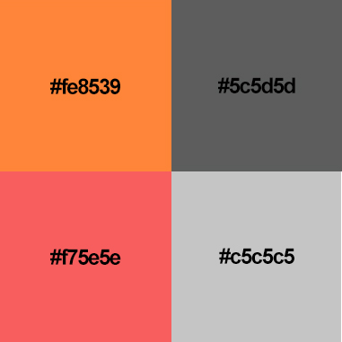</td>
    </tr>
  </tbody>
</table>

### 5.1.2. Web, Mobile and IoT Style Guidelines
La aplicación adaptará funcionalidades para dos plataformas principales: Windows (Desktop) y Android (Mobile). Para la presentación de información, se utilizará un diseño en forma de lista, aplicando el patrón F para la lectura de datos, y el patrón Z para la visualización en la landing page.

    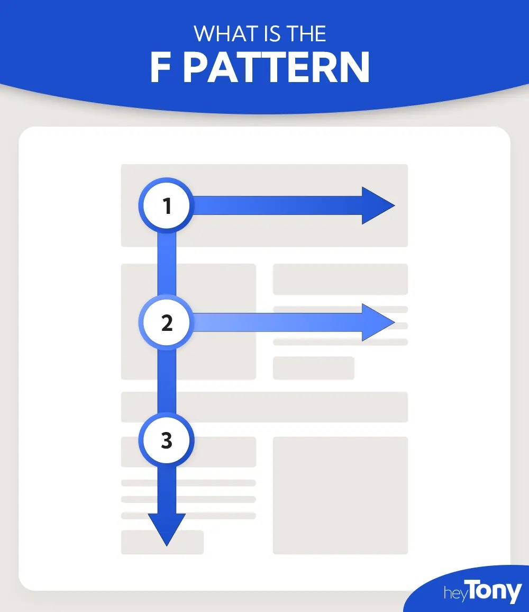

## 5.2. Information Architecture
### 5.2.1. Organization Systems
### 5.2.2. Labeling Systems

### 5.2.3. SEO Tags and Meta Tags
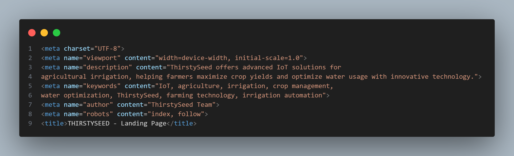

### **Explicación:**

- **`<meta charset="UTF-8">`**: Define la codificación de caracteres del documento, asegurando que se puedan mostrar caracteres especiales correctamente (como tildes y símbolos). El estándar **UTF-8** es ampliamente utilizado en la web.
  
- **`<meta name="viewport" content="width=device-width, initial-scale=1.0">`**: Este meta tag garantiza que la página sea **responsive**, lo que significa que se ajustará correctamente a diferentes tamaños de pantalla, como dispositivos móviles o tablets. Define la escala inicial y asegura que el ancho del contenido se ajuste al ancho del dispositivo.

- **`<meta name="description" content="...">`**: Proporciona un resumen del contenido de la página. Esta descripción es la que aparece en los resultados de búsqueda debajo del título de la página, por lo que debe ser clara y atractiva. Esto ayuda a aumentar la tasa de clics en los motores de búsqueda.

- **`<meta name="keywords" content="...">`**: Incluye una lista de palabras clave relevantes para el contenido de la página. Aunque algunos motores de búsqueda modernos no dan tanto peso a esta etiqueta, sigue siendo útil para mejorar el SEO y proporcionar contexto.

- **`<meta name="author" content="ThirstySeed Team">`**: Indica el autor o el equipo responsable de la creación de la página. Esto puede ser útil para proporcionar créditos y también puede ser utilizado por algunos navegadores y herramientas de análisis.

- **`<meta name="robots" content="index, follow">`**: Indica a los motores de búsqueda que deben indexar esta página (incluirla en sus resultados) y seguir los enlaces que contiene. Es esencial para asegurar que la página sea visible en los resultados de búsqueda.

- **`<title>`**: Define el título de la página que aparecerá en la pestaña del navegador y en los resultados de búsqueda. Debe ser corto pero descriptivo para captar la atención del usuario.
### 5.2.4. Searching Systems

La interfaz de la aplicación ofrece herramientas intuitivas para facilitar la búsqueda de información y la visualización de datos relevantes. A través de una barra de búsqueda sencilla y filtros bien definidos, los usuarios pueden acceder rápidamente a la información que necesitan, tanto en la versión web como en la móvil. La estructura de los reportes, gráficos y datos organizados asegura una experiencia fluida, permitiendo a los usuarios interactuar con la información de manera eficiente, sin sentirse abrumados por el volumen de datos. Esto garantiza que, sin importar el dispositivo, los usuarios puedan navegar y buscar datos con facilidad.

<table border="1" style="width: 100%; text-align: center;">
    <tr>
        <th colspan="2" style="font-weight: bold; text-align: center;">BÚSQUEDA DE DATOS</th>
    </tr>
    <tr>
        <th style="font-weight: bold; text-align: center;">VERSIÓN WEB</th>
        <th style="font-weight: bold; text-align: center;">VERSIÓN MÓVIL</th>
    </tr>
    <tr>
        <td>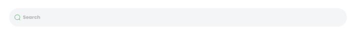</td>
        <td>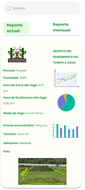</td>
    </tr>

</table>

### 5.2.5. Navigation Systems
Para poder navegar dentro de la aplicación, se va a añadir las siguientes secciones:
<table border="1" style="width: 100%; text-align: center;">
    <tr>
        <th colspan="2" style="font-weight: bold; text-align: center;">LANDING PAGE</th>
    </tr>
    <tr>
        <td colspan="2">
            

                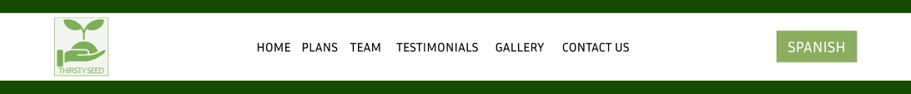
            

        </td>
    </tr>
    <tr>
        <th style="font-weight: bold; text-align: center;">WEB</th>
        <th style="font-weight: bold; text-align: center;">MOBILE</th>
    </tr>
    <tr>
        <td>
            

                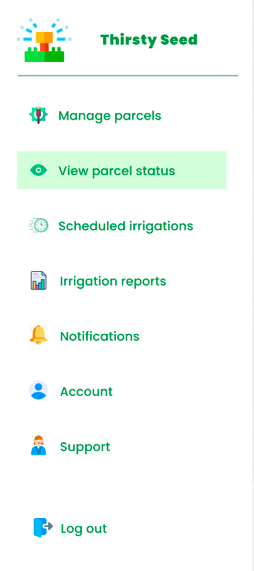
            

        </td>
        <td>
            

                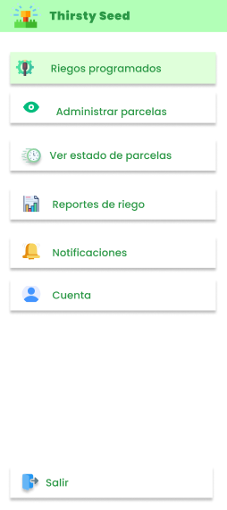
            

        </td>
    </tr>
</table>

## 5.3. Landing Page UI Design
Las landing pages se utilizan para convertir a los visitantes en clientes potenciales mediante mensajes persuasivos y la presentación de información relevante sobre el producto, entre otras estrategias. Por ello, decidimos emplear esta herramienta y desarrollar una versión preliminar tanto para dispositivos móviles como para computadoras.
### 5.3.1. Landing Page Wireframe
Esta landing page en su versión de wireframe muestra una estructura básica y funcional que permite visualizar cómo será el diseño final sin distracciones visuales. Las secciones principales incluyen:

- **Encabezado (Header):** Un espacio reservado para el logo, un menú de navegación que guía a los visitantes a través de las diferentes secciones de la página, y un botón para cambiar el idioma.
- **Planes (Plans):** Dos columnas muestran los distintos planes de suscripción disponibles (Premium y Plus) con un botón para iniciar el proceso de registro.
- **Equipo (Team):** Un área destinada a mostrar las imágenes y roles de los miembros del equipo, ayudando a personalizar la experiencia para los usuarios.
- **Testimonios (Testimonials):** Una sección en la que los usuarios podrán compartir sus experiencias con el producto o servicio, generando confianza para nuevos clientes.
- **Galería (Gallery):** Un grid que muestra imágenes relacionadas con el producto o servicio, proporcionando una visualización clara de los beneficios ofrecidos.
- **Formulario de Contacto (Contact Us):** Un formulario simple que permite a los usuarios ingresar su información y enviar mensajes para consultas o preguntas.
- **Pie de página (Footer):** Contiene información de contacto, una sección de suscripción al boletín informativo, y enlaces a las redes sociales, lo que asegura una mejor conexión con los usuarios.

El wireframe se enfoca en la funcionalidad y la disposición de los elementos, sin detalles visuales, ofreciendo una vista previa de la estructura antes de pasar al diseño final.

    

    <strong>Ver en Figma (Wireframe):</strong>
    <a href="https://www.figma.com/design/ejJ3uI6czOSWhxxlVF2AeO/IOT---GRUPO-3?node-id=9-8&node-type=canvas&t=V0JUeiPkzx23PxIb-0" target="_blank">
        https://www.figma.com/design/ejJ3uI6czOSWhxxlVF2AeO/IOT---GRUPO-3?node-id=9-8&node-type=canvas&t=V0JUeiPkzx23PxIb-0
    </a>

### 5.3.2. Landing Page Mock-up
Esta landing page está diseñada para captar la atención de los usuarios y convertirlos en clientes potenciales. Se compone de varias secciones clave:
- **Encabezado (Header):** Incluye el logo de la marca y un menú de navegación que permite acceder fácilmente a las secciones de la página como "Plans", "Team", "Testimonials", "Gallery" y "Contact Us". También ofrece un botón para cambiar el idioma a "Spanish".
- **Planes (Plans):** Presenta las opciones de planes disponibles (Premium y Plus), con detalles de los precios y un botón para comenzar a utilizar cada plan.
- **Equipo (Team):** Muestra las fotos y nombres de los miembros del equipo, lo que añade un toque personal y confiable a la página.
- **Testimonios (Testimonials):** Incluye opiniones de usuarios que han utilizado el servicio, generando confianza en los potenciales clientes.
- **Galería (Gallery):** Una selección de imágenes que muestran el producto o servicio en acción, lo que da una idea clara de su utilidad.
- **Formulario de Contacto (Contact Us):** Un formulario donde los usuarios pueden enviar un mensaje para obtener más información o realizar consultas.
- **Pie de página (Footer):** Contiene información de contacto, un formulario para suscribirse al boletín de noticias, enlaces a redes sociales y derechos reservados.

Este diseño está optimizado para guiar a los usuarios hacia la conversión mediante una navegación clara y contenido visual atractivo.

    

    <strong>Ver en Figma (Mock-up):</strong>
    <a href="https://www.figma.com/design/ejJ3uI6czOSWhxxlVF2AeO/IOT---GRUPO-3?node-id=0-1&node-type=canvas&t=02kOS1CLIyQNzAuC-0" target="_blank">
        https://www.figma.com/design/ejJ3uI6czOSWhxxlVF2AeO/IOT---GRUPO-3?node-id=0-1&node-type=canvas&t=02kOS1CLIyQNzAuC-0
    </a>

## 5.4. Applications UX/UI Design
### 5.4.1. Applications Wireframes
### 5.4.2. Applications Wireflow Diagrams
### 5.4.3. Applications Mock-ups
### 5.4.4. Applications User Flow Diagrams
## 5.5. Applications Prototyping
