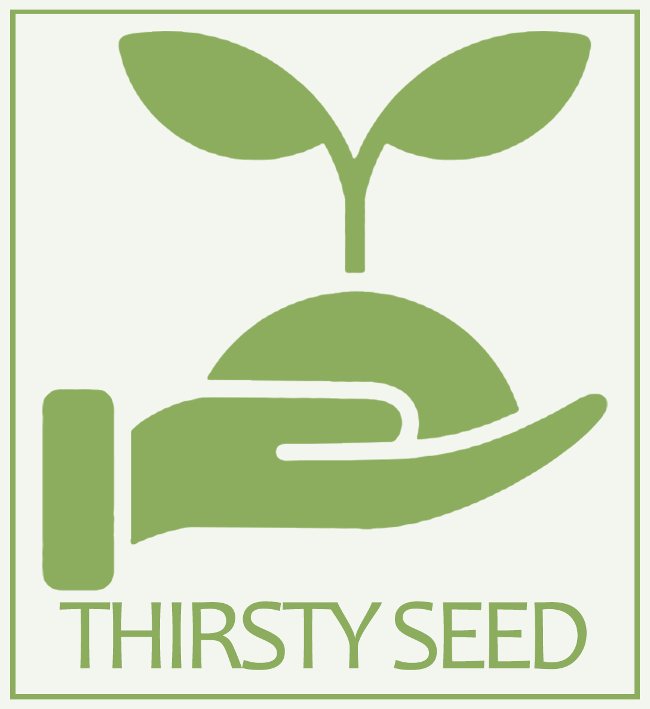

# **CAPÍTULO V: SOLUTION UI/UX DESIGN**
## 5.1. Style Guidelines
Este punto abarca los estilos que se usarán para diseñar el sitio web y la aplicación web.
### 5.1.1. General Style Guidelines
<table border="1" cellspacing="0" cellpadding="5">
    <tr>
        <td colspan="2" style="text-align: center;"><strong>BRAND OVERVIEW</strong></td>
    </tr>
    <tr>
        <td colspan="2">
            <strong>Thirsty Seed</strong> no es simplemente una herramienta más; es la solución definitiva para que los agricultores maximicen el rendimiento de sus cultivos, garanticen la calidad de los alimentos para sus animales y reduzcan los costos operativos. Nuestra aplicación automatiza el proceso de riego, eliminando las dudas y asegurando que cada gota de agua se utilice de la manera más eficiente posible. Además, los usuarios reciben notificaciones en tiempo real cuando es necesario rellenar los depósitos, manteniendo el flujo de trabajo sin interrupciones.
        </td>
    </tr>
    <tr>
        <td style="text-align: center;"><strong>BRAND NAME</strong></td>
        <td style="text-align: center;"><strong>TYPOGRAPHY</strong></td>
    </tr>
    <tr>
        <td>
            El nombre de nuestra aplicación es <strong>Thirsty Seed</strong> (Semilla Sedienta). "Thirsty" (Sedienta - Traducido al español) hace referencia a la necesidad constante de agua para que las plantas crezcan saludables, y "Seed" (Semilla - Traducido al español) simboliza el inicio del crecimiento de los cultivos. Con esta combinación, buscamos representar la importancia de un riego eficiente y oportuno para maximizar el rendimiento agrícola, asegurando que cada gota de agua sea utilizada de manera óptima.
        </td>
        <td>
            La tipografía ayuda a seccionar los distintos niveles de información que se le brinda al usuario, facilitando la comprensión y navegabilidad dentro de la aplicación. Para el logo, se ha elegido la tipografía <strong>Candara</strong>, ya que aporta un estilo moderno y distintivo, reforzando la identidad visual de la marca. Por otro lado, para el diseño de la página de destino (landing page), se utiliza la tipografía <strong>Changa</strong>, debido a su legibilidad y estilo amigable, lo que brinda al usuario una experiencia más fluida y agradable al interactuar con la herramienta.
        </td>
    </tr>
    <tr>
        <td></td>
        <td></td>
    </tr>
    <tr>
        <td colspan="2" style="text-align: center;"><strong>COLORES</strong></td>
    </tr>
    <tr>
        <td style="text-align: center;"><strong>COLOR PRINCIPAL-VERDE</strong></td>
        <td style="text-align: center;"><strong>COLOR SECUNDARIO-MARRÓN</strong></td>
    </tr>
    <tr>
        <td>El verde simboliza la vida y el crecimiento, reflejando la esencia de las plantas. Usamos estos tonos <strong>(#144B00 y #8CAC60)</strong> para transmitir una conexión con la naturaleza, destacando la vitalidad y frescura de nuestro contenido.</td>
        <td>El marrón representa la tierra y la estabilidad. Los tonos seleccionados <strong>(#66280A, #874421, #A55730)</strong> evocan la solidez del suelo que nutre las plantas, aportando calidez y un equilibrio orgánico a nuestro diseño.</td>
    </tr>
    <tr>
        <td></td>
        <td></td>
    </tr>
    <tr>
        <td colspan="2" style="text-align: center;"><strong>SPACE</strong></td>
    </tr>
    <tr>
        <td colspan="2">
            El espaciado se usa para que haya división entre imágenes, cuadros de textos, botones, etc, para que el usuario vea organizada la aplicación web. - Se usará para cada componente múltiplos de 8 pixeles (8px-24px-40px-56px-72px-96px).
        </td>
    </tr>
    <tr>
        <td colspan="2" style="text-align: center;"><strong>TONO DE LENGUAJE DE COMUNICACIÓN Y LENGUAJE APLICADO</strong></td>
    </tr>
    <tr>
        <td colspan="2">
            El lenguaje tanto de la aplicación web como el sitio web, es formal, serio, confiable y entusiasta. Debido a que se desea potenciar una confianza y tranquilidad al usuario y darle a entender que la aplicación es seria.
        </td>
    </tr>
</table>
### 5.1.2. Web, Mobile and IoT Style Guidelines
## 5.2. Information Architecture
### 5.2.1. Organization Systems
### 5.2.2. Labeling Systems
### 5.2.3. SEO Tags and Meta Tags
### 5.2.4. Searching Systems
### 5.2.5. Navigation Systems
## 5.3. Landing Page UI Design
### 5.3.1. Landing Page Wireframe
### 5.3.2. Landing Page Mock-up
## 5.4. Applications UX/UI Design
### 5.4.1. Applications Wireframes
### 5.4.2. Applications Wireflow Diagrams
### 5.4.3. Applications Mock-ups
### 5.4.4. Applications User Flow Diagrams
## 5.5. Applications Prototyping
