# **CAPÍTULO VI: PRODUCT IMPLEMENTATION, VALIDATION & DEPLOYMENT**
## 6.1. Software Configuration Management
### 6.1.1. Software Development Environment Configuration

### Software Development Environment Configuration

En nuestro proyecto utilizamos diversas herramientas y tecnologías para abarcar todas las fases del ciclo de vida de desarrollo de software. A continuación, se describen las principales herramientas utilizadas y su propósito:

**Project Management**
- **Trello**: Herramienta para gestionar proyectos de forma ágil, organizando tareas y sprints para facilitar el seguimiento de cada fase del desarrollo.  
  **Propósito**: Gestión de tareas y asignaciones.  
  **Ruta**: [https://trello.com](https://trello.com)

### Requirements Management

Para la gestion de requisitos usamos el **product backlog** y las **historias de usuario (HU)** de manera colaborativa dentro de un documento compartido, el cual es actualizado regularmente durante las sesiones de planificación de sprint. Este documento nos permite organizar, priorizar y refinar las **historias de usuario**, proporcionando una estructura clara para el seguimiento y cumplimiento de los objetivos del sprint.

**Product UX/UI Design**
- **Figma**: Herramienta colaborativa de diseño para la creación de interfaces, prototipos, wireframes, y mockups.  
  **Propósito**: Diseño de interfaces y prototipos.  
  **Ruta**: [https://www.figma.com](https://www.figma.com)

- **Miro**: Herramienta para colaborar en mapas de ideas, diagramas de flujo y arquitectura de la información.  
  **Propósito**: Diagramación de flujos de navegación y arquitectura.  
  **Ruta**: [https://miro.com](https://miro.com)

**Software Development**
Frontend:
- **Vue.js**: Framework progresivo de JavaScript para la construcción de interfaces de usuario y aplicaciones web SPA (Single Page Application).  
  **Propósito**: Desarrollo del frontend de la aplicación web.  
  **Ruta**: [https://vuejs.org/](https://vuejs.org/)

Backend:
- **Spring Boot**: Framework para la creación de aplicaciones basadas en Java, permitiendo desarrollo rápido con arquitectura RESTful.  
  **Propósito**: Desarrollo del backend de la aplicación web.  
  **Ruta**: [https://spring.io/projects/spring-boot](https://spring.io/projects/spring-boot)

Mobile:
- **Flutter**: Framework de desarrollo de aplicaciones móviles basado en Dart para crear interfaces nativas en iOS y Android.  
  **Propósito**: Desarrollo de la aplicación móvil.  
  **Ruta**: [https://flutter.dev/](https://flutter.dev/)

IoT:
- **Arduino IDE**: Entorno de desarrollo para programar microcontroladores **Arduino** con **C++**. Permite escribir, compilar y cargar código directamente en los dispositivos.  
  **Propósito**: Programación de los dispositivos IoT y microcontroladores.  
  **Ruta**: [https://www.arduino.cc/en/software](https://www.arduino.cc/en/software)

- **C++**: Lenguaje de programación de alto rendimiento usado para programar los microcontroladores Arduino, manejando el hardware directamente y optimizando los recursos del dispositivo.  
  **Propósito**: Programación de controladores de hardware.  
  **Ruta**: [https://isocpp.org/](https://isocpp.org/)

**Software Testing**
- **Cucumber**: Herramienta para pruebas automatizadas usando Gherkin, que permite realizar pruebas de aceptación a partir de descripciones funcionales.  
  **Propósito**: Automatización de pruebas para las aplicaciones desarrolladas.  
  **Ruta**: [https://cucumber.io/](https://cucumber.io/)

**Software Deployment**
- **Docker**: Plataforma de contenedores para la implementación de software de manera aislada y eficiente, permitiendo empaquetar la aplicación junto con todas sus dependencias.  
  **Propósito**: Contenerización y despliegue del software.  
  **Ruta**: [https://www.docker.com/](https://www.docker.com/)

**Software Documentation**
- **Markdown**: Usamos Markdown para documentar el proyecto de manera clara y concisa.  
  **Propósito**: Documentación colaborativa y legible en diferentes plataformas.  
  **Ruta**: [https://www.markdownguide.org/](https://www.markdownguide.org/)

Estas herramientas garantizan un flujo de trabajo ágil, eficiente y colaborativo, permitiendo que todos los miembros del equipo contribuyan en las distintas etapas del desarrollo del proyecto IoT.

### 6.1.2. Source Code Management
**Repositorios**

GitHub Organization: [Enlace](https://github.com/Grupo-3-IoTeam)

Landing Page Repository: [Enlace](https://github.com/Grupo-3-IoTeam/ThirstySeed-Landing)

Web Application Repository: [Enlace](https://github.com/Grupo-3-IoTeam/ThirstySeedWebApplication)

**Cuentas del equipo del proyecto**

| Nombre                 | Usuario de GitHub   |
|------------------------|---------------------|
| Giakomo Causso Mariano  | GiaKode             |
| Kurt Puican Salas       | KurtPuican          |
| Rafael Luyo             | RafaelLuyo          |
| Shayla Choque           | ShaylaChoque        |
| Alexis Vargas           | VrgasQ              |

**Evidencia de repositorios**:

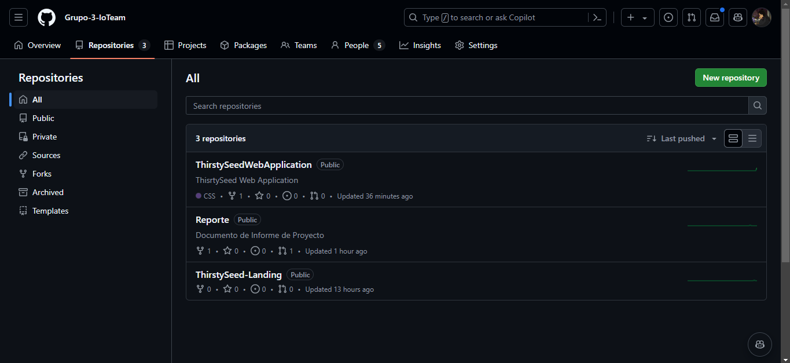

**GitFlow Workflow**

Para el control de versiones y la gestión de código, implementaremos el modelo **GitFlow** descrito por Vincent Driessen. Este modelo estructurará las ramas de nuestro repositorio de la siguiente forma:

- **Main branch** (`main`): Contiene el código listo para producción.
- **Develop branch** (`develop`): Rama en la que se integrarán todas las funcionalidades nuevas, y que posteriormente se fusionará con la `main` branch.
- **Feature branches** (`feature/<nombre>`): Se crearán para cada nueva funcionalidad que se desarrolle. Las convenciones para el nombre de las ramas de feature seguirán el patrón `feature/<nombre-feature>`, por ejemplo: `feature/registro-usuario`.
- **Release branches** (`release/<versión>`): Para preparar un nuevo release y hacer pruebas finales.
- **Hotfix branches** (`hotfix/<versión>`): Se utilizarán para corregir bugs críticos encontrados en producción.

Para nombrar nuestras versiones seguiremos **Semantic Versioning 2.0.0**, aplicando etiquetas como `v1.0.0`, `v1.0.1`, etc.

**Convenciones de Commits**

Adoptaremos la convención **Conventional Commits** para estructurar los mensajes de nuestros commits. Cada commit deberá seguir la estructura:

Donde el `tipo` puede ser:
- `feat`: Para introducir nuevas funcionalidades.
- `fix`: Para corregir bugs.
- `refactor`: Para cambios que mejoran el código sin cambiar su funcionalidad.
- `style`: Para cambios en formato, espacios, punto y coma, etc.

**Versionado Semántico**

Utilizaremos **Semantic Versioning 2.0.0** para nombrar nuestras versiones de forma consistente y clara. El formato que usaremos será `v<major>.<minor>.<patch>`, donde:
- **Major** (`<major>`): Incrementa cuando se introducen cambios incompatibles.
- **Minor** (`<minor>`): Incrementa cuando se agregan nuevas funcionalidades sin romper la compatibilidad.
- **Patch** (`<patch>`): Incrementa cuando se hacen correcciones menores o fixes.

### 6.1.3. Source Code Style Guide & Conventions

En nuestro proyecto utilizamos **Vue.js** para el desarrollo del **Web Application**, **Spring Boot** para el **API Application** y **Flutter** para la **Mobile Application**. A continuación se detallan las convenciones y guías de estilo adoptadas para cada tecnología:

**Vue.js (Frontend)**
Para el desarrollo de la **Web App** en Vue.js, seguimos las guías oficiales de estilo de Vue:

- **Nombres de componentes**: 
  Los nombres de los componentes deben ser en **PascalCase** o **kebab-case**. Ejemplo: `MyComponent.vue` o `my-component.vue`.

- **Propiedades**: 
  Las propiedades (props) deben seguir **camelCase** en JavaScript y **kebab-case** en las plantillas de Vue. Ejemplo:
  ```javascript
  props: {
    myProperty: String
  }
  ```
  En la plantilla:
  ```html
  <my-component my-property="value"></my-component>
  ```

- **Nombres de métodos y eventos**:
  - Métodos en **camelCase**. Ejemplo: `handleUserClick`.
  - Eventos en **kebab-case**. Ejemplo: `@user-click="handleUserClick"`.

Referencias:  
- [Vue.js Style Guide](https://vuejs.org/style-guide/)

**Spring Boot (Backend)**
Para el **backend** en **Spring Boot**, seguimos las convenciones de Java:

- **Nombres de clases y paquetes**: 
  - Clases en **PascalCase**.
  - Paquetes en **minúsculas** y separados por puntos. Ejemplo: `com.example.projectname.service`.

- **Métodos y variables**: 
  - Los nombres de métodos y variables deben seguir la convención **camelCase**. Ejemplo: `getUserName()`.

- **Anotaciones**:
  Se siguen buenas prácticas con anotaciones como `@Service`, `@Controller`, `@Autowired`.

Referencias:
- [Google Java Style Guide](https://google.github.io/styleguide/javaguide.html)

**Flutter (Mobile App)**
Para la **App Móvil** en **Flutter** usando **Dart**, seguimos las siguientes convenciones:

- **Nombres de clases y métodos**:
  - Las clases deben usar **PascalCase** y los métodos **camelCase**.
  - Ejemplo de clase: `UserProfile`.

- **Uso de const**:
  Se recomienda el uso del modificador `const` siempre que sea posible:
  ```dart
  const Text('Hello World');
  ```

- **Nombres de widgets personalizados**:
  Los widgets deben seguir la convención **PascalCase**. Ejemplo: `CustomButton`.

Referencias:  
- [Dart Language Style Guide](https://dart.dev/guides/language/effective-dart/style)

**Commits convencionales y Versionado semántico**
Se utilizarán **Conventional Commits** y **Semantic Versioning** para garantizar consistencia.

- **Ejemplos de commits**:
  - `feat: add user authentication`
  - `fix: correct login bug`
  - `refactor: optimize database queries`

- **Versionado Semántico**:
  Se utilizará el esquema de versionado: `MAJOR.MINOR.PATCH`.

Referencias:  
- [Conventional Commits](https://www.conventionalcommits.org/en/v1.0.0/)  
- [Semantic Versioning](https://semver.org/)

Las convenciones descritas permiten mantener un código limpio, comprensible y alineado con las mejores prácticas de desarrollo para cada una de las tecnologías utilizadas en el proyecto: **Vue.js**, **Spring Boot** y **Flutter**.

### 6.1.4. Software Deployment Configuration
En este punto, se dara a conocer el proceso de despliegue de las aplicaciones, así como la configuración de los servidores y la infraestructura necesaria para su correcto funcionamiento.

Landing Page: Para desplegar la Landing Page, se utilizó GitHub Pages, una plataforma gratuita que permite alojar sitios web estáticos directamente desde un repositorio de GitHub. El proceso de despliegue fue el siguiente:

1. Crear un repositorio en GitHub con el código de la Landing Page.
2. Acceder a la configuración del repositorio y habilitar GitHub Pages.

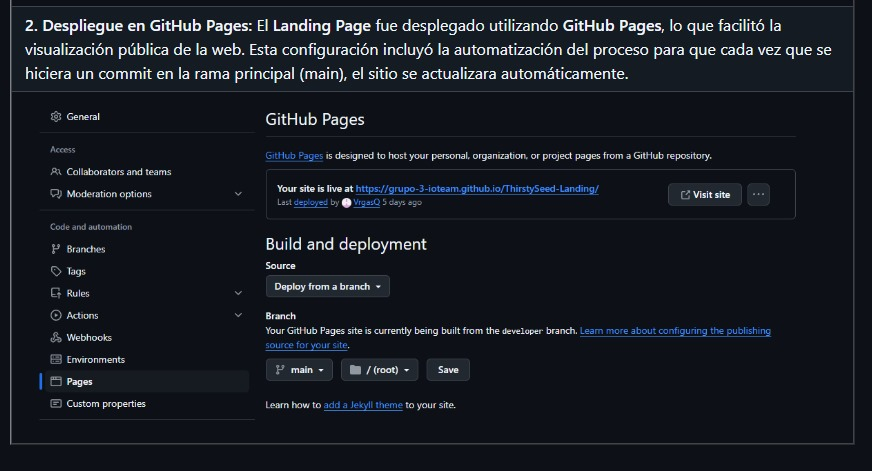

3.Seleccionar la rama y la carpeta de origen del sitio web.
4.Guardar la configuración y obtener la URL del sitio web desplegado.
5.Finalmente, acceder a la URL del sitio web para verificar que se haya desplegado correctamente.

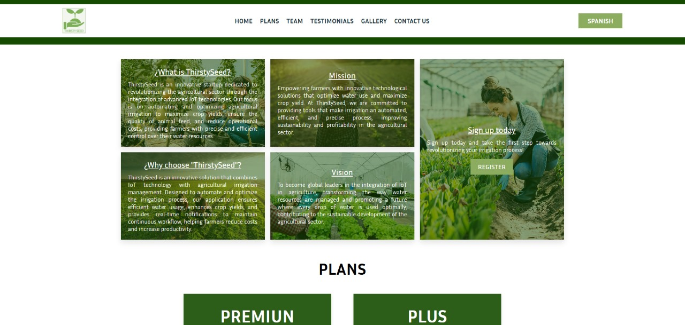

Enlace de la Landing Page desplegada: https://grupo-3-ioteam.github.io/ThirstySeed-Landing/ 

FrontEnd: Para el despliegue de la aplicacion se ha usado los servicios que ofrecen netlify una plataforma de alojamiento web que ofrece integración continua y despliegue automático desde repositorios de Git. El proceso de despliegue fue el siguiente:

Preparación del Repositorio: Asegúrarse que la página web esté almacenada en un repositorio Git, como GitHub, GitLab.
Crear una Cuenta en Netlify: Regístrarse en la plataforma.
Conectar el Repositorio: Inicia sesión en Netlify y ve al panel de control. Hacer clic en el botón "New site from Git" (Nuevo sitio desde Git). Selecciona tu proveedor de servicios de alojamiento de Git (por ejemplo, GitHub) y autoriza la conexión con tu cuenta. Seleccionar el repositorio que contiene la página web.

Configurar las Opciones de Despliegue: Netlify detectará automáticamente la configuración de tu proyecto. Si necesitas ajustes adicionales, como la configuración del directorio de compilación, puedes establecerlos en la sección de configuración de tu sitio.

Despliegue Automático: Activa la opción de "Deploy site" (Desplegar sitio) para habilitar el despliegue automático cada vez que realices cambios en tu repositorio.
Verificar el Despliegue: Una vez que se complete el despliegue, Netlify te proporcionará una URL única para acceder a tu página web.

## 6.2. Landing Page, Services & Applications Implementation
Esta sección resume el proceso de implementación, pruebas, documentación y despliegue del Landing Page, Web Services y las Aplicaciones Web y Móviles de ThirstySeed. Durante cada Sprint, se siguieron las mejores prácticas de desarrollo para garantizar la funcionalidad y calidad del producto.
### 6.2.1. Sprint 1
Durante el Sprint 1, se avanzó en la implementación de las funcionalidades planificadas, el equipo colaboró en la integración de los servicios y aplicaciones, realizando pruebas y documentando cada fase. Se incluyeron tareas como la planificación del sprint, la ejecución del desarrollo, la revisión de los avances y el ajuste de los entregables para asegurar un despliegue exitoso.
#### 6.2.1.1. Sprint Planning 1

##### LANDING PAGE

<table border="1" style="width:100%; text-align: center;">
  <tr>
    <th colspan="4" style="text-align: center;"><strong>LANDING PAGE</strong></th>
  </tr>
  <tr>
    <th colspan="2" style="text-align: center;"><strong>Sprint #</strong></th>
    <th colspan="2" style="text-align: center;"><strong>Sprint 1</strong></th>
  </tr>
  <tr>
    <th colspan="4" style="text-align: center;"><strong>Sprint Planning Background</strong></th>
  </tr>
  <tr>
    <td><strong>Date</strong></td>
    <td colspan="3">2024/09/07</td>
  </tr>
  <tr>
    <td><strong>Time</strong></td>
    <td colspan="3">22:00</td>
  </tr>
  <tr>
    <td><strong>Location</strong></td>
    <td colspan="3">Lima, Peru - Meeting held via Discord</td>
  </tr>
  <tr>
    <td><strong>Prepared By</strong></td>
    <td colspan="3">Vargas Quispe, Manuel Alexis</td>
  </tr>
  <tr>
    <td><strong>Attendees (to planning meeting)</strong></td>
    <td colspan="3">
      Giakomo Rodolfo Causso Mariano<br>Kurt Matthews Puican Salas<br>Rafael Arturo Luyo Ramirez<br>Shayla Lussiné Choque Puma
    </td>
  </tr>
  <tr>
    <th colspan="4" style="text-align: center;"><strong>Sprint Goal & User Stories</strong></th>
  </tr>
  <tr>
    <td><strong>Sprint Goal</strong></td>
    <td colspan="3">Development and deployment of ThirstySeed's Landing Page</td>
  </tr>
  <tr>
    <td><strong>Sprint Velocity</strong></td>
    <td colspan="3">11</td>
  </tr>
  <tr>
    <td><strong>Sum of Story Points</strong></td>
    <td colspan="3">11 story points</td>
  </tr>
</table>

##### FRONTEND

<table border="1" style="width:100%; text-align: center;">
  <tr>
    <th colspan="4" style="text-align: center;"><strong>WEB APP</strong></th>
  </tr>
  <tr>
    <th colspan="2" style="text-align: center;"><strong>Sprint #</strong></th>
    <th colspan="2" style="text-align: center;"><strong>Sprint 1</strong></th>
  </tr>
  <tr>
    <th colspan="4" style="text-align: center;"><strong>Sprint Planning Background</strong></th>
  </tr>
  <tr>
    <td><strong>Date</strong></td>
    <td colspan="3">2024/09/07</td>
  </tr>
  <tr>
    <td><strong>Time</strong></td>
    <td colspan="3">15:00</td>
  </tr>
  <tr>
    <td><strong>Location</strong></td>
    <td colspan="3">Lima, Peru - Meeting held via Discord</td>
  </tr>
  <tr>
    <td><strong>Prepared By</strong></td>
    <td colspan="3">Kurt Matthews Puican Salas</td>
  </tr>
  <tr>
    <td><strong>Attendees (to planning meeting)</strong></td>
    <td colspan="3">
      Giakomo Rodolfo Causso Mariano<br>Vargas Quispe, Manuel Alexis <br>Rafael Arturo Luyo Ramirez<br>Shayla Lussiné Choque Puma
    </td>
  </tr>
  <tr>
    <th colspan="4" style="text-align: center;"><strong>Sprint Goal & User Stories</strong></th>
  </tr>
  <tr>
    <td><strong>Sprint Goal</strong></td>
    <td colspan="3">Development and deployment of ThirstySeed's Web App</td>
  </tr>
  <tr>
    <td><strong>Sprint Velocity</strong></td>
    <td colspan="3">11</td>
  </tr>
  <tr>
    <td><strong>Sum of Story Points</strong></td>
    <td colspan="3">11 story points</td>
  </tr>
</table>


#### 6.2.1.2. Sprint Backlog 1
Para este sprint, tuvimos como objetivo implementar el diseño de nuestra aplicación web asi como la creacion del langind page mediante el uso de HTML, CSS y JavaScript. A continuación, se presentan las historias de usuario y sus respectivos puntos de historia:

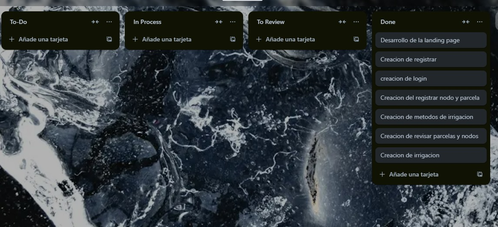

#### 6.2.1.3. Development Evidence for Sprint Review
<table border="1" cellspacing="0" cellpadding="5" style="width:100%; text-align: center; border-collapse: collapse;">
    <thead>
        <tr>
        <th colspan="6" style="text-align: center;"><strong>LANDING PAGE</strong></th>
        </tr>
        <tr>
            <th style="text-align: center;"><strong>Repository</strong></th>
            <th style="text-align: center;"><strong>Branch</strong></th>
            <th style="text-align: center;"><strong>Commit Id</strong></th>
            <th style="text-align: center;"><strong>Commit Message</strong></th>
            <th style="text-align: center;"><strong>Commit Message Body</strong></th>
            <th style="text-align: center;"><strong>Commited on (Date)</strong></th>
        </tr>
    </thead>
    <tbody>
        <tr>
            <td rowspan="10"><a href="https://github.com/Grupo-3-IoTeam/ThirstySeed-Landing">https://github.com/Grupo-3-IoTeam/ThirstySeed-Landing</a></td>
            <td>Main</td>
            <td>70fe572</td>
            <td>feat: add new final version LandingPage</td>
            <td>Se publicó y editó la versión final del LandingPage (Ya desplegada)</td>
            <td>27/09/2024</td>
        </tr>
        <tr>
            <td>Developer</td>
            <td>601331e</td>
            <td>Update index.html</td>
            <td>Últimos cambios del LandingPage</td>
            <td>27/09/2024</td>
        </tr>
        <tr>
            <td>Feature/section-contact_us</td>
            <td>9ba5e7c</td>
            <td>feat: add file contact-us</td>
            <td>Se realizó la sección de contáctanos</td>
            <td>22/09/2024</td>
        </tr>
        <tr>
            <td>Feature/section-footer</td>
            <td>a9b1c3e</td>
            <td>feat: add file footer</td>
            <td>Se realizó la sección del pie de página</td>
            <td>22/09/2024</td>
        </tr>
        <tr>
            <td>Feature/section-gallery</td>
            <td>7455f96</td>
            <td>feat: add section gallery</td>
            <td>Se realizó la sección galería</td>
            <td>22/09/2024</td>
        </tr>
        <tr>
            <td>Feature/section-home</td>
            <td>459d30a</td>
            <td>feat: file home</td>
            <td>Se realizó la sección de inicio</td>
            <td>22/09/2024</td>
        </tr>
        <tr>
            <td>Feature/section-plans</td>
            <td>67fac89</td>
            <td>feat: add plans</td>
            <td>Se realizó la sección de planes de suscripción</td>
            <td>13/09/2024</td>
        </tr>
        <tr>
            <td>Feature/section-team</td>
            <td>f21e164</td>
            <td>feat: add file team</td>
            <td>Se realizó la sección del equipo</td>
            <td>22/09/2024</td>
        </tr>
        <tr>
            <td>Feature/section-testimonials</td>
            <td>c6027fd</td>
            <td>feat: add testimonials</td>
            <td>Se realizó la sección de testimonios de las personas que usaron la página</td>
            <td>13/09/2024</td>
        </tr>
        <tr>
            <td>Feature/section-toolbar</td>
            <td>14002c5</td>
            <td>feat: add file toolbar</td>
            <td>Se realizó la sección de toolbar</td>
            <td>22/09/2024</td>
        </tr>
    </tbody>
</table>


En la siguiente tabla se mostrarán algunos de los commits más importantes realizados por cada developer del Sprint 1.

| Repository                       | Branch                       | Commit Id                             | Commit Message                     | Commit Message Body                          | Commited on (Date) |
|----------------------------------|------------------------------|---------------------------------------|-------------------------------------|-----------------------------------------------|---------------------|
| Shayla/ThirstySeedWebApplication | feature/side-navigation-bar   | 83cbbaa3caeee697d3b62d12cf7f90e059dec03d | feat (side-navigation-bar)          | implement sidenav                             |                     |
| Shayla/ThirstySeedWebApplication | feature/set-irrigation-mode   | d86d83f9b575a97451d71c126b0fa8787e024ec8 | feat(set-irrigation-mode)          | implement set irrigation mode                 |                     |
| Alexis/ThirstySeedWebApplication  | feature/section-activate-nodes | e590cab599bc4a3bea4d988bd538f9f6e499f858 | feat (section-activate-nodes)      | add router activate-nodes                     |                     |
| Giakomo/ThirstySeedWebApplication | feature/section-plot-registered | 0956347c43edff4bf66ca76b352fef9b35172a76 | feat (section-plot-registered)     | registeredView                                |                     |
| Giakomo/ThirstySeedWebApplication | feature/section-plot-registered | da6b2b7517b8e31162155f8b84dc1106d0d272aa | feat (section-plot-registered)     | viewPlot                                     |                     |
| Kurt/ThirstySeedWebApplication    | feature/section-register-node   | 097a35d477726c8a3d72f79160a52459d0b87b4c | feat (section-register-node)       | service and component added                   |                     |
| Kurt/ThirstySeedWebApplication    | feature/section-register         | 85851af4ed03d6862750130369ab2d345a5e6632 | feat (section-register)            | add component                                 |                     |
| Rafael/ThirstySeedWebApplication   | feature/section-irrigation-schedule | d309e872799790e7d9b9bbb7b797545843cc0811 | feat (section-irrigation-schedule) | Irrigation Schedule added                      |                     |
| Rafael/ThirstySeedWebApplication   | feature/section-plot-status      | 904efa00f8ffb361df38c0f9581d249a43ebb78c | feat (section-plot-status)        | Plot Status View Added                        |                     |
#### 6.2.1.4. Testing Suite Evidence for Sprint Review
Aquí se proporcionara información sobre las pruebas realizadas durante el sprint.Se detallaran las pruebas funcionales,de rendimiento que se han llevado a cabo para garantizar la calidad del software .Se incluiran los resultados de estas pruebas y cualquier correcion o mejora realizada.

##### Landing Page
<p align="center">
    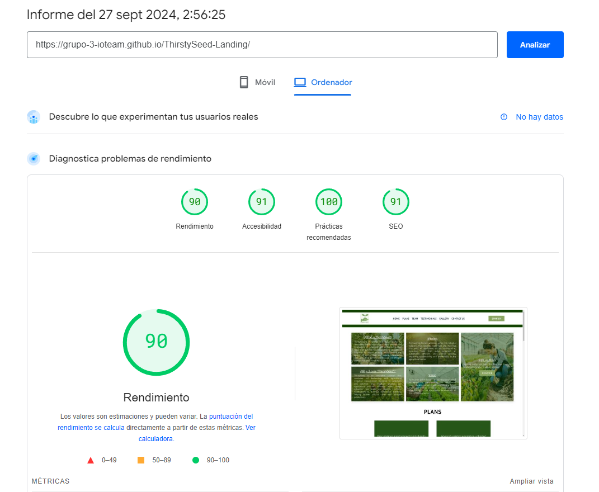
</p>
<p align="center">
    <strong>Landing Page Testeo:</strong>
    <a href="https://pagespeed.web.dev/analysis/https-grupo-3-ioteam-github-io-ThirstySeed-Landing/foaeucaur9?hl=es-ES&form_factor=desktop" target="_blank">
        https://pagespeed.web.dev/analysis/https-grupo-3-ioteam-github-io-ThirstySeed-Landing/foaeucaur9?hl=es-ES&form_factor=desktop
    </a>
</p>
Por otro lado, no se ha llevado a cabo la prueba de la suite de testing para la web app esta entrega debido a que aún no disponemos de la primera versión del backend. Posteriormente, implementaremos pruebas utilizando una herramienta de automatización para pruebas de aceptación y comportamiento.

#### 6.2.1.5. Execution Evidence for Sprint Review
Esta sección se centrará en la ejecución de la aplicación durante el sprint. Se visualizará la navegación del Landing Page como la de la página web, de esta manera se destacaran las características y funcionalidades implementadas en la aplicación.
##### Landing Page
<td>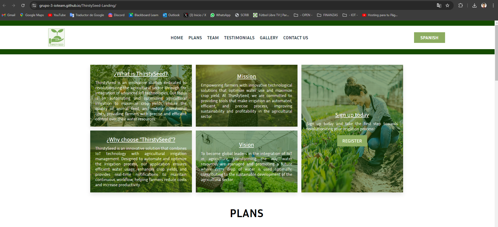</td>
<p align="center">
    <strong>Landing Page Desplegado:</strong>
    <a href="https://grupo-3-ioteam.github.io/ThirstySeed-Landing/" target="_blank">
        https://grupo-3-ioteam.github.io/ThirstySeed-Landing/
    </a>
</p>

Para el Sprint 1 se realizaron las diferentes HU, completándolas al 100% y otros al 80%. Compartimos imágenes para mostrar cómo quedó el avance de la primera versión del servicio web. Cada uno con su ruta respectiva.

**Link de la página desplegada:** [https://thirstyseed.netlify.app](https://thirstyseed.netlify.app)

- **Cuenta:** El usuario visualiza su perfil de usuario
  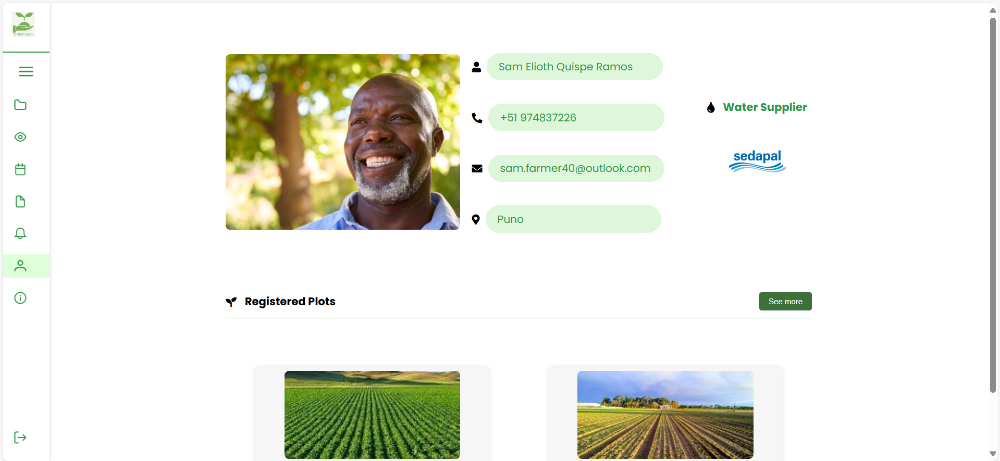
- **Registrar parcela:** El usuario registra una parcela
  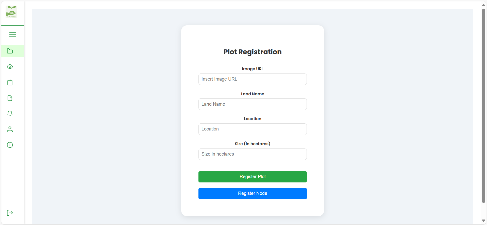
- **Registrar Nodo:** El usuario registra un nodo
  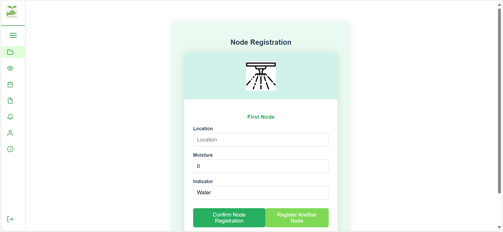
- **Parcelas Registradas:** El usuario visualiza sus parcelas previamente registradas
  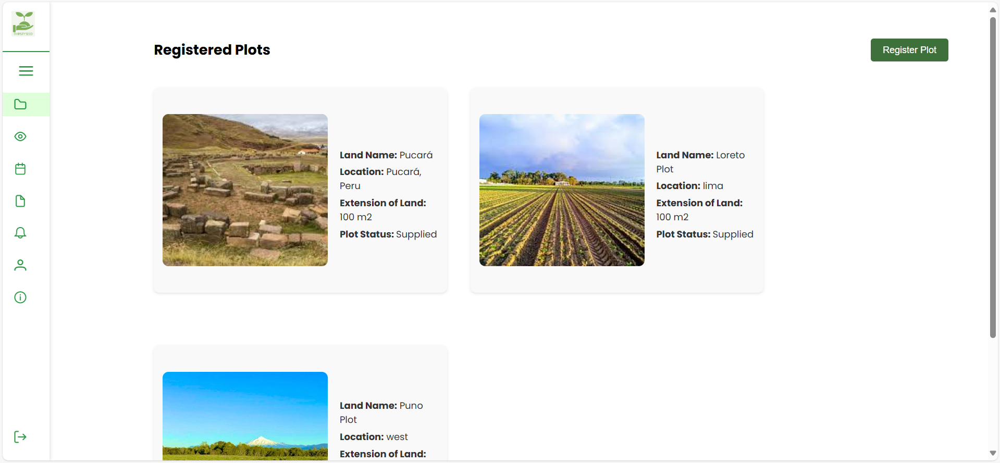
- **Estado de Parcela:** El usuario visualiza el estado de su parcela especificada
  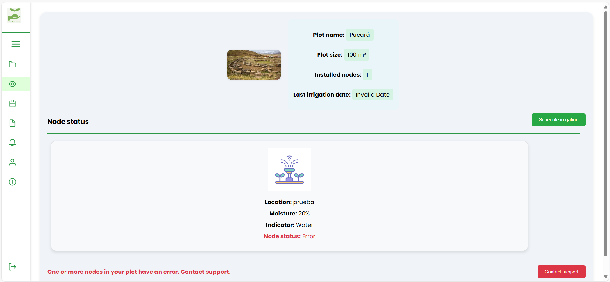
- **Calendario de Irrigación:** El usuario visualiza el calendario de Irrigación de sus parcelas
  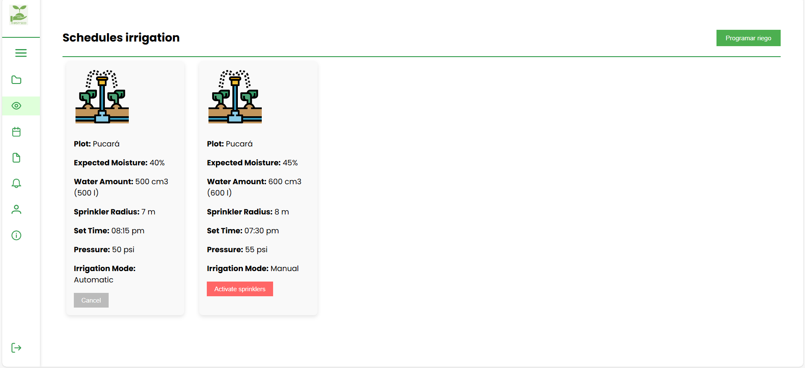
- **Agregar/modificar el calendario de riego de parcela:** El usuario es capaz de agregar o modificar el calendario de riego de sus parcelas registradas
  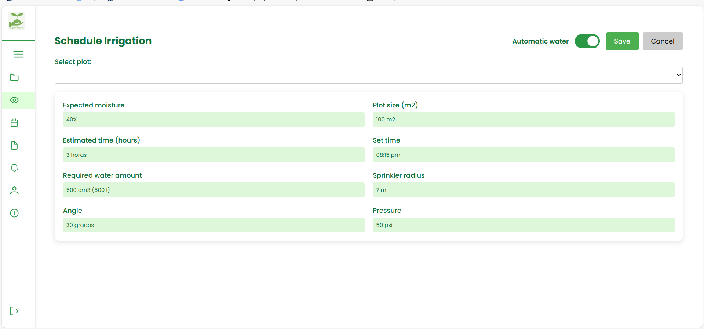
- **Activación de Nodos de Riego:** El usuario es capaz de activar los nodos de riego referente a una parcela específica
  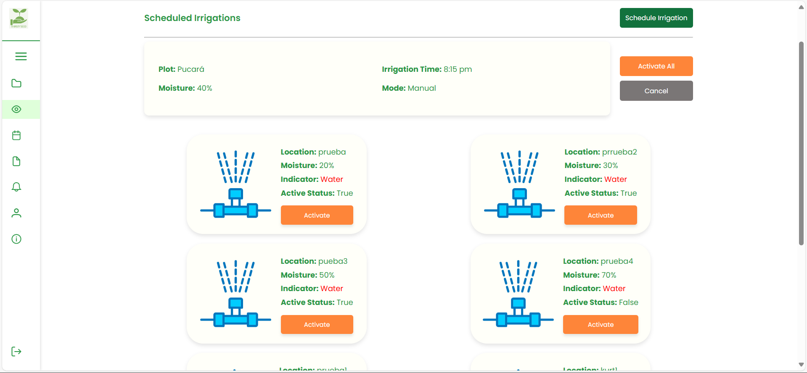
- **Notificación:** El usuario visualiza una notificación acerca de la irrigación completada
  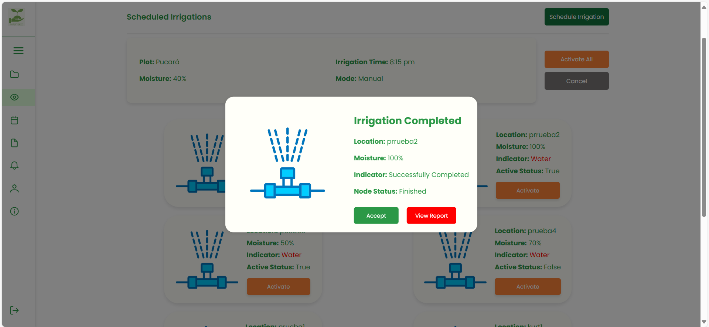


### 6.2.1.6. Services Documentation Evidence for Sprint Review

#### Descripción General:
En este apartado se documentan los servicios relacionados con el sistema de riego inteligente. Los endpoints que permiten interactuar con las parcelas (plots), nodos, horarios de riego (irrigationSchedules), y la información del usuario son descritos en detalle, con ejemplos de las respuestas que pueden ser obtenidas.

#### Tabla de Documentación de Servicios:

| EndPoint | Acción Implementada | Verbo | Descripción |
|----------|---------------------|-------|-------------|
| `http://localhost:3000/plots` | Obtener la lista de parcelas registradas en el sistema. | **GET** | Retorna un JSON con la información de todas las parcelas. Ejemplo de respuesta: <br> `[{"id": "1", "name": "Pucará", "location": "Pucará, Peru", "size": "100", "status": "Supplied", "imageUrl": "https://i.pinimg.com/564x/41/52/e2/4152e208971ee40322e0dffbc94b2436.jpg"}, {"id": "2", "name": "Loreto Plot", "location": "lima", "status": "Supplied"}]` |
| `http://localhost:3000/nodes` | Obtener la información de los nodos instalados en las parcelas. | **GET** | Retorna un JSON con los nodos que monitorizan la humedad de las parcelas. Ejemplo de respuesta: <br> `[{"id": "1", "plotId": 1, "moisture": 20, "status": "Error"}, {"id": "2", "plotId": 2, "moisture": 30, "status": "Correct"}]` |
| `http://localhost:3000/irrigationSchedules` | Obtener los horarios de riego establecidos para cada parcela. | **GET** | Devuelve un JSON con los horarios programados para el riego, incluyendo los parámetros de humedad, duración y cantidad de agua. Ejemplo de respuesta: <br> `[{"id": "7e9f", "expectedMoisture": "40%", "plotSize": "100 m2", "setTime": "08:15 pm", "requiredWaterAmount": "500 cm3"}, {"id": "8a2b", "expectedMoisture": "45%", "setTime": "07:30 pm"}]` |
| `http://localhost:3000/user` | Obtener la información del usuario registrado en el sistema. | **GET** | Retorna un JSON con los datos del usuario, como su nombre, teléfono, ubicación, y proveedor de agua. Ejemplo de respuesta: <br> `{"id": 1, "name": "Sam Elioth Quispe Ramos", "phone": "+51 974837226", "location": "Puno", "waterSupplier": {"name": "Sedapal", "logo": "https://pbs.twimg.com/profile_images/1557423579599446016/yC3WRAP6_200x200.jpg"}}` |

#### Detalles Adicionales:
- **Headers Utilizados**: No es necesario utilizar headers específicos para estos endpoints durante las pruebas locales, pero en producción se podría requerir un token de autenticación para proteger la información.
- **Estatus HTTP**: Los endpoints retornan códigos **200 OK** cuando las solicitudes son exitosas. En caso de error, se devuelven códigos **400 Bad Request** o **500 Internal Server Error**.

#### Evidencia:
Los siguientes endpoints fueron probados utilizando un servidor local (`localhost`) y los datos de prueba fueron obtenidos desde un archivo `db.json`. A continuación se muestran ejemplos de las respuestas obtenidas para cada uno de los endpoints.


#### 6.2.1.7. Software Deployment Evidence for Sprint Review
En este Sprint, nos enfocamos en el despliegue del producto ThirstySeed a través de GitHub para el deployment y la administración del repositorio. El proceso incluyó la creación de las cuentas y configuraciones necesarias para asegurar una integración eficiente entre el Landing Page, los Web Services y las Aplicaciones móviles.

<table border="1" style="width: 100%; text-align: center;">
    <tr>
        <th colspan="2" style="text-align: center;"><strong>LANDING PAGE</strong></th>
    </tr>
    <tr>
        <td style="text-align: left;">
            <strong>1. Creación de repositorios en GitHub:</strong> Se creó un repositorio dedicado para alojar el código de la Landing Page. Esto permitió la colaboración fluida y el control de versiones entre los miembros del equipo.
        </td>
    </tr>
    <tr>
        <td>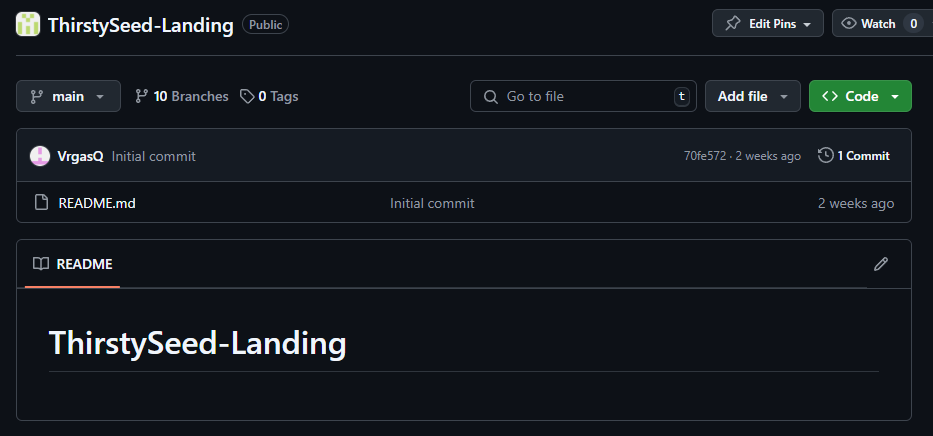</td>
    </tr>
    <tr>
        <td style="text-align: left;">
            <strong>2. Despliegue en GitHub Pages:</strong> El <strong>Landing Page</strong> fue desplegado utilizando <strong>GitHub Pages</strong>, lo que facilitó la visualización pública de la web. Esta configuración incluyó la automatización del proceso para que cada vez que se hiciera un commit en la rama principal (main), el sitio se actualizara automáticamente.
        </td>
    </tr>
    <tr>
        <td>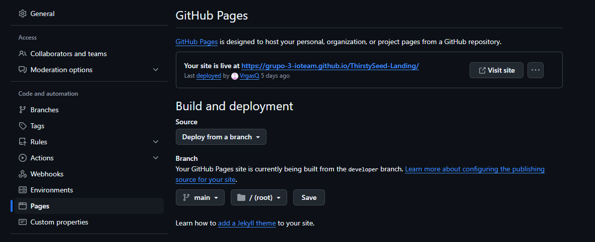</td>
    </tr>
</table>


#### 6.2.1.8. Team Collaboration Insights during Sprint
<table border="1" style="width: 100%; text-align: center;">
    <tr>
        <th colspan="2" style="text-align: center;"><strong>LANDING PAGE</strong></th>
    </tr>
    <tr>
        <td colspan="2" style="text-align: justify;">
            En esta entrega, el objetivo principal fue la implementación de las funciones para la gestión y visualización en <strong>ThirstySeed</strong>. Para cumplir con este propósito, se utilizaron herramientas como <strong>GitHub</strong> (para el <em>deployment</em> y gestión del repositorio), <strong>Visual Studio Code</strong> como entorno de desarrollo, y lenguajes como <strong>HTML, CSS,</strong> y <strong>JavaScript</strong> para la construcción de la interfaz y funcionalidad. A continuación, se presentan los diagramas de flujo que detallan los <strong>commits</strong> realizados y las contribuciones de cada miembro del equipo en el desarrollo del proyecto.
        </td>
    </tr>
    <tr>
        <td colspan="2">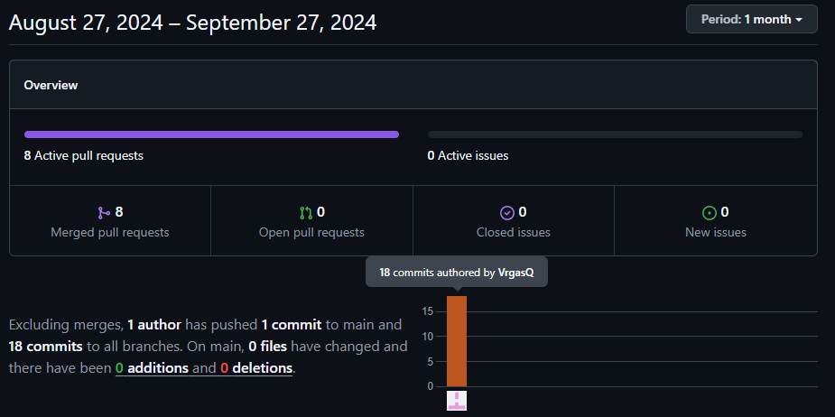</td>
    </tr>
    <tr>
        <td colspan="2" style="text-align: justify;">
            En la imagen se evidencia el gráfico de barras de la cantidad de <strong>commits</strong> realizados por cada uno de los integrantes del equipo.
        </td>
    </tr>
    <tr>
        <td colspan="2">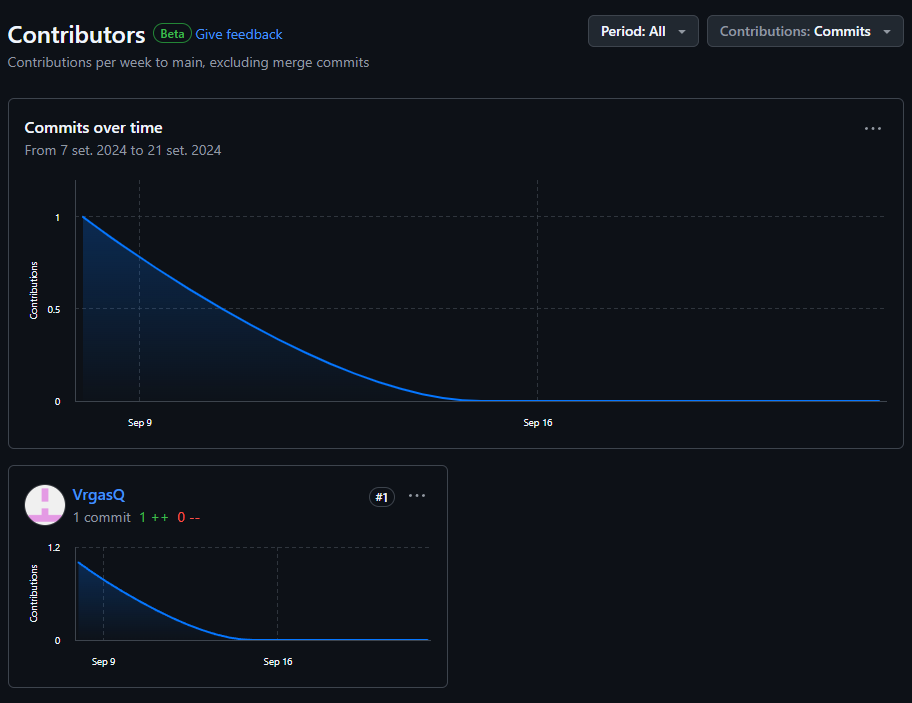</td>
    </tr>
    <tr>
        <td colspan="2" style="text-align: justify;">
            En esta imagen, se ofrece una representación visual de las fechas en las que se llevaron a cabo cambios en el repositorio de nuestro sprint (Enfocado al <strong>Landing Page</strong>), junto con la cantidad de modificaciones realizadas en cada uno de los <strong>commits</strong>. Esta representación gráfica es una herramienta valiosa para comprender la evolución temporal del proyecto y la intensidad del desarrollo a lo largo del tiempo.
        </td>
    </tr>
    <tr>
        <td colspan="2">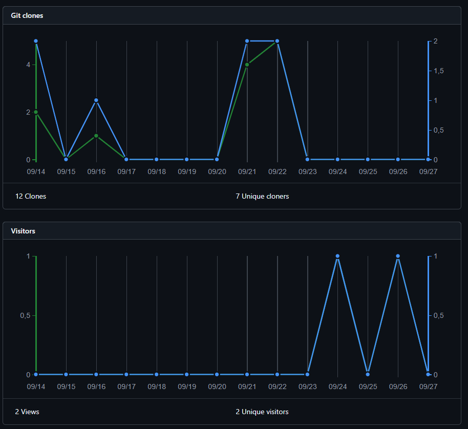</td>
    </tr>
    <tr>
        <td colspan="2" style="text-align: justify;">
            Estos gráficos ofrecen una representación visual de las clonaciones registradas en nuestro repositorio, junto con la fecha en que cada una de estas acciones se llevó a cabo. Además, se presenta información sobre la cantidad de visitantes que ha tenido el repositorio de nuestro equipo a lo largo del tiempo.
        </td>
    </tr>
    <tr>
        <td colspan="2">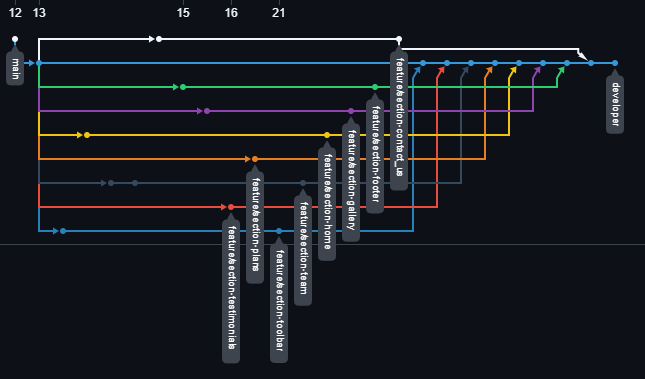</td>
    </tr>
</table>


[def]: image.png

### 6.2.2. Sprint 2
#### 6.2.2.1.Sprint Planning 2

<table border="1" style="width:100%; text-align: center;">
  <tr>
    <th colspan="2" style="text-align: center;"><strong>Sprint #</strong></th>
    <th colspan="2" style="text-align: center;"><strong>Sprint 2</strong></th>
  </tr>
  <tr>
    <th colspan="4" style="text-align: center;"><strong>Sprint Planning Background</strong></th>
  </tr>
  <tr>
    <td><strong>Date</strong></td>
    <td colspan="3">08/10/2024</td>
  </tr>
  <tr>
    <td><strong>Time</strong></td>
    <td colspan="3">07:00 AM</td>
  </tr>
  <tr>
    <td><strong>Location</strong></td>
    <td colspan="3">Lima, Peru - Meeting held via Discord</td>
  </tr>
  <tr>
    <td><strong>Prepared By</strong></td>
    <td colspan="3">Choque Puma, Shayla Lussiné</td>
  </tr>
  <tr>
    <td><strong>Attendees (to planning meeting)</strong></td>
    <td colspan="3">
      Giakomo Rodolfo Causso Mariano<br>Kurt Matthews Puican Salas<br>Rafael Arturo Luyo Ramirez<br>Manuel Alexis Vargas Quispe
    </td>
  </tr>
    <tr>
    <td><strong>Sprint 1 - Review Summary</strong></td>
    <td colspan="3">
      Durante el Sprint 1, se implementaron la landing page y la aplicación web, incluyendo la gestión de parcelas, nodos y la planificación de riego dentro del bounded context de irrigation. El equipo destacó el avance logrado, mencionando desafíos en la integración de la planificación de riego. El Product Owner sugirió continuar con el desarrollo de los demás bounded contexts de la plataforma y agregar el cambio de idioma en la aplicación web.
    </td>
  </tr>
    </tr>
    <tr>
    <td><strong>Sprint 1 - Retrospective Summary</strong></td>
    <td colspan="3">
      Durante el Sprint 1, destacamos la buena comunicación y el equilibrio en el trabajo en equipo, donde todos contribuimos con nuestras fortalezas. GitHub fue la herramienta clave para el manejo de versiones y la revisión de avances. Como oportunidad de mejora, identificamos la necesidad de organizar mejor nuestro tiempo personal y definir más claramente las tareas. El mayor desafío fue el margen casi nulo para finalizar los archivos antes de la entrega, lo cual evidenció cierta descoordinación. Aunque la carga de trabajo fue adecuada, consideramos que podríamos equilibrarla mejor con una organización y definición más detallada de las tareas.
    </td>
  </tr>
  <tr>
    <th colspan="4" style="text-align: center;"><strong>Sprint Goal & User Stories</strong></th>
  </tr>
  <tr>
    <td><strong>Sprint Goal</strong></td>
    <td colspan="3">
      Nuestro foco está en establecer la base de la conexión entre la API Rest, la aplicación móvil y la aplicación embebida en Wokwi, para permitir el monitoreo y control de riego en tiempo real.
      Creemos que esto aportará una estructura sólida para la integración de todas las aplicaciones, facilitando una gestión centralizada del sistema de riego para los usuarios.
      Esto se confirmará cuando logremos que la comunicación entre el backend, la aplicación móvil y la aplicación embebida funcione de manera sincronizada en un entorno de desarrollo.
    </td>
  </tr>
  <tr>
    <td><strong>Sprint Velocity</strong></td>
    <td colspan="3"> 
      Aplicacion Movil: 24 <br>
      - Plot Management (5)<br>
      - Node Management (5)<br>
      - Schedule Management (8) <br>
      - (View) Profile (3) <br>
      - (View) Sign In - SignUp (3) <br>
      API Services: 15 <br>
      - Plot Management (5)<br>
      - Node Management (5) <br>
      - Schedule Management (5) <br>
      Wokwi: 8 <br>
      Edge Service: 8 <br>
      - Node Management (8)<br>
      Web Application Deployment: 3 <br>
      Database Deployment: 3 <br>
      API Service Deployment: 3 <br>
    </td>
  </tr>
  <tr>
    <td><strong>Sum of Story Points</strong></td>
    <td colspan="3">64 story points</td>
  </tr>
</table>

#### 6.2.2.2. Sprint Backlog 2
Para la planificación y monitoreo de tareas durante el presente sprint, utilizamos Trello como herramienta de gestión de proyectos para organizar, priorizar y hacer seguimiento del avance de cada actividad. Puedes acceder al Sprint Backlog en el siguiente enlace:

[Trello - Sprint Backlog 2](https://trello.com/b/fFjl9Pyt/sprint-backlog-2)

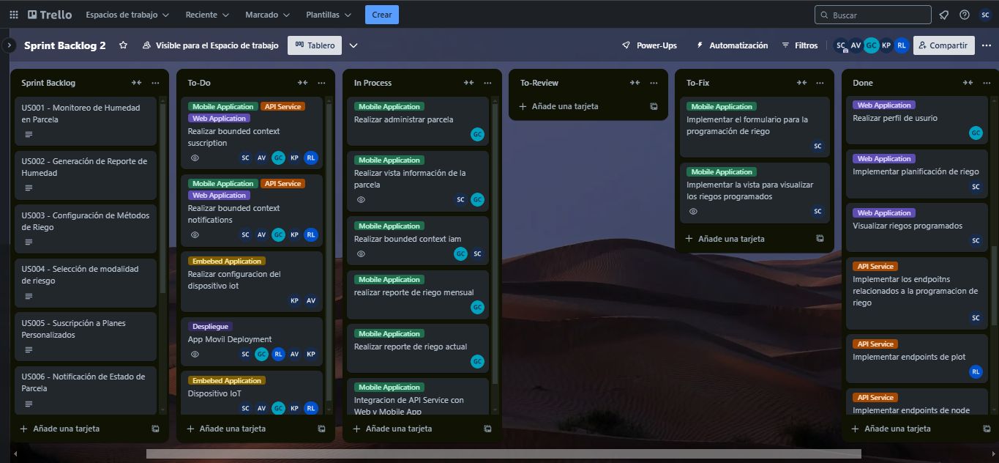

<table border="1">
  <thead>
    <tr>
      <th colspan="2">Sprint #</th>
      <th colspan="6">Sprint n</th>
    </tr>
    <tr>
      <th colspan="2">User Story</th>
      <th colspan="6">Work-Item / Task</th>
    </tr>
    <tr>
      <th>Id</th>
      <th>Title</th>
      <th>Id</th>
      <th>Title</th>
      <th>Description</th>
      <th>Estimation (Hours)</th>
      <th>Assigned To</th>
      <th>Status (To-do / In-Process / To-Review / Done)</th>
    </tr>
  </thead>
  <tbody>
    <tr>
      <td rowspan="2">US001</td>
      <td rowspan="2">Monitoreo de Humedad en Parcela</td>
      <td>1</td>
      <td>Realizar configuración del dispositivo IoT</td>
      <td>Configurar dispositivo para monitoreo de humedad (Embedded Application)</td>
      <td>8</td>
      <td>Kurt Puican, Alexis Vargas</td>
      <td>To-do</td>
    </tr>
    <tr>
      <td>2</td>
      <td>Realizar funcionalidad detección de humedad</td>
      <td>Implementar funcionalidad para detectar la humedad con sensores IoT (Embedded Application)</td>
      <td>6</td>
      <td>Kurt Puican, Rafael Luyo</td>
      <td>Done</td>
    </tr>
    <tr>
      <td rowspan="2">US002</td>
      <td rowspan="2">Generación de Reporte de Humedad</td>
      <td>3</td>
      <td>Realizar reporte de riego mensual</td>
      <td>Generar reporte mensual basado en datos de humedad (Web Application)</td>
      <td>7</td>
      <td>Giakomo Causso</td>
      <td>In-Process</td>
    </tr>
    <tr>
      <td>4</td>
      <td>Visualizar reportes generados</td>
      <td>Interfaz para mostrar reportes de riego (Web Application)</td>
      <td>4</td>
      <td>Shayla Choque</td>
      <td>Done</td>
    </tr>
    <tr>
      <td rowspan="2">US003</td>
      <td rowspan="2">Configuración de Métodos de Riego</td>
      <td>5</td>
      <td>Realizar modo de riego</td>
      <td>Implementar diferentes modos de riego (manual, automático) (Web Application)</td>
      <td>5</td>
      <td>Shayla Choque</td>
      <td>Done</td>
    </tr>
    <tr>
      <td>6</td>
      <td>Implementar planificación de riego</td>
      <td>Planificación basada en datos meteorológicos (Web Application)</td>
      <td>6</td>
      <td>Shayla Choque</td>
      <td>Done</td>
    </tr>
    <tr>
      <td>US004</td>
      <td>Selección de modalidad de riego</td>
      <td>7</td>
      <td>Realizar funcionalidad para activar aspersor</td>
      <td>Funcionalidad para activar el aspersor manualmente (Web Application)</td>
      <td>4</td>
      <td>Alexis Vargas</td>
      <td>Done</td>
    </tr>
    <tr>
      <td rowspan="2">US005</td>
      <td rowspan="2">Suscripción a Planes Personalizados</td>
      <td>8</td>
      <td>Realizar bounded context suscription</td>
      <td>Definir contexto de bounded context para suscripciones (Web Application)</td>
      <td>6</td>
      <td>Shayla Choque, Giakomo Causso, Alexis Vargas, Kurt Puican, Rafael Luyo</td>
      <td>To-do</td>
    </tr>
    <tr>
      <td>9</td>
      <td>Visualizar suscripciones de usuarios</td>
      <td>Mostrar las suscripciones de los usuarios en la aplicación (Web Application)</td>
      <td>5</td>
      <td>Shayla Choque</td>
      <td>Done</td>
    </tr>
    <tr>
      <td>US006</td>
      <td>Notificación de Estado de Parcela</td>
      <td>10</td>
      <td>Realizar bounded context notifications</td>
      <td>Definir contexto de notificaciones (Web Application)</td>
      <td>5</td>
      <td>Shayla Choque, Giakomo Causso, Alexis Vargas, Kurt Puican, Rafael Luyo</td>
      <td>To-do</td>
    </tr>
    <tr>
      <td>US008</td>
      <td>Integración con Sensores de Humedad</td>
      <td>12</td>
      <td>Integrar sensores de humedad con sistema IoT</td>
      <td>Implementar la integración de sensores para la recolección de datos (Embedded Application)</td>
      <td>8</td>
      <td>Kurt Puican, Rafael Luyo</td>
      <td>In-Process</td>
    </tr>
    <tr>
      <td>US009</td>
      <td>API RESTful para Reportes</td>
      <td>13</td>
      <td>Cors configuration for API Application</td>
      <td>Configurar CORS para permitir el acceso desde distintas aplicaciones (API Service)</td>
      <td>3</td>
      <td>Shayla Choque</td>
      <td>Done</td>
    </tr>
    <tr>
      <td rowspan="2">US010</td>
      <td rowspan="2">Personalización de Notificaciones</td>
      <td>14</td>
      <td>Realizar funcionalidad detección de humedad</td>
      <td>Implementar funcionalidad para detectar humedad en el sistema embebido (Embedded Application)</td>
      <td>5</td>
      <td>Kurt Puican, Rafael Luyo</td>
      <td>Done</td>
    </tr>
    <tr>
      <td>15</td>
      <td>Realiza funcionalidad detección de temperatura</td>
      <td>Implementar funcionalidad para detectar la temperatura en el sistema embebido (Embedded Application)</td>
      <td>5</td>
      <td>Kurt Puican, Rafael Luyo</td>
      <td>Done</td>
    </tr>
    <tr>
      <td rowspan="2">US011</td>
      <td rowspan="2">Despliegue de Servicios</td>
      <td>16</td>
      <td>Despliegue del database</td>
      <td>Realizar el despliegue del servicio de base de datos (Deployment)</td>
      <td>4</td>
      <td>Rafael Luyo</td>
      <td>Done</td>
    </tr>
    <tr>
      <td>17</td>
      <td>Despliegue de API Service</td>
      <td>Realizar el despliegue del servicio de API (Deployment)</td>
      <td>4</td>
      <td>Rafael Luyo</td>
      <td>Done</td>
    </tr>
  </tbody>
</table>

#### 6.2.2.3.Development Evidence for Sprint Review.

#### Descripción General:
En este apartado se documentan los servicios relacionados con el sistema de riego inteligente. Los endpoints que permiten interactuar con las parcelas (plots), nodos, horarios de riego (schedules), y la información del usuario son descritos en detalle, con ejemplos de las respuestas que pueden ser obtenidas.

#### Tabla de Documentación de Servicios:

| EndPoint                                                                                  | Acción Implementada                           | Verbo     | Descripción                                                                                                                                                                                                                                                                                    |
|-------------------------------------------------------------------------------------------|-----------------------------------------------|-----------|------------------------------------------------------------------------------------------------------------------------------------------------------------------------------------------------------------------------------------------------------------------------------------------------|
| `https://thirstyseedapi-production.up.railway.app/api/v1/plot/{plotId}/supply`            | Activar suministro de agua a la parcela       | **PUT**   | Cambia el estado de la parcela a "suministrado". No se requiere un body en la solicitud.                                                                                                                                                                |
| `https://thirstyseedapi-production.up.railway.app/api/v1/plot/{plotId}/not-supply`        | Desactivar suministro de agua a la parcela    | **PUT**   | Cambia el estado de la parcela a "no suministrado". No se requiere un body en la solicitud.                                                                                                                                                             |
| `https://thirstyseedapi-production.up.railway.app/api/v1/plot`                            | Obtener la lista de parcelas registradas      | **GET**   | Retorna un JSON con la información de todas las parcelas registradas en el sistema. Ejemplo de respuesta: <br> `[{"id": "1", "name": "Pucará", "location": "Pucará, Peru", "size": "100", "status": "Supplied", "imageUrl": "https://i.pinimg.com/..."}]`  |
| `https://thirstyseedapi-production.up.railway.app/api/v1/schedules`                       | Obtener horarios de riego                     | **GET**   | Devuelve un JSON con los horarios programados para el riego de cada parcela, incluyendo los parámetros de humedad, duración y cantidad de agua.                                                                                                         |
| `https://thirstyseedapi-production.up.railway.app/api/v1/schedules`                       | Crear un nuevo horario de riego               | **POST**  | Permite crear un horario de riego para una parcela específica. Se requiere un JSON con los detalles del horario.                                                                                                                                        |
| `https://thirstyseedapi-production.up.railway.app/api/v1/schedules/{scheduleId}`          | Obtener un horario de riego por ID            | **GET**   | Retorna la información de un horario de riego específico. Ejemplo de respuesta: <br> `{"id": "7e9f", "expectedMoisture": "40%", "plotSize": "100 m2", "setTime": "08:15 pm", "requiredWaterAmount": "500 cm3"}`                                           |
| `https://thirstyseedapi-production.up.railway.app/api/v1/schedules/{scheduleId}`          | Eliminar un horario de riego por ID           | **DELETE**| Elimina un horario de riego específico por su ID.                                                                                                                                                                                                       |
| `https://thirstyseedapi-production.up.railway.app/api/v1/node/{nodeId}/moisture`          | Actualizar nivel de humedad de un nodo        | **PUT**   | Permite actualizar el nivel de humedad registrado por un nodo en particular. Se requiere un JSON con el valor de la humedad.                                                                                                                           |
| `https://thirstyseedapi-production.up.railway.app/api/v1/node`                            | Obtener información de todos los nodos        | **GET**   | Retorna un JSON con la información de todos los nodos instalados en las parcelas. Ejemplo de respuesta: <br> `[{"id": "1", "plotId": 1, "moisture": 20, "status": "Error"}, {"id": "2", "plotId": 2, "moisture": 30, "status": "Correct"}]`              |
| `https://thirstyseedapi-production.up.railway.app/api/v1/node/{nodeId}`                   | Obtener información de un nodo por ID         | **GET**   | Devuelve la información de un nodo específico, incluyendo el nivel de humedad.                                                                                                                                                                          |
| `https://thirstyseedapi-production.up.railway.app/api/v1/node/{plotId}`                   | Obtener nodos asociados a una parcela         | **GET**   | Retorna la lista de nodos que están asociados a una parcela específica, identificada por su `plotId`.                                                                                                                                                   |

#### Detalles Adicionales:
- **Headers Utilizados**: En entornos de producción, estos endpoints pueden requerir un token de autenticación para proteger la información.
- **Estatus HTTP**: Los endpoints retornan códigos **200 OK** cuando las solicitudes son exitosas. En caso de error, se devuelven códigos **400 Bad Request** o **500 Internal Server Error**.

#### Evidencia:
Estos endpoints fueron probados utilizando el servidor desplegado en Railway, y los datos de prueba fueron cargados en la base de datos correspondiente al entorno de producción. A continuación se presentan ejemplos de las respuestas obtenidas para cada uno de los endpoints.
#### 6.2.2.4.Testing Suite Evidence for Sprint Review.
Aqui veremos las pruebas de test que hicimos para nuestra aplicacion web, se detallaran las pruebas funcionales,de rendimiento que se han llevado a cabo para garantizar la calidad del software .Se incluiran los resultados de estas pruebas y cualquier correcion o mejora realizada.
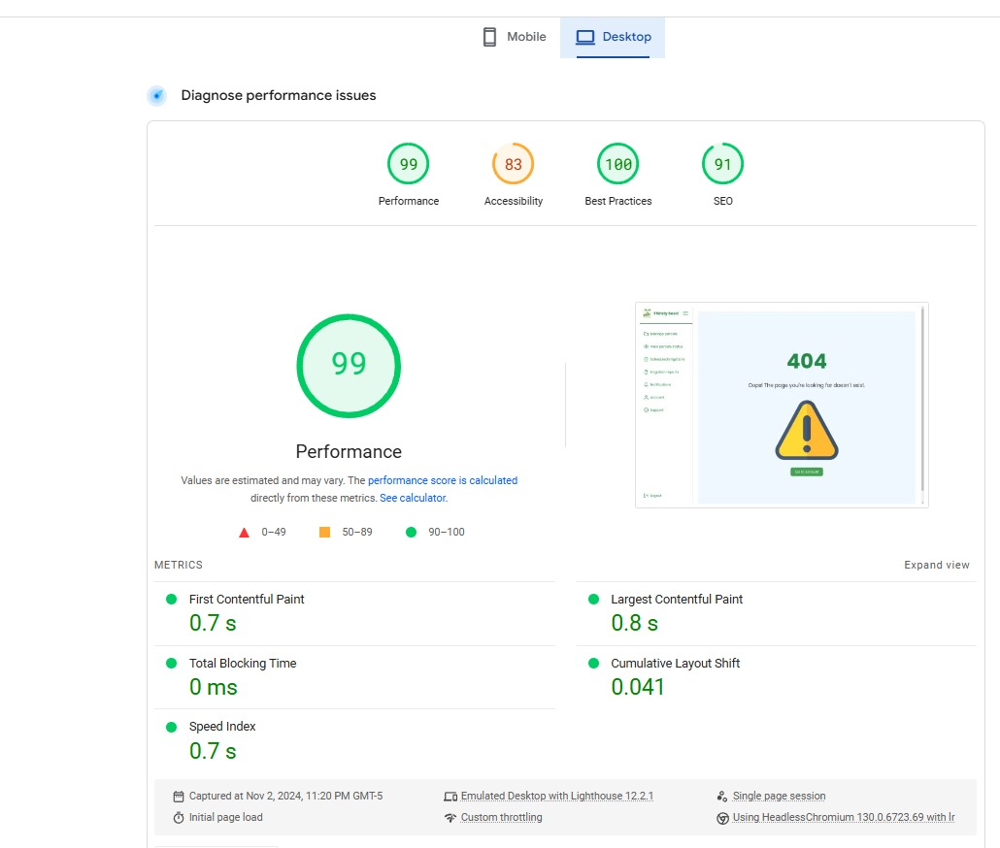

link de donde se realizo el testeo:https://pagespeed.web.dev/analysis/https-thirstyseed-netlify-app/ba3jvvuqwl?hl=en-US&form_factor=desktop 
#### 6.2.2.5.Execution Evidence for Sprint Review.
En esta sección, se abordará la ejecución de la aplicación durante el sprint, resaltando las características y funcionalidades que se han implementado. Durante este periodo, se desarrolló el backend utilizando Spring Boot, donde se establecieron los endpoints necesarios. También se trabajó en la aplicación móvil con Flutter y se implementó el sistema IoT utilizando Wokwi.

#### Ejecucion de la Embedded app
Se puede visualizar la ejecucion del dispositivo IOT mostrando la temperatura como tambien la humedad devolviendo datos en la consola
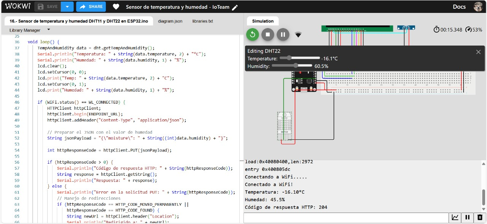
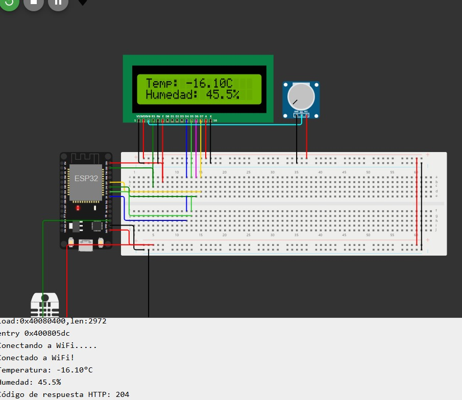

###### Ejecucion del mobile app
Se puede visualizar las distintas vistas referente a nuestra aplicación móvil

## Login 
Esta pantalla permite a los usuarios ingresar a la aplicación utilizando su dirección de correo electrónico y contraseña. Incluye enlaces para recuperar la contraseña olvidada y para registrarse como nuevo usuario.
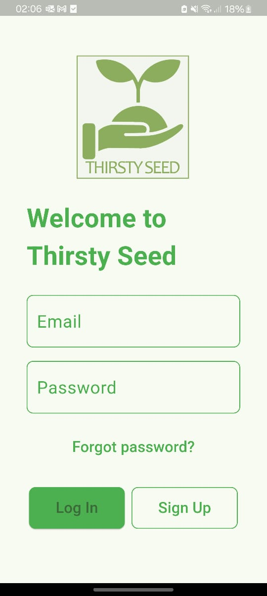

## SIGN UP
Pantalla de registro donde nuevos usuarios pueden crear una cuenta ingresando su nombre, apellido, ciudad, teléfono, correo electrónico y contraseña.
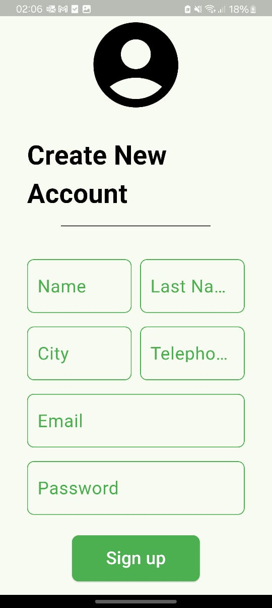

## USER PROFILE
En esta pantalla, los usuarios pueden ver y editar su perfil, que muestra la información personal, la foto de perfil, y las parcelas registradas junto con opciones para gestionar estas parcelas.


## PLOT STATUS
Muestra detalles específicos de una parcela seleccionada como el nombre del terreno, extensión, última fecha de riego y el estado actual de los nodos, con la opción de programar riego directamente desde esta pantalla.
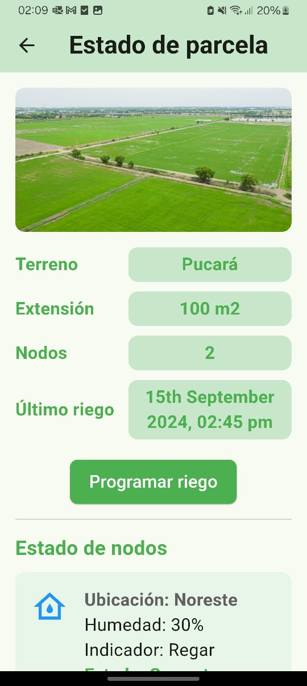

## NODE STATUS
Proporciona información detallada sobre los nodos instalados en una parcela, incluyendo la ubicación del nodo, la humedad actual del suelo, indicaciones para regar y el estado operativo del nodo.
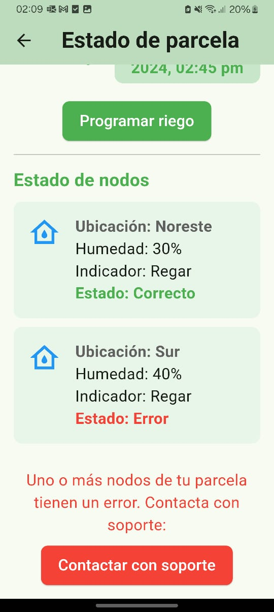

## REGISTERED PLOTS
Pantalla que muestra todas las parcelas registradas por el usuario. Ofrece una funcionalidad de búsqueda y la opción de registrar nuevas parcelas.
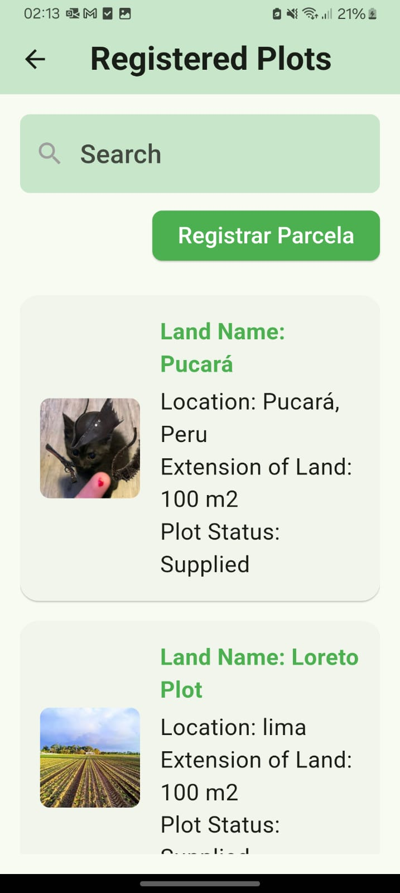

## REGISTER PLOT
Interfaz para agregar una nueva parcela, donde el usuario puede ingresar el nombre del terreno, ubicación, extensión y subir una imagen representativa.
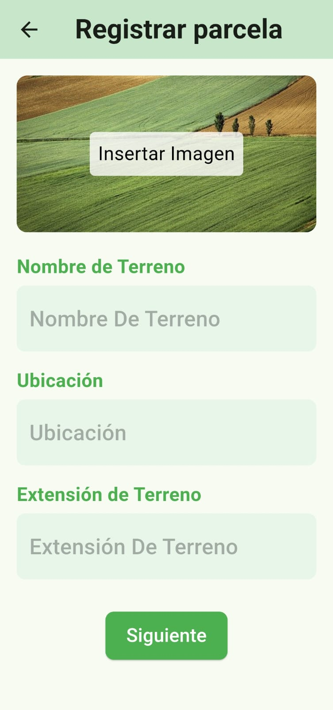

## NODE REGISTRATION
Permite a los usuarios agregar y configurar nuevos nodos a sus parcelas, especificando el nombre del terreno, tipo de nodo y su ubicación.
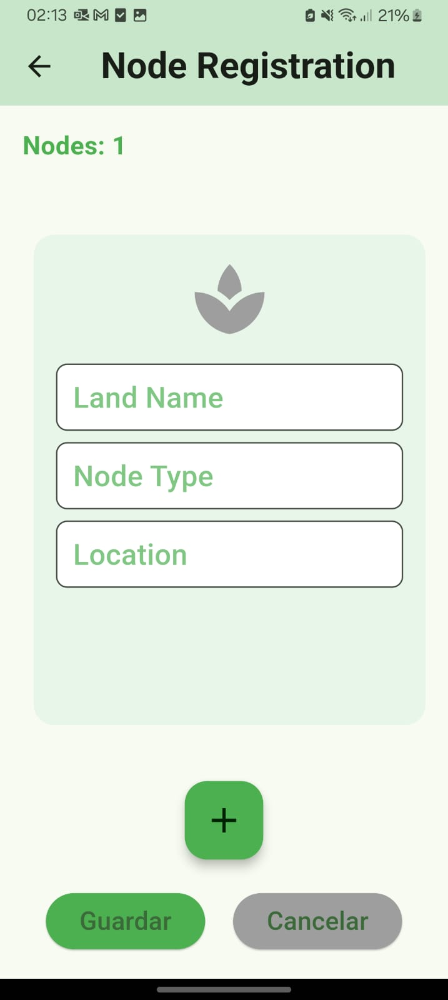

## FORGOT PASSWORD
Una interfaz para recuperar la contraseña donde los usuarios pueden introducir su correo electrónico para recibir instrucciones sobre cómo restablecer su contraseña.
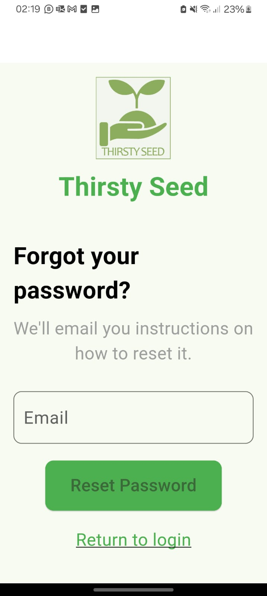

## CREATE IRRIGATION SCHEDULE
Esta pantalla permite a los usuarios configurar un nuevo programa de riego, ajustando parámetros como la presión, el radio del aspersor, la hora de riego, la humedad esperada, el tiempo estimado y el ángulo del aspersor, con opción para modo automático o manual.


--------

#### 6.2.2.6.Services Documentation Evidence for Sprint Review.

### Plots services
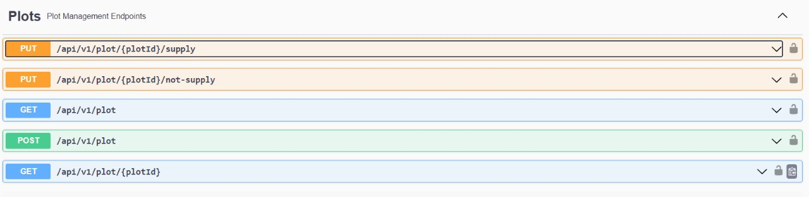

### Nodes services
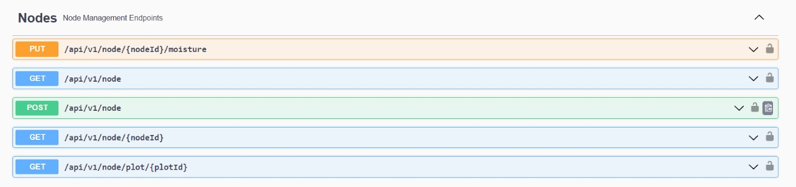

### Schedule services

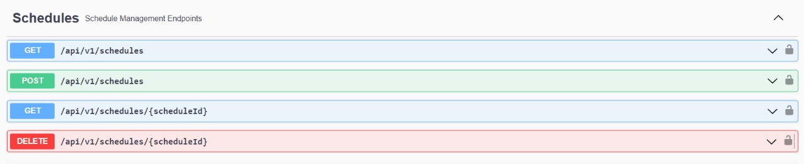

**Link de la página desplegada:** [https://thirstyseedapi-production.up.railway.app/swagger-ui/index.html#/](https://thirstyseedapi-production.up.railway.app/swagger-ui/index.html#/)


#### 6.2.2.7.Software Deployment Evidence for Sprint Review.
En este Sprint, nos enfocamos en el despliegue del producto ThirstySeed.

Desplegamos el backend y la base de datos en Railway, lo que nos permitió una gestión eficiente de ambos componentes. 

Además, se creó el repositorio en GitHub para el control de versiones y la administración del código.

<table border="1" style="width: 100%; text-align: center;">
    <tr>
        <th colspan="2" style="text-align: center;">
            <strong>DESPLIEGUE DEL BACKEND Y BASE DE DATOS</strong>
        </th>
    </tr>
    <tr>
        <td style="text-align: left;">
            <strong>1. Despliegue del Backend en Railway:</strong>
            <br>
            Se configuró el backend de la aplicación en Railway, lo que facilitó la integración y acceso a los servicios desde la aplicación móvil y el sistema IoT.
        </td>
    </tr>
    <tr>
        <td>
          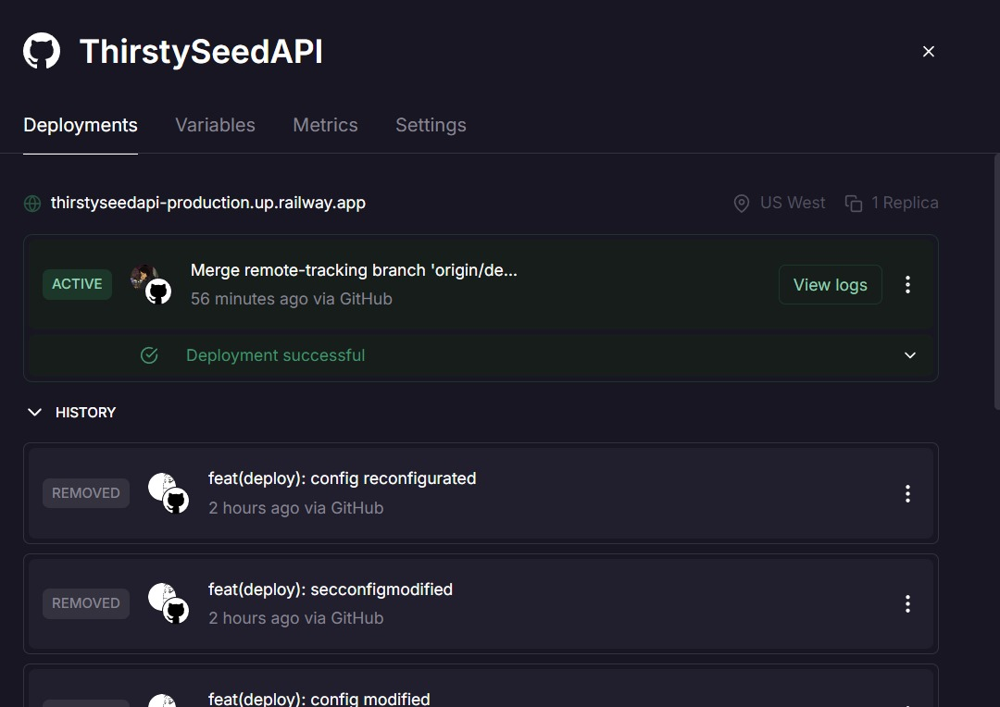
           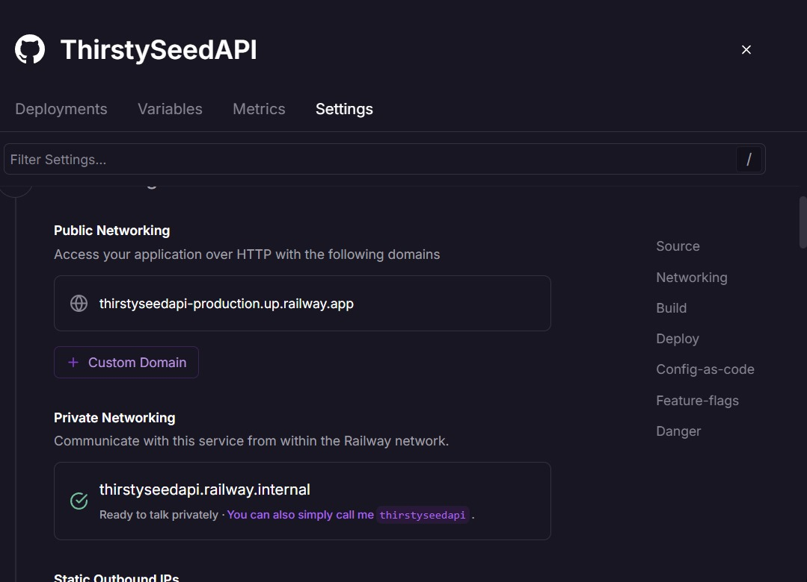
        </td>
    </tr>
    <tr>
        <td style="text-align: left;">
            <strong>2. Despliegue de la Base de Datos en Railway:</strong>
            <br>
            La base de datos fue también desplegada en Railway, asegurando la conectividad y disponibilidad de los datos para el backend y las aplicaciones.
        </td>
    </tr>
    <tr>
        <td>
            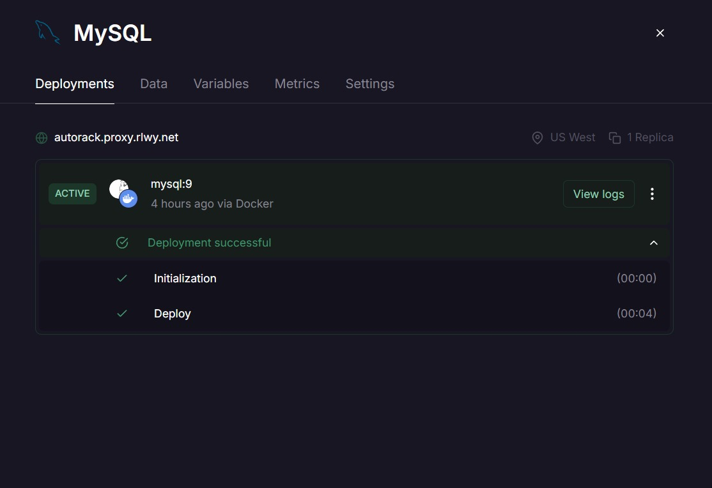
            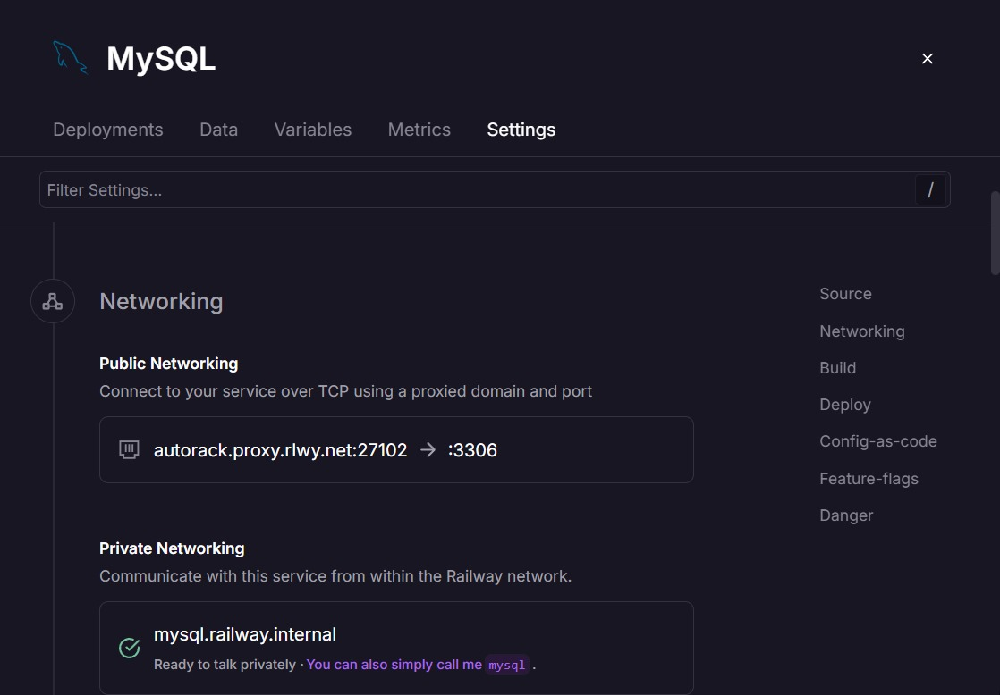
        </td>
    </tr>
</table>


#### 6.2.2.8.Team Collaboration Insights during Sprint.

### 6.2.3. Sprint 3
#### 6.2.3.1. Sprint Planning 3

<table border="1" style="width:100%; text-align: center;">
  <tr>
    <th colspan="2" style="text-align: center;"><strong>Sprint #</strong></th>
    <th colspan="2" style="text-align: center;"><strong>Sprint 3</strong></th>
  </tr>
  <tr>
    <th colspan="4" style="text-align: center;"><strong>Sprint Planning Background</strong></th>
  </tr>
  <tr>
    <td><strong>Date</strong></td>
    <td colspan="3">02/11/2024</td>
  </tr>
  <tr>
    <td><strong>Time</strong></td>
    <td colspan="3">07:00 PM</td>
  </tr>
  <tr>
    <td><strong>Location</strong></td>
    <td colspan="3">Lima, Peru - Meeting held via Discord</td>
  </tr>
  <tr>
    <td><strong>Prepared By</strong></td>
    <td colspan="3">Choque Puma, Shayla Lussiné</td>
  </tr>
  <tr>
    <td><strong>Attendees (to planning meeting)</strong></td>
    <td colspan="3">
      Giakomo Rodolfo Causso Mariano
      <br>
      Kurt Matthews Puican Salas
      <br>
      Rafael Arturo Luyo Ramirez
      <br>
      Manuel Alexis Vargas Quispe
    </td>
  </tr>
    <tr>
    <td><strong>Sprint 3 - Review Summary</strong></td>
    <td colspan="3">
      Durante el Sprint 3, se implementaron la landing page y la aplicación web, 
      incluyendo la gestión de parcelas, nodos y la planificación de riego dentro 
      del bounded context de irrigation. El equipo destacó el avance logrado, 
      mencionando desafíos en la integración de la planificación de riego. 
      El Product Owner sugirió continuar con el desarrollo de los demás bounded 
      contexts de la plataforma y agregar el cambio de idioma en la aplicación web.
    </td>
  </tr>
    </tr>
    <tr>
    <td><strong>Sprint 3 - Retrospective Summary</strong></td>
    <td colspan="3">
      Durante el Sprint 3, destacamos la buena comunicación y el equilibrio en el trabajo en equipo, donde todos contribuimos con nuestras fortalezas. GitHub fue la herramienta clave para el manejo de versiones y la revisión de avances. Como oportunidad de mejora, identificamos la necesidad de organizar mejor nuestro tiempo personal y definir más claramente las tareas. El mayor desafío fue el margen casi nulo para finalizar los archivos antes de la entrega, lo cual evidenció cierta descoordinación. Aunque la carga de trabajo fue adecuada, consideramos que podríamos equilibrarla mejor con una organización y definición más detallada de las tareas.
    </td>
  </tr>
  <tr>
    <th colspan="4" style="text-align: center;"><strong>Sprint Goal & User Stories</strong></th>
  </tr>
  <tr>
    <td><strong>Sprint Goal</strong></td>
    <td colspan="3">
      Nuestro foco es implementar los bounded contexts de IAM, Profile y Subscriptions en el API Service, integrando estas funcionalidades tanto en la aplicación web como en la móvil. En el caso de la aplicación móvil, se integrarán y completarán las vistas para administrar terrenos, nodos y planificar riegos manuales y automáticos, así como la activación de riegos. También terminaremos la implementación del Edge Service, que manejará los nodos y recibirá datos actualizados del sistema. Asimismo, actualizaremos la aplicación embebida para que los datos de monitoreo de humedad sean enviados al Edge Service, y este, a su vez, se conecte con el API Service. Además, optimizaremos la landing page para mostrar con mayor claridad los planes disponibles en la plataforma. Finalmente, trabajaremos en la versión funcional del prototipo físico del dispositivo IoT.
      Creemos que esto permitirá ofrecer nuevas funcionalidades clave para cada segmento de usuario. Los agricultores podrán monitorear y controlar su sistema de riego de forma más eficiente mediante la integración de las aplicaciones web y móvil con los nuevos bounded contexts. Por otro lado, el prototipo físico y la actualización de los servicios validarán la solución de hardware y software en conjunto. Además, la optimización de la landing page atraerá y convertirá nuevos usuarios interesados en los planes de la plataforma.
      Esto será confirmado cuando:  Los usuarios puedan administrar terrenos, nodos y planificar riegos desde las aplicaciones web y móvil utilizando los nuevos bounded contexts del API Service. El Edge Service reciba datos de la aplicación embebida y los transmita correctamente al API Service. El prototipo físico esté operativo y listo para pruebas iniciales. La landing page sea capaz de mostrar claramente los planes de la plataforma y redirigir a los usuarios hacia la aplicación web. Los desarrolladores validen las nuevas funcionalidades mediante pruebas completas de integración entre los componentes.
    </td>
  </tr>
  <tr>
    <td><strong>Sprint Velocity</strong></td>
    <td colspan="3">
      50
    </td>
  </tr>
  <tr>
    <td><strong>Sum of Story Points</strong></td>
    <td colspan="3">60 story points</td>
  </tr>
</table>

#### 6.2.3.2. Sprint Backlog 3

Para la planificación y monitoreo de tareas durante el presente sprint, utilizamos Trello como herramienta de gestión de proyectos para organizar, priorizar y hacer seguimiento del avance de cada actividad. Puedes acceder al Sprint Backlog en el siguiente enlace:

[Trello - Sprint Backlog 3](https://trello.com/b/UyPa4XMg/sprint-backlog-3)

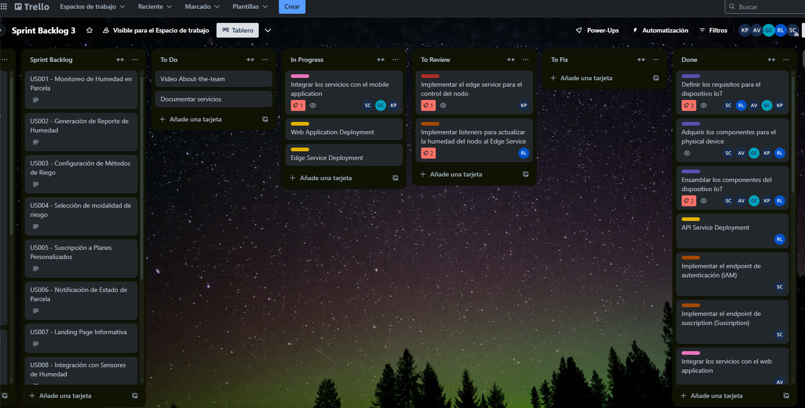

<table border="1">
  <thead>
    <tr>
      <th colspan="2">Sprint #</th>
      <th colspan="6">Sprint 3</th>
    </tr>
    <tr>
      <th colspan="2">User Story</th>
      <th colspan="6">Work-Item / Task</th>
    </tr>
    <tr>
      <th>Id</th>
      <th>Title</th>
      <th>Id</th>
      <th>Title</th>
      <th>Description</th>
      <th>Estimation (Hours)</th>
      <th>Assigned To</th>
      <th>Status (To-do / In-Process / To-Review / Done)</th>
    </tr>
  </thead>
  <tbody>
    <tr>
      <td rowspan="2">US001</td>
      <td rowspan="2">Monitoreo de Humedad en Parcela</td>
      <td>1</td>
      <td>Realizar configuración del dispositivo IoT</td>
      <td>Configurar dispositivo para monitoreo de humedad (Embedded Application)</td>
      <td>8</td>
      <td>Kurt Puican, Alexis Vargas</td>
      <td>done</td>
    </tr>
    <tr>
      <td>2</td>
      <td>Realizar funcionalidad detección de humedad</td>
      <td>Implementar funcionalidad para detectar la humedad con sensores IoT (Embedded Application)</td>
      <td>6</td>
      <td>Kurt Puican, Rafael Luyo</td>
      <td>Done</td>
    </tr>
    <tr>
      <td rowspan="2">US002</td>
      <td rowspan="2">Generación de Reporte de Humedad</td>
      <td>3</td>
      <td>Realizar reporte de riego mensual</td>
      <td>Generar reporte mensual basado en datos de humedad (Web Application)</td>
      <td>7</td>
      <td>Giakomo Causso</td>
      <td>In-Process</td>
    </tr>
    <tr>
      <td>4</td>
      <td>Visualizar reportes generados</td>
      <td>Interfaz para mostrar reportes de riego (Web Application)</td>
      <td>4</td>
      <td>Shayla Choque</td>
      <td>Done</td>
    </tr>
    <tr>
      <td rowspan="2">US003</td>
      <td rowspan="2">Configuración de Métodos de Riego</td>
      <td>5</td>
      <td>Realizar modo de riego</td>
      <td>Implementar diferentes modos de riego (manual, automático) (Web Application)</td>
      <td>5</td>
      <td>Shayla Choque</td>
      <td>Done</td>
    </tr>
    <tr>
      <td>6</td>
      <td>Implementar planificación de riego</td>
      <td>Planificación basada en datos meteorológicos (Web Application)</td>
      <td>6</td>
      <td>Shayla Choque</td>
      <td>Done</td>
    </tr>
    <tr>
      <td>US004</td>
      <td>Selección de modalidad de riego</td>
      <td>7</td>
      <td>Realizar funcionalidad para activar aspersor</td>
      <td>Funcionalidad para activar el aspersor manualmente (Web Application)</td>
      <td>4</td>
      <td>Alexis Vargas</td>
      <td>Done</td>
    </tr>
    <tr>
      <td rowspan="2">US005</td>
      <td rowspan="2">Suscripción a Planes Personalizados</td>
      <td>8</td>
      <td>Realizar bounded context suscription</td>
      <td>Definir contexto de bounded context para suscripciones (Web Application)</td>
      <td>6</td>
      <td>Shayla Choque, Giakomo Causso, Alexis Vargas, Kurt Puican, Rafael Luyo</td>
      <td>Done</td>
    </tr>
    <tr>
      <td>9</td>
      <td>Visualizar suscripciones de usuarios</td>
      <td>Mostrar las suscripciones de los usuarios en la aplicación (Web Application)</td>
      <td>5</td>
      <td>Shayla Choque</td>
      <td>Done</td>
    </tr>
    <tr>
      <td>US006</td>
      <td>Notificación de Estado de Parcela</td>
      <td>10</td>
      <td>Realizar bounded context notifications</td>
      <td>Definir contexto de notificaciones (Web Application)</td>
      <td>5</td>
      <td>Shayla Choque, Giakomo Causso, Alexis Vargas, Kurt Puican, Rafael Luyo</td>
      <td>To-do</td>
    </tr>
    <tr>
      <td>US008</td>
      <td>Integración con Sensores de Humedad</td>
      <td>12</td>
      <td>Integrar sensores de humedad con sistema IoT</td>
      <td>Implementar la integración de sensores para la recolección de datos (Embedded Application)</td>
      <td>8</td>
      <td>Kurt Puican, Rafael Luyo</td>
      <td>Done</td>
    </tr>
    <tr>
      <td>US009</td>
      <td>API RESTful para Reportes</td>
      <td>13</td>
      <td>Cors configuration for API Application</td>
      <td>Configurar CORS para permitir el acceso desde distintas aplicaciones (API Service)</td>
      <td>3</td>
      <td>Shayla Choque</td>
      <td>Done</td>
    </tr>
    <tr>
      <td rowspan="2">US010</td>
      <td rowspan="2">Personalización de Notificaciones</td>
      <td>14</td>
      <td>Realizar funcionalidad detección de humedad</td>
      <td>Implementar funcionalidad para detectar humedad en el sistema embebido (Embedded Application)</td>
      <td>5</td>
      <td>Kurt Puican, Rafael Luyo</td>
      <td>Done</td>
    </tr>
    <tr>
      <td>15</td>
      <td>Realiza funcionalidad detección de temperatura</td>
      <td>Implementar funcionalidad para detectar la temperatura en el sistema embebido (Embedded Application)</td>
      <td>5</td>
      <td>Kurt Puican, Rafael Luyo</td>
      <td>Done</td>
    </tr>
    <tr>
      <td rowspan="2">US011</td>
      <td rowspan="2">Despliegue de Servicios</td>
      <td>16</td>
      <td>Despliegue del database</td>
      <td>Realizar el despliegue del servicio de base de datos (Deployment)</td>
      <td>4</td>
      <td>Rafael Luyo</td>
      <td>Done</td>
    </tr>
    <tr>
      <td>17</td>
      <td>Despliegue de API Service</td>
      <td>Realizar el despliegue del servicio de API (Deployment)</td>
      <td>4</td>
      <td>Rafael Luyo</td>
      <td>Done</td>
    </tr>
  </tbody>
</table>

#### 6.2.3.3. Development Evidence for Sprint Review

##### Historial de commits del sprint 3
<table border="1" class="dataframe">
  <thead>
    <tr style="text-align: right;">
      <th>Repository</th>
      <th>Branch</th>
      <th>Commit Id</th>
      <th>Commit Message</th>
      <th>Committed on (Date)</th>
      <th>Author</th>
    </tr>
  </thead>
  <tbody>
    <tr>
      <td>ThirstySeedMobileApplication</td>
      <td>origin/feature/IAM</td>
      <td>92280bc</td>
      <td>update: payment</td>
      <td>2024-11-17</td>
      <td>GiaKode</td>
    </tr>
    <tr>
      <td>ThirstySeedMobileApplication</td>
      <td>origin/feature/IAM</td>
      <td>d7e10d8</td>
      <td>update: payment</td>
      <td>2024-11-17</td>
      <td>GiaKode</td>
    </tr>
    <tr>
      <td>ThirstySeedMobileApplication</td>
      <td>develop</td>
      <td>02f8fba</td>
      <td>Merge pull request #6 from Grupo-3-IoTeam/feature/PlotV1, update: ViewPlotxProfile</td>
      <td>2024-11-17</td>
      <td>Giakomo Causso Mariano</td>
    </tr>
    <tr>
      <td>ThirstySeedMobileApplication</td>
      <td>origin/feature/PlotV1</td>
      <td>4aedf0d</td>
      <td>update: ViewPlotxProfile</td>
      <td>2024-11-17</td>
      <td>GiaKode</td>
    </tr>
    <tr>
      <td>ThirstySeedMobileApplication</td>
      <td>develop</td>
      <td>6e7b0c3</td>
      <td>Merge branch 'develop'</td>
      <td>2024-11-17</td>
      <td>Shayla Choque</td>
    </tr>
    <tr>
      <td>ThirstySeedMobileApplication</td>
      <td>develop</td>
      <td>c406003</td>
      <td>Merge branch 'feature/schedule' into develop</td>
      <td>2024-11-17</td>
      <td>Shayla Choque</td>
    </tr>
    <tr>
      <td>ThirstySeedMobileApplication</td>
      <td>develop</td>
      <td>357cad5</td>
      <td>feat: implement add schedule feat</td>
      <td>2024-11-17</td>
      <td>Shayla Choque</td>
    </tr>
    <tr>
      <td>ThirstySeedMobileApplication</td>
      <td>develop</td>
      <td>3279bc1</td>
      <td>Merge branch 'develop'</td>
      <td>2024-11-17</td>
      <td>Shayla Choque</td>
    </tr>
    <tr>
      <td>ThirstySeedMobileApplication</td>
      <td>develop</td>
      <td>0347ff9</td>
      <td>clean</td>
      <td>2024-11-17</td>
      <td>Shayla Choque</td>
    </tr>
    <tr>
      <td>ThirstySeedMobileApplication</td>
      <td>develop</td>
      <td>d8006f0</td>
      <td>del</td>
      <td>2024-11-17</td>
      <td>Shayla Choque</td>
    </tr>
    <tr>
      <td>ThirstySeedMobileApplication</td>
      <td>develop</td>
      <td>5f61546</td>
      <td>delete</td>
      <td>2024-11-17</td>
      <td>Shayla Choque</td>
    </tr>
    <tr>
      <td>ThirstySeedMobileApplication</td>
      <td>develop</td>
      <td>5c88d9b</td>
      <td>Merge pull request #5 from Grupo-3-IoTeam/develop, Develop</td>
      <td>2024-11-17</td>
      <td>Shayla Choque</td>
    </tr>
    <tr>
      <td>ThirstySeedMobileApplication</td>
      <td>develop</td>
      <td>5d3c909</td>
      <td>Merge pull request #4 from Grupo-3-IoTeam/feature/schedule, update develop</td>
      <td>2024-11-17</td>
      <td>Shayla Choque</td>
    </tr>
    <tr>
      <td>ThirstySeedMobileApplication</td>
      <td>feature/schedule</td>
      <td>2cd625c</td>
      <td>Merge branch 'develop' into feature/schedule</td>
      <td>2024-11-17</td>
      <td>Shayla Choque</td>
    </tr>
    <tr>
      <td>ThirstySeedMobileApplication</td>
      <td>feature/schedule</td>
      <td>f0254e8</td>
      <td>fix: change directory</td>
      <td>2024-11-17</td>
      <td>Shayla Choque</td>
    </tr>
    <tr>
      <td>ThirstySeedMobileApplication</td>
      <td>feature/schedule</td>
      <td>b42d770</td>
      <td>.,.</td>
      <td>2024-11-17</td>
      <td>Shayla Choque</td>
    </tr>
    <tr>
      <td>ThirstySeedMobileApplication</td>
      <td>feature/schedule</td>
      <td>371fe1a</td>
      <td>feat: implement schedules</td>
      <td>2024-11-17</td>
      <td>Shayla Choque</td>
    </tr>
    <tr>
      <td>ThirstySeedMobileApplication</td>
      <td>origin/feature/IAM</td>
      <td>92280bc</td>
      <td>update: payment</td>
      <td>2024-11-17</td>
      <td>GiaKode</td>
    </tr>
    <tr>
      <td>ThirstySeedMobileApplication</td>
      <td>origin/feature/lol</td>
      <td>801cf5f</td>
      <td>fix/feature-register-plot</td>
      <td>2024-11-16</td>
      <td>Kurt Puican</td>
    </tr>
    <tr>
      <td>ThirstySeedMobileApplication</td>
      <td>origin/feature/plot_screen</td>
      <td>4fedd04</td>
      <td>fix/plot_screen</td>
      <td>2024-11-16</td>
      <td>Kurt Puican</td>
    </tr>
    <tr>
      <td>ThirstySeedWebApplication</td>
      <td>origin/feature/change-details</td>
      <td>898a803</td>
      <td>feat(change-details): add status button</td>
      <td>2024-11-18</td>
      <td>RafaelLuyo</td>
    </tr>
    <tr>
      <td>ThirstySeedWebApplication</td>
      <td>origin/feature/change-details</td>
      <td>71d7647</td>
      <td>feat: add style plot's</td>
      <td>2024-11-18</td>
      <td>Alexis Vargas</td>
    </tr>
    <tr>
      <td>ThirstySeedWebApplication</td>
      <td>develop, origin/main, origin/develop, main</td>
      <td>fb16d8d</td>
      <td>NaN</td>
      <td>2024-11-18</td>
      <td>Shayla Choque</td>
    </tr>
    <tr>
      <td>ThirstySeedWebApplication</td>
      <td>develop</td>
      <td>df0f2ed</td>
      <td>Merge branch 'feature/test' into develop</td>
      <td>2024-11-18</td>
      <td>Shayla Choque</td>
    </tr>
    <tr>
      <td>ThirstySeedWebApplication</td>
      <td>origin/feature/test, feature/test</td>
      <td>8df50e7</td>
      <td>feat: implement subscription</td>
      <td>2024-11-18</td>
      <td>Shayla Choque</td>
    </tr>
    <tr>
      <td>ThirstySeedWebApplication</td>
      <td>develop</td>
      <td>73002b5</td>
      <td>feat(test): subscription added</td>
      <td>2024-11-18</td>
      <td>RafaelLuyo</td>
    </tr>
    <tr>
      <td>ThirstySeedWebApplication</td>
      <td>develop</td>
      <td>3fbd56d</td>
      <td>feat(test): not found and side navigation fixed</td>
      <td>2024-11-17</td>
      <td>RafaelLuyo</td>
    </tr>
    <tr>
      <td>ThirstySeedWebApplication</td>
      <td>develop</td>
      <td>03911cb</td>
      <td>feat: 1ra version login</td>
      <td>2024-11-17</td>
      <td>Alexis Vargas</td>
    </tr>
    <tr>
      <td>ThirstySeedWebApplication</td>
      <td>develop</td>
      <td>3d2e8d0</td>
      <td>feat: edit redirection link</td>
      <td>2024-11-17</td>
      <td>Alexis Vargas</td>
    </tr>
    <tr>
      <td>ThirstySeedWebApplication</td>
      <td>develop</td>
      <td>0f86417</td>
      <td>feat: add logic i18n and translate</td>
      <td>2024-11-17</td>
      <td>Alexis Vargas</td>
    </tr>
    <tr>
      <td>ThirstySeedWebApplication</td>
      <td>origin/feature/profile-corrections, feature/profile-corrections</td>
      <td>2281808</td>
      <td>feat: implement profile and account</td>
      <td>2024-11-17</td>
      <td>Shayla Choque</td>
    </tr>
    <tr>
      <td>ThirstySeedWebApplication</td>
      <td>develop</td>
      <td>7051867</td>
      <td>feat(test): nodes modified</td>
      <td>2024-11-17</td>
      <td>RafaelLuyo</td>
    </tr>
    <tr>
      <td>ThirstySeedWebApplication</td>
      <td>develop</td>
      <td>e0008c5</td>
      <td>feat: add styles in the component plot</td>
      <td>2024-11-17</td>
      <td>Alexis Vargas</td>
    </tr>
    <tr>
      <td>ThirstySeedWebApplication</td>
      <td>develop</td>
      <td>a013009</td>
      <td>feat(test): commentaries off</td>
      <td>2024-11-17</td>
      <td>RafaelLuyo</td>
    </tr>
    <tr>
      <td>ThirstySeedWebApplication</td>
      <td>develop</td>
      <td>fc5f7f5</td>
      <td>feat(test): plot modified</td>
      <td>2024-11-17</td>
      <td>RafaelLuyo</td>
    </tr>
    <tr>
      <td>ThirstySeedWebApplication</td>
      <td>develop</td>
      <td>5773315</td>
      <td>feat: I hope it doesn't fail</td>
      <td>2024-11-17</td>
      <td>Alexis Vargas</td>
    </tr>
    <tr>
      <td>ThirstySeedWebApplication</td>
      <td>develop</td>
      <td>a4d0b8c</td>
      <td>implement login screen</td>
      <td>2024-11-17</td>
      <td>Shayla Choque</td>
    </tr>
    <tr>
      <td>ThirstySeedWebApplication</td>
      <td>origin/feature/install-nodes</td>
      <td>453b326</td>
      <td>fix: new version nodes and plot's</td>
      <td>2024-11-14</td>
      <td>Alexis Vargas</td>
    </tr>
    <tr>
      <td>ThirstySeedWebApplication</td>
      <td>origin/feature/install-nodes</td>
      <td>3a77094</td>
      <td>aa</td>
      <td>2024-11-14</td>
      <td>Alexis Vargas</td>
    </tr>
    <tr>
      <td>ThirstySeedWebApplication</td>
      <td>develop</td>
      <td>393fd1a</td>
      <td>Merge pull request #29 from Grupo-3-IoTeam/feature/plotv2,"feat(plot): plot status view modified"</td>
      <td>2024-11-12</td>
      <td>Rafael Luyo</td>
    </tr>
    <tr>
      <td>ThirstySeedWebApplication</td>
      <td>origin/feature/plotv2</td>
      <td>51263c5</td>
      <td>feat(plot): plot status view modified</td>
      <td>2024-11-12</td>
      <td>RafaelLuyo</td>
    </tr>
    <tr>
      <td>ThirstySeedWebApplication</td>
      <td>develop</td>
      <td>36ceaf9</td>
      <td>feat(plotv2): plot register component modified</td>
      <td>2024-11-11</td>
      <td>RafaelLuyo</td>
    </tr>
    <tr>
      <td>ThirstySeedAPI</td>
      <td>main</td>
      <td>643a3c6</td>
      <td>feat_x000D_\nattribute to schedule response</td>
      <td>2024-11-17</td>
      <td>Shayla Choque</td>
    </tr>
    <tr>
      <td>ThirstySeedAPI</td>
      <td>main</td>
      <td>0bfaec5</td>
      <td>feat_x000D_\nattribute to schedule response</td>
      <td>2024-11-17</td>
      <td>Shayla Choque</td>
    </tr>
    <tr>
      <td>ThirstySeedAPI</td>
      <td>main</td>
      <td>8c33141</td>
      <td>hot-fix: Rename repository function</td>
      <td>2024-11-17</td>
      <td>Shayla Choque</td>
    </tr>
    <tr>
      <td>ThirstySeedAPI</td>
      <td>main</td>
      <td>3cbff43</td>
      <td>fix: delete unused import</td>
      <td>2024-11-17</td>
      <td>Shayla Choque</td>
    </tr>
    <tr>
      <td>ThirstySeedAPI</td>
      <td>main</td>
      <td>92848ad</td>
      <td>Merge branch 'develop'</td>
      <td>2024-11-17</td>
      <td>Shayla Choque</td>
    </tr>
    <tr>
      <td>ThirstySeedAPI</td>
      <td>feature/new-queries</td>
      <td>4de24be</td>
      <td>feat: Add new queries for profile</td>
      <td>2024-11-17</td>
      <td>Shayla Choque</td>
    </tr>
    <tr>
      <td>ThirstySeedAPI</td>
      <td>feature/new-queries</td>
      <td>f65c684</td>
      <td>Merge branch 'develop'</td>
      <td>2024-11-17</td>
      <td>Shayla Choque</td>
    </tr>
    <tr>
      <td>ThirstySeedAPI</td>
      <td>feature/new-queries</td>
      <td>c9dea88</td>
      <td>feat: Add new queries for schedule</td>
      <td>2024-11-17</td>
      <td>Shayla Choque</td>
    </tr>
    <tr>
      <td>ThirstySeedAPI</td>
      <td>feature/new-queries</td>
      <td>3b2e8b8</td>
      <td>feat: allow all origins</td>
      <td>2024-11-17</td>
      <td>Shayla Choque</td>
    </tr>
    <tr>
      <td>ThirstySeedAPI</td>
      <td>feature/new-queries</td>
      <td>3a23350</td>
      <td>Update application.properties</td>
      <td>2024-11-16</td>
      <td>Rafael Luyo</td>
    </tr>
    <tr>
      <td>ThirstySeedAPI</td>
      <td>feature/new-queries</td>
      <td>ef46d2f</td>
      <td>Update application.properties</td>
      <td>2024-11-16</td>
      <td>Rafael Luyo</td>
    </tr>
    <tr>
      <td>ThirstySeedAPI</td>
      <td>feature/new-queries</td>
      <td>3037ba6</td>
      <td>Merge branch 'main' into develop</td>
      <td>2024-11-16</td>
      <td>Shayla Choque</td>
    </tr>
    <tr>
      <td>ThirstySeedAPI</td>
      <td>feature/new-queries</td>
      <td>a2bbf24</td>
      <td>feat: enable delete method</td>
      <td>2024-11-16</td>
      <td>Shayla Choque</td>
    </tr>
    <tr>
      <td>ThirstySeedAPI</td>
      <td>feature/new-queries</td>
      <td>df06c2e</td>
      <td>Merge branch 'develop'</td>
      <td>2024-11-16</td>
      <td>Shayla Choque</td>
    </tr>
    <tr>
      <td>ThirstySeedAPI</td>
      <td>feature/new-queries</td>
      <td>9acc3bd</td>
      <td>feat: implement delete endpoints for user, profile and subscription</td>
      <td>2024-11-16</td>
      <td>Shayla Choque</td>
    </tr>
    <tr>
      <td>ThirstySeedAPI</td>
      <td>feature/new-queries</td>
      <td>a5e609b</td>
      <td>Merge branch 'develop'</td>
      <td>2024-11-16</td>
      <td>Shayla Choque</td>
    </tr>
    <tr>
      <td>ThirstySeedAPI</td>
      <td>feature/new-queries</td>
      <td>6569999999999999731204223439598518272</td>
      <td>fix: enable requests for all endpoints</td>
      <td>2024-11-16</td>
      <td>Shayla Choque</td>
    </tr>
    <tr>
      <td>ThirstySeedAPI</td>
      <td>feature/new-queries</td>
      <td>435944e</td>
      <td>Merge branch 'develop'</td>
      <td>2024-11-16</td>
      <td>Shayla Choque</td>
    </tr>
    <tr>
      <td>ThirstySeedAPI</td>
      <td>feature/new-queries</td>
      <td>20f8797</td>
      <td>fix: unable requests for all endpoints</td>
      <td>2024-11-16</td>
      <td>Shayla Choque</td>
    </tr>
    <tr>
      <td>ThirstySeedAPI</td>
      <td>feature/new-queries</td>
      <td>f4b2a26</td>
      <td>fix: update db credentials</td>
      <td>2024-11-15</td>
      <td>Shayla Choque</td>
    </tr>
    <tr>
      <td>ThirstySeedAPI</td>
      <td>origin/no-auth</td>
      <td>c14a7f5</td>
      <td>update: enable endpoints</td>
      <td>2024-11-15</td>
      <td>Shayla Choque</td>
    </tr>
    <tr>
      <td>ThirstySeedAPI</td>
      <td>origin/no-auth</td>
      <td>2d06c2c</td>
      <td>fix: delete unused imports</td>
      <td>2024-11-15</td>
      <td>Shayla Choque</td>
    </tr>
    <tr>
      <td>ThirstySeedAPI</td>
      <td>origin/no-auth</td>
      <td>e877a5e</td>
      <td>update: refactor security chain</td>
      <td>2024-11-15</td>
      <td>Shayla Choque</td>
    </tr>
    <tr>
      <td>ThirstySeedAPI</td>
      <td>origin/no-auth</td>
      <td>55c54cd</td>
      <td>Merge pull request #13 from Grupo-3-IoTeam/develop</td>
      <td>2024-11-14</td>
      <td>Rafael Luyo</td>
    </tr>
    <tr>
      <td>ThirstySeedAPI</td>
      <td>origin/no-auth</td>
      <td>aaee09b</td>
      <td>feat(properties): application properties modified</td>
      <td>2024-11-14</td>
      <td>Rafael Luyo</td>
    </tr>
    <tr>
      <td>ThirstySeedAPI</td>
      <td>origin/no-auth</td>
      <td>9c31b9a</td>
      <td>Merge pull request #12 from Grupo-3-IoTeam/develop</td>
      <td>2024-11-14</td>
      <td>Rafael Luyo</td>
    </tr>
    <tr>
      <td>ThirstySeedAPI</td>
      <td>origin/no-auth</td>
      <td>6bd52df</td>
      <td>Merge pull request #11 from Grupo-3-IoTeam/feature/schedulev2</td>
      <td>2024-11-14</td>
      <td>Rafael Luyo</td>
    </tr>
    <tr>
      <td>ThirstySeedAPI</td>
      <td>origin/feature/schedulev2</td>
      <td>781d47e</td>
      <td>feat(schedule): schedule update added</td>
      <td>2024-11-14</td>
      <td>Rafael Luyo</td>
    </tr>
    <tr>
      <td>ThirstySeedAPI</td>
      <td>origin/feature/schedulev3</td>
      <td>6a12fcd</td>
      <td>Merge pull request #10 from Grupo-3-IoTeam/develop</td>
      <td>2024-11-14</td>
      <td>Kurt Puican Salas</td>
    </tr>
    <tr>
      <td>ThirstySeedAPI</td>
      <td>origin/feature/schedulev4</td>
      <td>85d23f8</td>
      <td>Merge branch 'main' into develop</td>
      <td>2024-11-14</td>
      <td>Kurt Puican Salas</td>
    </tr>
    <tr>
      <td>ThirstySeedAPI</td>
      <td>origin/feature/plotupdel</td>
      <td>c6eb50e</td>
      <td>feature/plot_x000D_\nand delete</td>
      <td>2024-11-14</td>
      <td>Kurt Puican</td>
    </tr>
    <tr>
      <td>ThirstySeedAPI</td>
      <td>origin/feature/plotupdel</td>
      <td>ba609a9</td>
      <td>Merge pull request #9 from Grupo-3-IoTeam/feature/plotupdel</td>
      <td>2024-11-14</td>
      <td>Kurt Puican Salas</td>
    </tr>
    <tr>
      <td>ThirstySeedAPI</td>
      <td>origin/feature/plotupdel</td>
      <td>bbe33fe</td>
      <td>Merge branch 'feature/subscriptions' into develop</td>
      <td>2024-11-14</td>
      <td>Shayla Choque</td>
    </tr>
    <tr>
      <td>ThirstySeedAPI</td>
      <td>origin/feature/subscriptions</td>
      <td>841aa9f</td>
      <td>fix: refactor aggregates</td>
      <td>2024-11-14</td>
      <td>Shayla Choque</td>
    </tr>
    <tr>
      <td>ThirstySeedAPI</td>
      <td>origin/feature/subscriptions</td>
      <td>cb4d9bd</td>
      <td>fix: delete unused imports</td>
      <td>2024-11-14</td>
      <td>Shayla Choque</td>
    </tr>
    <tr>
      <td>ThirstySeedAPI</td>
      <td>origin/feature/subscriptions</td>
      <td>3f13bfe</td>
      <td>update: integrate new headers and properties</td>
      <td>2024-11-14</td>
      <td>Shayla Choque</td>
    </tr>
    <tr>
      <td>ThirstySeedAPI</td>
      <td>origin/feature/subscriptions</td>
      <td>583995b</td>
      <td>feat: implement interfaces layer</td>
      <td>2024-11-14</td>
      <td>Shayla Choque</td>
    </tr>
    <tr>
      <td>ThirstySeedAPI</td>
      <td>origin/feature/subscriptions</td>
      <td>fb58cee</td>
      <td>feat: implement interfaces layer</td>
      <td>2024-11-14</td>
      <td>Shayla Choque</td>
    </tr>
    <tr>
      <td>ThirstySeedAPI</td>
      <td>origin/feature/subscriptions</td>
      <td>c929e35</td>
      <td>feat: implement infrastructure layer</td>
      <td>2024-11-14</td>
      <td>Shayla Choque</td>
    </tr>
    <tr>
      <td>ThirstySeedAPI</td>
      <td>origin/feature/subscriptions</td>
      <td>568801f</td>
      <td>feat: implement domain layer</td>
      <td>2024-11-14</td>
      <td>Shayla Choque</td>
    </tr>
    <tr>
      <td>ThirstySeedAPI</td>
      <td>origin/feature/subscriptions</td>
      <td>b9f74bb</td>
      <td>Merge pull request #8 from Grupo-3-IoTeam/feature/nodev4</td>
      <td>2024-11-14</td>
      <td>Rafael Luyo</td>
    </tr>
    <tr>
      <td>ThirstySeedAPI</td>
      <td>origin/feature/nodev4</td>
      <td>16b66a5</td>
      <td>feat(node): node update and delete endpoints added</td>
      <td>2024-11-14</td>
      <td>Rafael Luyo</td>
    </tr>
    <tr>
      <td>ThirstySeedAPI</td>
      <td>origin/feature/profile</td>
      <td>667324f</td>
      <td>update: db credentials</td>
      <td>2024-11-13</td>
      <td>Shayla Choque</td>
    </tr>
    <tr>
      <td>ThirstySeedAPI</td>
      <td>origin/feature/profile</td>
      <td>e6e4711</td>
      <td>feat: implement interfaces layer</td>
      <td>2024-11-13</td>
      <td>Shayla Choque</td>
    </tr>
    <tr>
      <td>ThirstySeedAPI</td>
      <td>origin/feature/profile</td>
      <td>8d6a2bb</td>
      <td>feat: implement application layer</td>
      <td>2024-11-13</td>
      <td>Shayla Choque</td>
    </tr>
    <tr>
      <td>ThirstySeedAPI</td>
      <td>origin/feature/profile</td>
      <td>f0c3bc9</td>
      <td>feat: implement domain layer</td>
      <td>2024-11-13</td>
      <td>Shayla Choque</td>
    </tr>
    <tr>
      <td>ThirstySeedAPI</td>
      <td>origin/feature/profile</td>
      <td>bfd00f2</td>
      <td>feat: implement infrastructure layer</td>
      <td>2024-11-13</td>
      <td>Shayla Choque</td>
    </tr>
    <tr>
      <td>ThirstySeedAPI</td>
      <td>origin/feature/profile</td>
      <td>e816593</td>
      <td>feat: implement domain layer</td>
      <td>2024-11-13</td>
      <td>Shayla Choque</td>
    </tr>
    <tr>
      <td>ThirstySeedAPI</td>
      <td>origin/feature/profile</td>
      <td>1cb7b2a</td>
      <td>fix: delete unused files</td>
      <td>2024-11-13</td>
      <td>Shayla Choque</td>
    </tr>
    <tr>
      <td>ThirstySeedAPI</td>
      <td>origin/feature/profile</td>
      <td>7c811ab</td>
      <td>Merge remote-tracking branch 'origin/develop' into develop</td>
      <td>2024-11-12</td>
      <td>Shayla Choque</td>
    </tr>
    <tr>
      <td>ThirstySeedAPI</td>
      <td>origin/feature/profile</td>
      <td>f516f26</td>
      <td>refractos: plot endpoint</td>
      <td>2024-11-12</td>
      <td>Kurt Puican</td>
    </tr>
    <tr>
      <td>ThirstySeedAPI</td>
      <td>origin/feature/iam</td>
      <td>19e808b</td>
      <td>fix: delete unused file</td>
      <td>2024-11-12</td>
      <td>Shayla Choque</td>
    </tr>
    <tr>
      <td>ThirstySeedAPI</td>
      <td>origin/feature/iam</td>
      <td>bddd813</td>
      <td>feat: implement iam bounded context</td>
      <td>2024-11-12</td>
      <td>Shayla Choque</td>
    </tr>
  </tbody>
</table>

En este apartado se documentan los servicios relacionados con el sistema de riego inteligente. Los endpoints que permiten interactuar con las parcelas (plots), nodos, horarios de riego (schedules), y la información del usuario son descritos en detalle, con ejemplos de las respuestas que pueden ser obtenidas.

##### Tabla de Documentación de Servicios:

| EndPoint                                                                                  | Acción Implementada                           | Verbo     | Descripción                                                                                                                                                                                                                                                                                    |
|-------------------------------------------------------------------------------------------|-----------------------------------------------|-----------|------------------------------------------------------------------------------------------------------------------------------------------------------------------------------------------------------------------------------------------------------------------------------------------------|
| `https://thirstyseedapi-production.up.railway.app/api/v1/authentication/sign-up`          | Generar la autenticacion del usuario       | **POST**   | Se registra el la autenticacion del usuario para poder guardarlo en la base de datos y pueda iniciar sesion.  |
| `https://thirstyseedapi-production.up.railway.app/api/v1/authentication/sign-in`          | Generar el token para poder ingresar a la aplicacion    | **POST**   | Se valida la informacion de la cuenta para generar el token para que pueda entrar y utilizar los demas servicios.     |
| `https://thirstyseedapi-production.up.railway.app/api/v1/plot/{plotId}`                   | Actualiza la informacion de un plot       | **PUT**   | Se actualiza la informacion de un plot por medio de su id.  |
| `https://thirstyseedapi-production.up.railway.app/api/v1/plot/{plotId}`                   | Elimina un plot por id       | **DELETE**   | Borra el polot por medio de un id del plot  |
| `https://thirstyseedapi-production.up.railway.app/api/v1/plot/user/{userId}`              | Obtener el id del plot por medio del id del usuario  | **GET**   | Devuelve el plot correspondiente por medio de el id del usuario  |
| `https://thirstyseedapi-production.up.railway.app/api/v1/profiles`              | Obtener un profile  | **GET**   | Devuelve el profile |
| `https://thirstyseedapi-production.up.railway.app/api/v1/profiles`              | Registrar un profile  | **POST**   | Registra un profile con los parametros {"userId": 0,"firstName": "string","lastName": "string","email": "string","phoneNumber": "string","profileImage": "string","location": "string"|
| `https://thirstyseedapi-production.up.railway.app/api/v1/profiles/{profileId}`              | Obtener un profile por medio de un id  | **GET**   | Devuelve el profile por medio de un id  |
| `https://thirstyseedapi-production.up.railway.app/api/v1/profiles/{profileId}`             | Elimina un profile por id  | **DELETE**   | Borra un profile por medio de su id |
| `https://thirstyseedapi-production.up.railway.app/api/v1/profiles/user/{profileId}`             | Obtiene profile id por medio de userId  | **GET**   | Muestra el profileId por medio de un userId |
| `https://thirstyseedapi-production.up.railway.app/api/v1/schedules/user/{userId}`             | Obtiene schedule id por medio de userId  | **GET**   | Muestra el schedule por medio de un userId |
| `https://thirstyseedapi-production.up.railway.app/api/v1/schedules/plot/{userId}`             | Obtiene schedule id por medio de userId  | **GET**   | Muestra el schedule por medio de un userId |
| `https://thirstyseedapi-production.up.railway.app/api/v1/roles`             | Obtiene el rol del usuario  | **GET**   | Muestra el rol del usuario|
| `https://thirstyseedapi-production.up.railway.app/api/v1/node/{nodeId}`             | Actualiza el node por id  | **PUT**   | Actualiza el nodo por medio de su id|
| `https://thirstyseedapi-production.up.railway.app/api/v1/node/{nodeId}`             | Borra un nodo por id  | **DELETE**   | Elimida el nodo por medio de su id|
| `https://thirstyseedapi-production.up.railway.app/api/v1/users`             | Obtiene el usuario  | **GET**   | Muestra el usuario|
| `https://thirstyseedapi-production.up.railway.app/api/v1/users/{userId}`             | Obtiene el usuario por usuarioId  | **GET**   | Muestra el usuario por medio de su id|
| `https://thirstyseedapi-production.up.railway.app/api/v1/users/{userId}`             | Elimina el usuario por usuarioId  | **DELETE**   | Borra el usuario por medio de su id|
| `https://thirstyseedapi-production.up.railway.app/api/v1/subscriptions`             | Registra el Subscription  | **POST**   | Registra las subscripciones de los usuarios|
| `https://thirstyseedapi-production.up.railway.app/api/v1/subscriptions/users/{userId}`             |Obtiene el Subscription por medio del id del usuario  | **GET**   | obtiene las subscripciones de los usuarios por su id|
| `https://thirstyseedapi-production.up.railway.app/api/v1/subscriptions/{subscriptionsId}`             | Elimina el subscriptions por subscriptionsId  | **DELETE**   | Borra el subscriptions por medio de su id|


#### Detalles Adicionales:
- **Headers Utilizados**: En entornos de producción, estos endpoints pueden requerir un token de autenticación para proteger la información.
- **Estatus HTTP**: Los endpoints retornan códigos **200 OK** cuando las solicitudes son exitosas. En caso de error, se devuelven códigos **400 Bad Request** o **500 Internal Server Error**.

#### 6.2.3.4. Testing Suite Evidence for Sprint Review
Aquí se proporcionara información sobre las pruebas realizadas durante el sprint.Se detallaran las pruebas funcionales,de rendimiento que se han llevado a cabo para garantizar la calidad del software .Se incluiran los resultados de estas pruebas y cualquier correcion o mejora realizada.

##### Landing Page
<p align="center">
    
</p>
<p align="center">
    <strong>Landing Page Testeo:</strong>
    <a href="https://pagespeed.web.dev/analysis/https-grupo-3-ioteam-github-io-ThirstySeed-Landing/foaeucaur9?hl=es-ES&form_factor=desktop" target="_blank">
        https://pagespeed.web.dev/analysis/https-grupo-3-ioteam-github-io-ThirstySeed-Landing/foaeucaur9?hl=es-ES&form_factor=desktop
    </a>
</p>
Por otro lado, no se ha llevado a cabo la prueba de la suite de testing para la web app esta entrega debido a que aún no disponemos de la primera versión del backend. Posteriormente, implementaremos pruebas utilizando una herramienta de automatización para pruebas de aceptación y comportamiento.

#### 6.2.3.5. Execution Evidence for Sprint Review
En esta sección, se abordará la ejecución de la aplicación durante el sprint, resaltando las características y funcionalidades que se han implementado. y modificado para este sprint en todos los dispositivos.

### Ejecucion del web aplication

## Plot status 

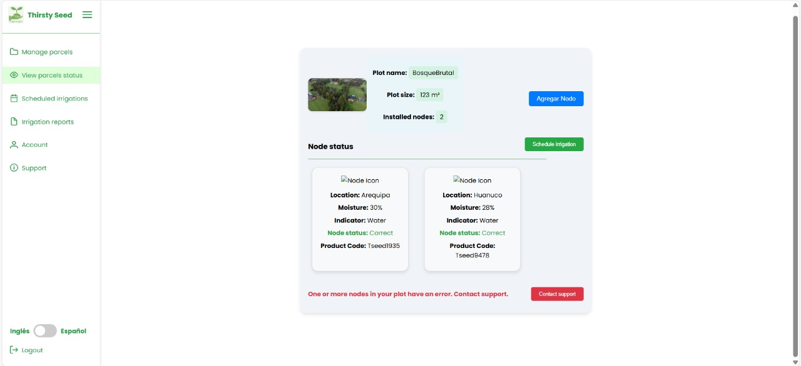

## ConfirmPayment 

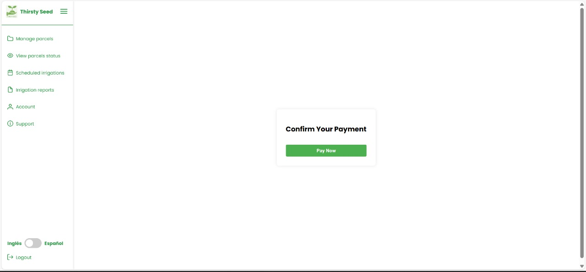

## SelectPlan


## CompleteProfile 

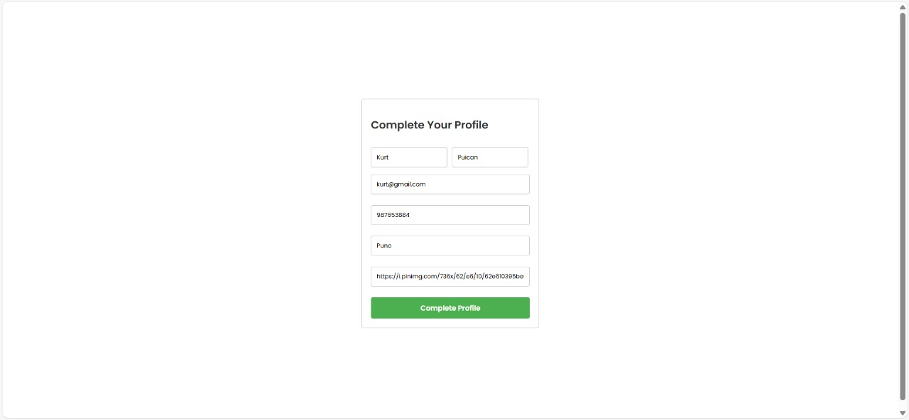

## CreateAccount

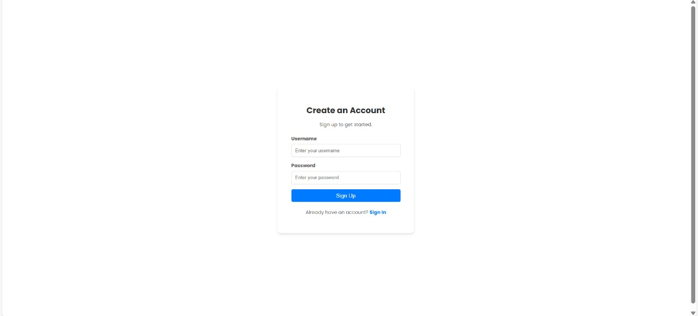

## Registered Plots

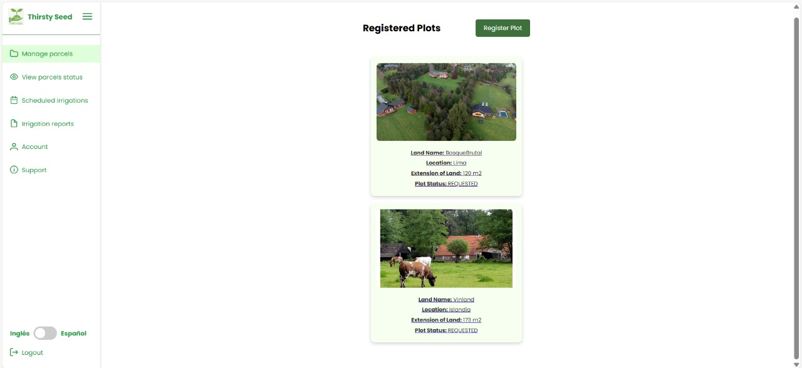

## Profile

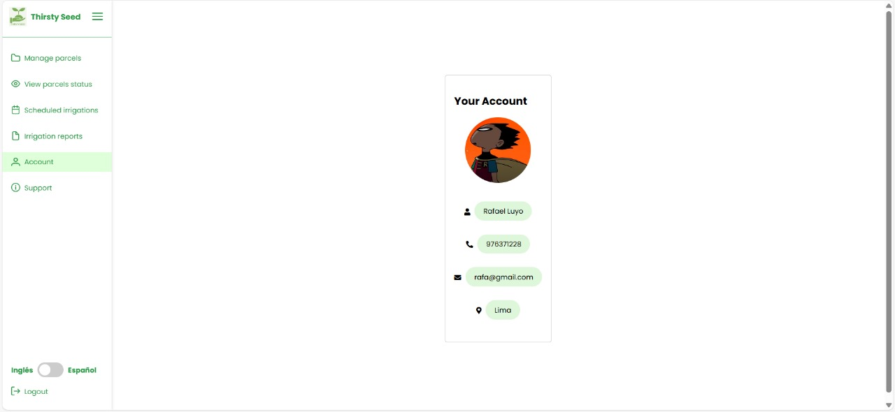

## Sign In


## PlotRegistration

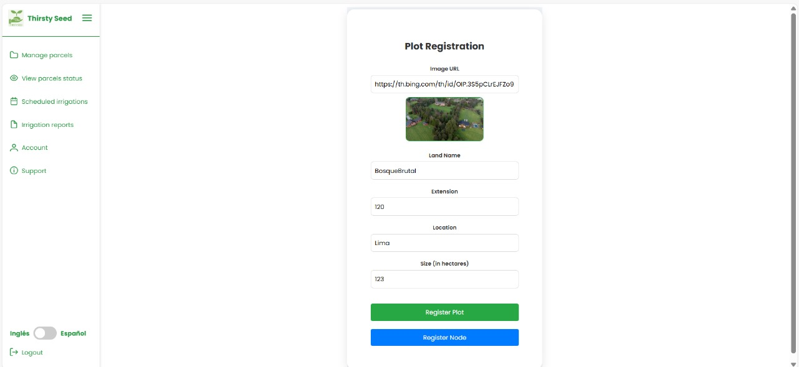

## NodeRegistration

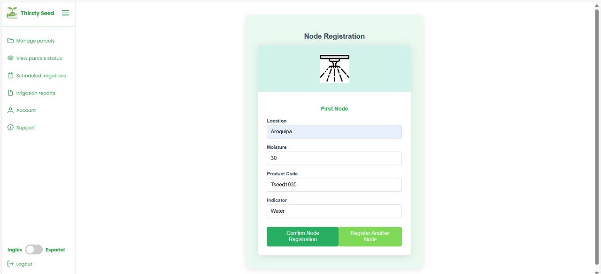

### Ejecucion del Mobile aplication

### Menu
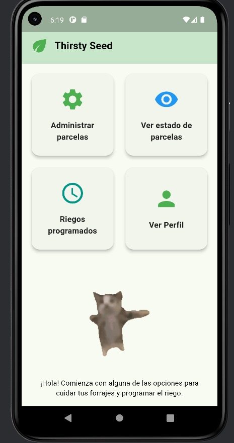

### Administrar parcelas
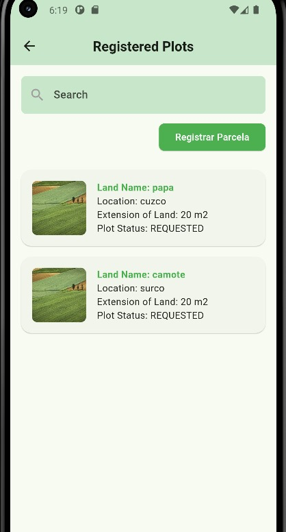

### Nodos
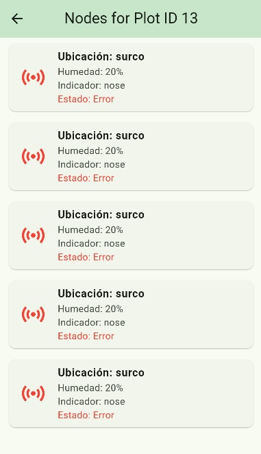

### Calendario de riego
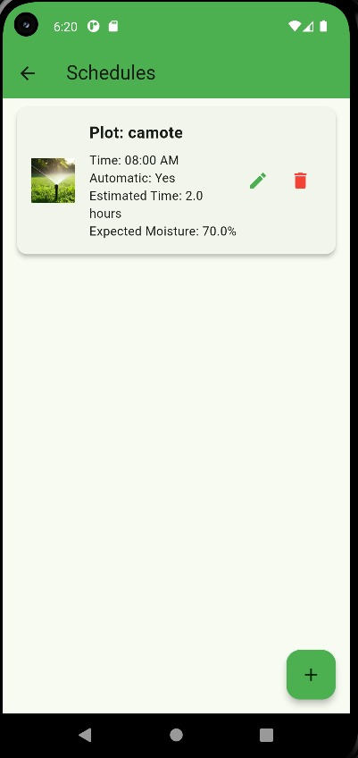

### Programar riego
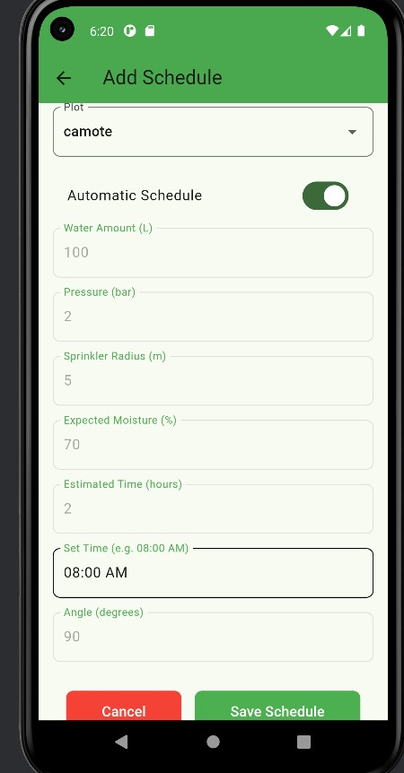


#### 6.2.3.6. Services Documentation Evidence for Sprint Review

En esta documentacion se vera los endopoints tanto nuevos como actualizados de nuestro proyecto

### Autentication services
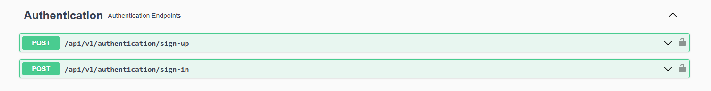

### Plots services
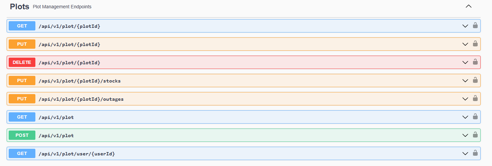

### Profile services
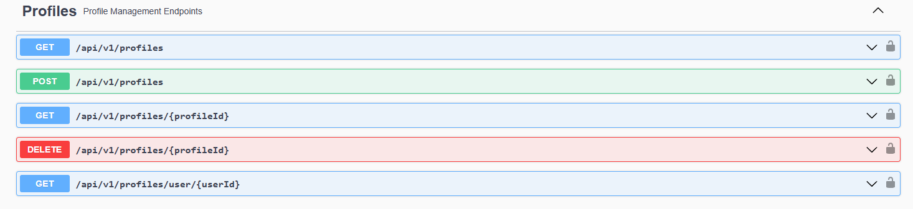

### Schedule services
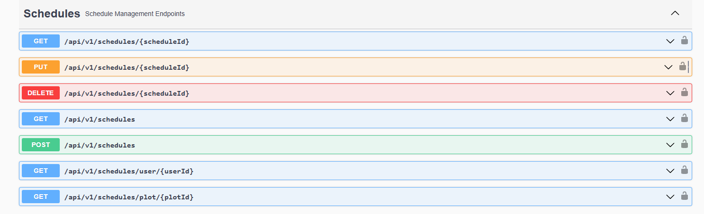

### Nodes services
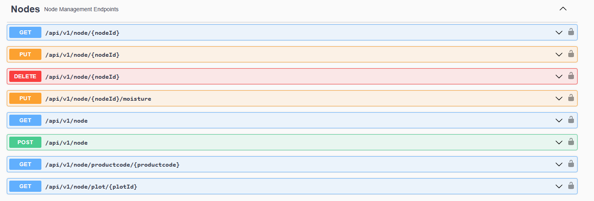

### User services
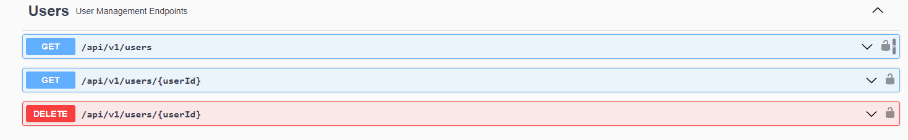

### Subscription services
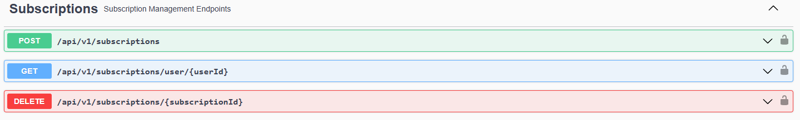

**Link de la página desplegada:** [https://thirstyseedapi-production.up.railway.app/swagger-ui/index.html#/](https://thirstyseedapi-production.up.railway.app/swagger-ui/index.html#/)


#### 6.2.3.7. Software Deployment Evidence for Sprint Review

En este Sprint, volvimos a deployar el producto ThirrstySeed a la ultima version con los cambios actualizados

Desplegamos el backend y la base de datos en Railway, lo que nos permitió una gestión eficiente de ambos componentes. 

Además, se creó el repositorio en GitHub para el control de versiones y la administración del código.

<table border="1" style="width: 100%; text-align: center;">
    <tr>
        <th colspan="2" style="text-align: center;">
            <strong>DESPLIEGUE DEL BACKEND Y BASE DE DATOS</strong>
        </th>
    </tr>
    <tr>
        <td style="text-align: left;">
            <strong>1. Despliegue del Backend en Railway:</strong>
            <br>
            Se configuró el backend de la aplicación en Railway, lo que facilitó la integración y acceso a los servicios desde la aplicación móvil y el sistema IoT.
        </td>
    </tr>
    <tr>
        <td>
          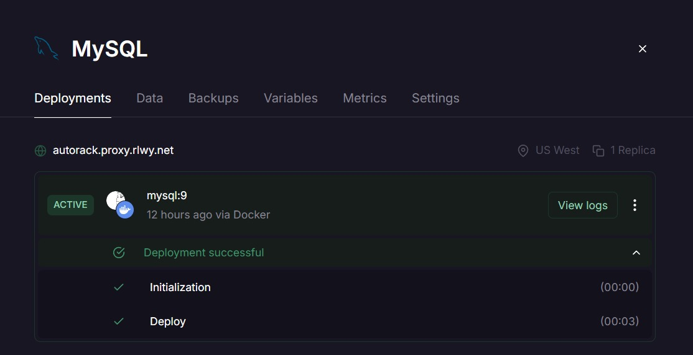
           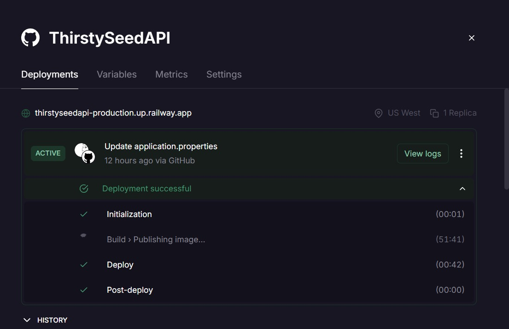
        </td>
    </tr>
    <tr>
        <td style="text-align: left;">
            <strong>2. Despliegue de la Base de Datos en Railway:</strong>
            <br>
            La base de datos fue también desplegada en Railway, asegurando la conectividad y disponibilidad de los datos para el backend y las aplicaciones.
        </td>
    </tr>
    <tr>
        <td>
            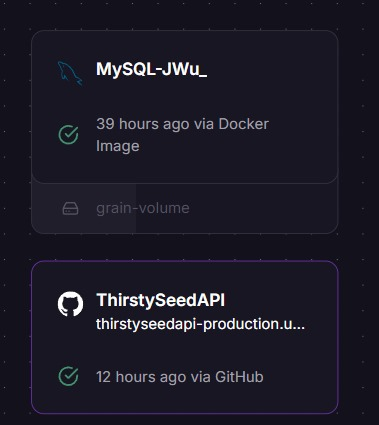
        </td>
    </tr>
</table>


#### 6.2.3.8. Team Collaboration Insights during Sprint


## 6.3. Validation Interviews.
### 6.3.1. Diseño de Entrevistas

**Preguntas generales**
1. ?Cual es tu nombre completo?
2. ?De donde eres?
3. Cuantos anios tenies?
4. Cual el sistema operativo de tu smartphone?

**Preguntas especificas**
1. ¿Qué te parecio la aplicación?
2. ¿Consideras que sera útil en tu trabajo?
3. ¿Cuántos estas dispuesto a pagar por este servicio?
4. ¿Qué es lo que mas te gusto?
5. ¿Qué crees que podemos mejorar?

### 6.3.2. Registro de Entrevistas
|***Entrevista - Segmento Productor agricola***|***1***|
|---------|----------|
|Nombre completo|Tatiana cruzado|
|Edad|57|
|Distrito|Lima|
|Sistema Operativo|Android|
|Entrevista entre los minutos|0:00 - 6:08|
|Screenshot de video|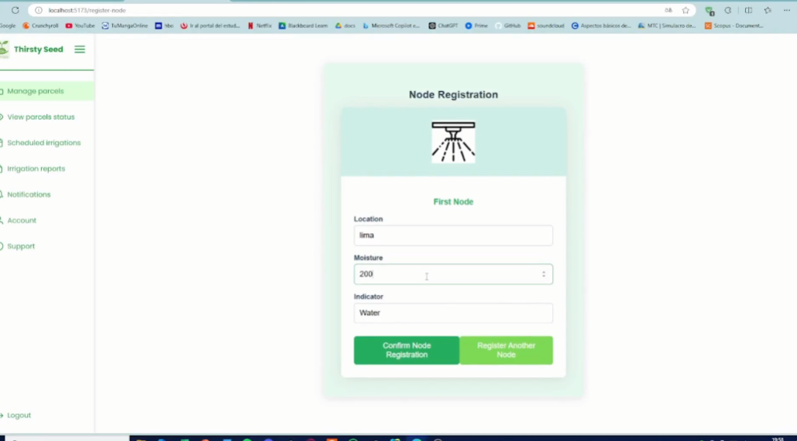|
|URL del video|[Link Entrevista](https://upcedupe-my.sharepoint.com/personal/u20201c144_upc_edu_pe/_layouts/15/stream.aspx?id=%2Fpersonal%2Fu20201c144%5Fupc%5Fedu%5Fpe%2FDocuments%2FUniversidad%2FCICLO%20IX%2FDesarrollo%20de%20Soluciones%20IoT%2FFinal%20Project%2FTB2%2FEntrevistas%2FEntrevistas%2Emp4&referrer=StreamWebApp%2EWeb&referrerScenario=AddressBarCopied%2Eview%2E9a43b4d1%2D4915%2D47db%2D9013%2De537173495c0)|
|Resumen de entrevista|Tatiana nos comenta que encuentra la aplicacion bastante llamativa e interesante para poder satisfacer sus nececidades de trabajo, cuenta que lo mas interesante es poder administra los horarios de riego asi como tambien el poder activar sus aspersores automaticamente ya que asi ahorra tiempo y dinero, menciono que aun hay cosas que estan sin terminar como las notificaciones pero nos comento que la aplicacion esta bastante bien para poder ayudarla en lo que nececita|


|***Entrevista - Segmento Proveedores de agua***|***2***|
|---------|----------|
|Nombre completo|Raúl Erasmo|
|Edad|47 años|
|Distrito|Chorrillos|
|Sistema Operativo|Android, HarmonyOS|
|Entrevista entre los minutos|6:10 - 14:34|
|Screenshot de video|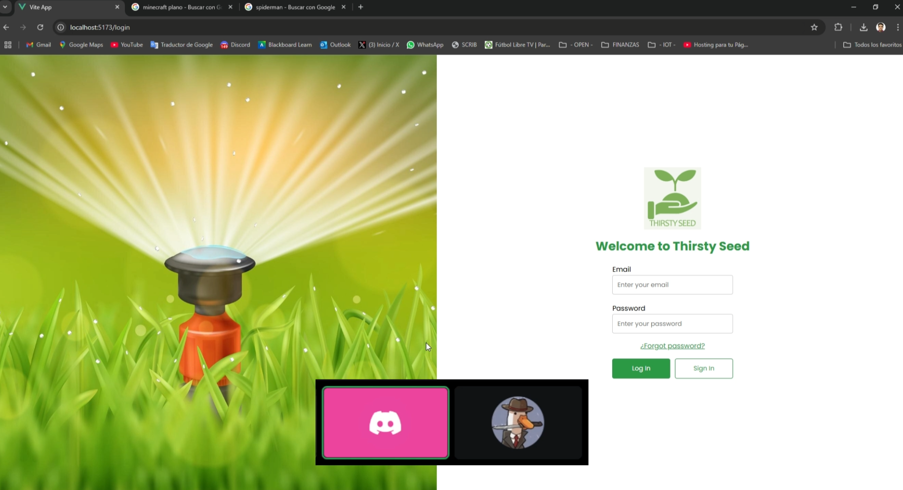|
|URL del video|[Link Entrevista](https://upcedupe-my.sharepoint.com/personal/u20201c144_upc_edu_pe/_layouts/15/stream.aspx?id=%2Fpersonal%2Fu20201c144%5Fupc%5Fedu%5Fpe%2FDocuments%2FUniversidad%2FCICLO%20IX%2FDesarrollo%20de%20Soluciones%20IoT%2FFinal%20Project%2FTB2%2FEntrevistas%2FEntrevistas%2Emp4&referrer=StreamWebApp%2EWeb&referrerScenario=AddressBarCopied%2Eview%2E9a43b4d1%2D4915%2D47db%2D9013%2De537173495c0)|
|Resumen de entrevista|Raúl Erasmo, de 47 años y de Chorrillos, Lima, usa HarmonyOS. Encontró una app de control de riego interesante y útil para su jardín, evitando exceso de agua en días de lluvia. Le gustó la interfaz y diseño. Está dispuesto a pagar 7 soles para probarla y, si es efectiva, 15 soles para una mejor experiencia. No ve mejoras urgentes, pero espera sugerir algunas tras usarla más tiempo.|


|***Entrevista - Segmento Productor Agrícultor***|***3***|
|---------|----------|
|Nombre completo|Karla Choque  |
|Edad|18 años|
|Distrito|Santo Domingo, Acopia, Acomayo, Cusco|
|Sistema Operativo|Android|
|Entrevista entre los minutos|14:35 - 25:10|
|Screenshot de video||
|URL del video|[Link Entrevista](https://upcedupe-my.sharepoint.com/personal/u20201c144_upc_edu_pe/_layouts/15/stream.aspx?id=%2Fpersonal%2Fu20201c144%5Fupc%5Fedu%5Fpe%2FDocuments%2FUniversidad%2FCICLO%20IX%2FDesarrollo%20de%20Soluciones%20IoT%2FFinal%20Project%2FTB2%2FEntrevistas%2FEntrevistas%2Emp4&referrer=StreamWebApp%2EWeb&referrerScenario=AddressBarCopied%2Eview%2E9a43b4d1%2D4915%2D47db%2D9013%2De537173495c0)|
|Resumen de entrevista|Karla tiene 18 años y dedica parte de su tiempo a la producción de forrajes. Con respecto a la aplicacion, menciona que le gustó mucho las funcionalidades que ofrece. También, considera que todo ello facilitara el modo de riego de sus forrajes, destaca que sobre todo, la aplicacion permitira que ese tiempo de planificacion, traslado al terreno y la preparacion de los aspersores, se veran disminuidos y podra goazar de mas tiempo para hacer otras actividades. Menciona que si le brindan todo el equipo para el nodo (aspersores y sensores) estaria dispuesta a pagar un inicial de 150 dolares por 4 nodos. Y pagar mensualmente por el mantemiento y el resto de las funcionaladesde hasta 7 dólares. Lo que mas le gusto de la aplicacion es el registro de terreno, nodos y la planificacion del riego. Considera que la funcionalidad que usaria seria la plainificacion de riego. Menciona que la fncionalidad que debe mejorarse seria una mejor precision de la humedad cuando la planificacion del riego sea automatica y el tiempo en función en ello. Por ello, cree que esta funcionalidad debe refinarse.|
### 6.3.3. Evaluaciones según heurísticas
#### UX Heuristics & Principles Evaluation
**Usability – Inclusive Design – Information Architecture**  
**CARRERA:** Ingeniería de Software  
**CURSO:** Desarrollo de Soluciones IoT  
**SECCIÓN:** WV71  
**PROFESORES:** Angel Augusto Velasquez Nuñez  
**AUDITOR:** Nombre del Grupo que ejecuta la Sesión de evaluación  
**CLIENTE(S):** IOTEAM  

#### SITE o APP A EVALUAR:
**ThirstySeed**

#### TAREAS A EVALUAR:
El alcance de esta evaluación incluye la revisión de la usabilidad de las siguientes tareas:
1. Registro de un usuario nuevo
2. Logueo de un usuario
3. Registro de una parcela
4. Registro de un nodo
5. Pago del plan
6. Vista de las parcelas registradas
7. Vista de los nodos registrados
8. Activación de aspersores
9. Editar perfil

No están incluidas en esta versión de la evaluación las siguientes tareas:
1. Validación del plan del usuario
2. Reportes de irrigación
3. Cambio de idioma
4. Atención al cliente

#### ESCALA DE SEVERIDAD:
Los errores serán puntuados tomando en cuenta la siguiente escala de severidad:

| Nivel | Descripción                                                                                                                                      |
|-------|--------------------------------------------------------------------------------------------------------------------------------------------------|
| 1     | Problema superficial: puede ser fácilmente superado por el usuario o ocurre con muy poca frecuencia. No necesita ser arreglado de inmediato.    |
| 2     | Problema menor: ocurre con mayor frecuencia o es algo más difícil de superar para el usuario. Debería tener una prioridad baja para el próximo release. |
| 3     | Problema mayor: ocurre frecuentemente o los usuarios no son capaces de resolverlo. Es importante corregirlo y debe tener una prioridad alta.     |
| 4     | Problema muy grave: error de gran impacto que impide al usuario continuar usando la herramienta. Debe ser corregido antes del lanzamiento.      |

#### TABLA RESUMEN:

| #  | Problema                                     | Escala de severidad | Heurística/Principio violado            |
|----|----------------------------------------------|----------------------|-----------------------------------------|
| 1  | No hay una opción para editar una parcela    | 3                    | Libertad y control del usuario          |
| 2  | No hay una opción para borrar una parcela    | 3                    | Libertad y control del usuario          |
| 3  | No hay una opción para editar un nodo        | 3                    | Libertad y control del usuario          |
| 4  | No hay una opción para borrar un nodo        | 3                    | Libertad y control del usuario          |
| 5  | No hay una función para editar perfil        | 3                    | Visibilidad del estado del sistema      |

---

#### DESCRIPCIÓN DE PROBLEMAS:

##### PROBLEMA #1: No hay una opción para editar una parcela
**Severidad:** 3  
**Heurística violada:** Libertad y control del usuario  
**Descripción:**  
La aplicación no proporciona una opción para editar la información de las parcelas registradas. Esto limita el control del usuario sobre los datos que ha ingresado, dificultando la actualización o corrección de información.  
**Recomendación:**  
Agregar un botón de “Editar” en la vista de parcelas registradas, permitiendo modificar la información existente de una parcela.

---

##### PROBLEMA #2: No hay una opción para borrar una parcela
**Severidad:** 3  
**Heurística violada:** Libertad y control del usuario  
**Descripción:**  
Actualmente, los usuarios no tienen una opción para eliminar una parcela registrada, lo cual puede resultar en desorden y dificultad para gestionar los registros de parcelas, especialmente si alguna parcela ya no es relevante.  
**Recomendación:**  
Incluir un botón de “Eliminar” en cada parcela registrada, permitiendo a los usuarios borrar parcelas innecesarias o incorrectas con una confirmación de acción.

---

##### PROBLEMA #3: No hay una opción para editar un nodo
**Severidad:** 3  
**Heurística violada:** Libertad y control del usuario  
**Descripción:**  
No existe la posibilidad de editar los nodos después de haberlos registrado. Esto limita la flexibilidad del usuario para actualizar o corregir datos en los nodos, especialmente si hay cambios en la configuración.  
**Recomendación:**  
Añadir una función de “Editar” en la vista de nodos registrados para que el usuario pueda modificar fácilmente la información de cada nodo.

---

##### PROBLEMA #4: No hay una opción para borrar un nodo
**Severidad:** 3  
**Heurística violada:** Libertad y control del usuario  
**Descripción:**  
La aplicación no permite a los usuarios eliminar un nodo una vez que ha sido registrado, lo cual puede complicar la gestión de nodos activos y generar confusión si hay nodos obsoletos.  
**Recomendación:**  
Incorporar una opción de “Eliminar” en cada nodo registrado, con una confirmación para evitar eliminaciones accidentales.

---

##### PROBLEMA #5: No hay una función para editar perfil
**Severidad:** 3  
**Heurística violada:** Visibilidad del estado del sistema  
**Descripción:**  
Falta una función para que los usuarios editen su perfil, lo cual limita la capacidad de actualizar datos personales y puede afectar la precisión de la información registrada.  
**Recomendación:**  
Agregar una opción de “Editar perfil” en la configuración o en el menú de perfil, proporcionando un feedback visual cuando los cambios se guarden correctamente.

## 6.4. Video About-the-Product

En el siguiente video se puede visualizar de meejor manera como se ha desarrollado el producto para el usuario final en la aplicación web.


Enlace: [Video About the product](https://upcedupe-my.sharepoint.com/personal/u20201c144_upc_edu_pe/_layouts/15/stream.aspx?id=%2Fpersonal%2Fu20201c144%5Fupc%5Fedu%5Fpe%2FDocuments%2FUniversidad%2FCICLO%20IX%2FDesarrollo%20de%20Soluciones%20IoT%2FFinal%20Project%2FTB2%2F2024%2D11%2D03%2000%2D25%2D49%2Emp4&referrer=StreamWebApp%2EWeb&referrerScenario=AddressBarCopied%2Eview%2E679d6abd%2Da79a%2D4262%2Da1d3%2D44641dd148d5)

## 6.5. Video About-the-Team
En el siguiente enlace se puede visulizar el video about the team del equipo de desarrollo.


Enlace: [Video About the team]()
