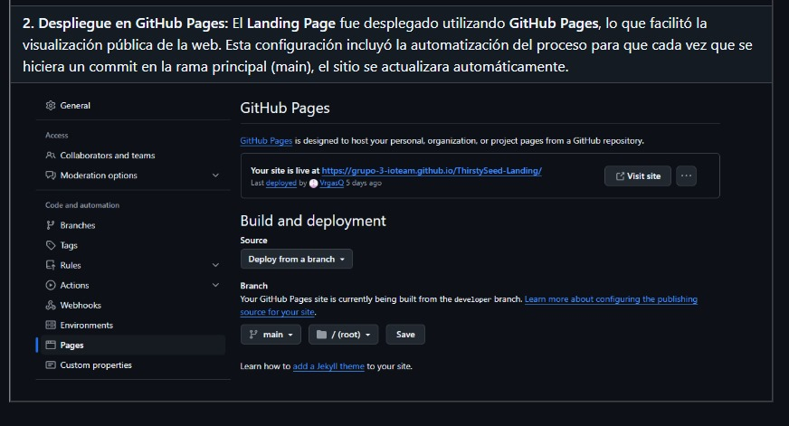
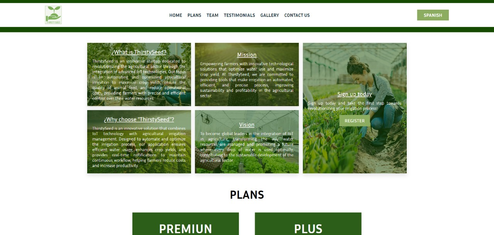
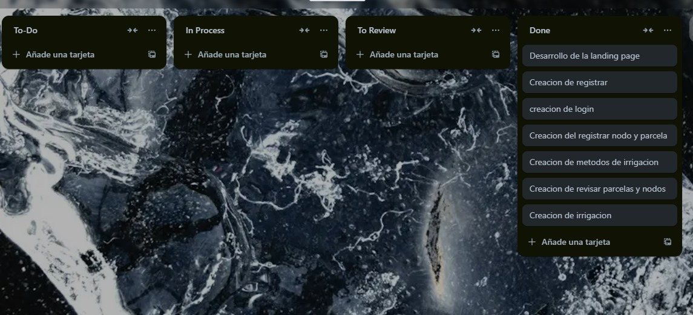

# **CAPÍTULO VI: PRODUCT IMPLEMENTATION, VALIDATION & DEPLOYMENT**
## 6.1. Software Configuration Management
### 6.1.1. Software Development Environment Configuration

### Software Development Environment Configuration

En nuestro proyecto utilizamos diversas herramientas y tecnologías para abarcar todas las fases del ciclo de vida de desarrollo de software. A continuación, se describen las principales herramientas utilizadas y su propósito:

**Project Management**
- **Trello**: Herramienta para gestionar proyectos de forma ágil, organizando tareas y sprints para facilitar el seguimiento de cada fase del desarrollo.  
  **Propósito**: Gestión de tareas y asignaciones.  
  **Ruta**: [https://trello.com](https://trello.com)

### Requirements Management

Para la gestion de requisitos usamos el **product backlog** y las **historias de usuario (HU)** de manera colaborativa dentro de un documento compartido, el cual es actualizado regularmente durante las sesiones de planificación de sprint. Este documento nos permite organizar, priorizar y refinar las **historias de usuario**, proporcionando una estructura clara para el seguimiento y cumplimiento de los objetivos del sprint.

**Product UX/UI Design**
- **Figma**: Herramienta colaborativa de diseño para la creación de interfaces, prototipos, wireframes, y mockups.  
  **Propósito**: Diseño de interfaces y prototipos.  
  **Ruta**: [https://www.figma.com](https://www.figma.com)

- **Miro**: Herramienta para colaborar en mapas de ideas, diagramas de flujo y arquitectura de la información.  
  **Propósito**: Diagramación de flujos de navegación y arquitectura.  
  **Ruta**: [https://miro.com](https://miro.com)

**Software Development**
Frontend:
- **Vue.js**: Framework progresivo de JavaScript para la construcción de interfaces de usuario y aplicaciones web SPA (Single Page Application).  
  **Propósito**: Desarrollo del frontend de la aplicación web.  
  **Ruta**: [https://vuejs.org/](https://vuejs.org/)

Backend:
- **Spring Boot**: Framework para la creación de aplicaciones basadas en Java, permitiendo desarrollo rápido con arquitectura RESTful.  
  **Propósito**: Desarrollo del backend de la aplicación web.  
  **Ruta**: [https://spring.io/projects/spring-boot](https://spring.io/projects/spring-boot)

Mobile:
- **Flutter**: Framework de desarrollo de aplicaciones móviles basado en Dart para crear interfaces nativas en iOS y Android.  
  **Propósito**: Desarrollo de la aplicación móvil.  
  **Ruta**: [https://flutter.dev/](https://flutter.dev/)

IoT:
- **Arduino IDE**: Entorno de desarrollo para programar microcontroladores **Arduino** con **C++**. Permite escribir, compilar y cargar código directamente en los dispositivos.  
  **Propósito**: Programación de los dispositivos IoT y microcontroladores.  
  **Ruta**: [https://www.arduino.cc/en/software](https://www.arduino.cc/en/software)

- **C++**: Lenguaje de programación de alto rendimiento usado para programar los microcontroladores Arduino, manejando el hardware directamente y optimizando los recursos del dispositivo.  
  **Propósito**: Programación de controladores de hardware.  
  **Ruta**: [https://isocpp.org/](https://isocpp.org/)

**Software Testing**
- **Cucumber**: Herramienta para pruebas automatizadas usando Gherkin, que permite realizar pruebas de aceptación a partir de descripciones funcionales.  
  **Propósito**: Automatización de pruebas para las aplicaciones desarrolladas.  
  **Ruta**: [https://cucumber.io/](https://cucumber.io/)

**Software Deployment**
- **Docker**: Plataforma de contenedores para la implementación de software de manera aislada y eficiente, permitiendo empaquetar la aplicación junto con todas sus dependencias.  
  **Propósito**: Contenerización y despliegue del software.  
  **Ruta**: [https://www.docker.com/](https://www.docker.com/)

**Software Documentation**
- **Markdown**: Usamos Markdown para documentar el proyecto de manera clara y concisa.  
  **Propósito**: Documentación colaborativa y legible en diferentes plataformas.  
  **Ruta**: [https://www.markdownguide.org/](https://www.markdownguide.org/)

Estas herramientas garantizan un flujo de trabajo ágil, eficiente y colaborativo, permitiendo que todos los miembros del equipo contribuyan en las distintas etapas del desarrollo del proyecto IoT.

### 6.1.2. Source Code Management
**Repositorios**

GitHub Organization: [Enlace](https://github.com/Grupo-3-IoTeam)

Landing Page Repository: [Enlace](https://github.com/Grupo-3-IoTeam/ThirstySeed-Landing)

Web Application Repository: [Enlace](https://github.com/Grupo-3-IoTeam/ThirstySeedWebApplication)

**Cuentas del equipo del proyecto**

| Nombre                 | Usuario de GitHub   |
|------------------------|---------------------|
| Giakomo Causso Mariano  | GiaKode             |
| Kurt Puican Salas       | KurtPuican          |
| Rafael Luyo             | RafaelLuyo          |
| Shayla Choque           | ShaylaChoque        |
| Alexis Vargas           | VrgasQ              |

**Evidencia de repositorios**:


**GitFlow Workflow**

Para el control de versiones y la gestión de código, implementaremos el modelo **GitFlow** descrito por Vincent Driessen. Este modelo estructurará las ramas de nuestro repositorio de la siguiente forma:

- **Main branch** (`main`): Contiene el código listo para producción.
- **Develop branch** (`develop`): Rama en la que se integrarán todas las funcionalidades nuevas, y que posteriormente se fusionará con la `main` branch.
- **Feature branches** (`feature/<nombre>`): Se crearán para cada nueva funcionalidad que se desarrolle. Las convenciones para el nombre de las ramas de feature seguirán el patrón `feature/<nombre-feature>`, por ejemplo: `feature/registro-usuario`.
- **Release branches** (`release/<versión>`): Para preparar un nuevo release y hacer pruebas finales.
- **Hotfix branches** (`hotfix/<versión>`): Se utilizarán para corregir bugs críticos encontrados en producción.

Para nombrar nuestras versiones seguiremos **Semantic Versioning 2.0.0**, aplicando etiquetas como `v1.0.0`, `v1.0.1`, etc.

**Convenciones de Commits**

Adoptaremos la convención **Conventional Commits** para estructurar los mensajes de nuestros commits. Cada commit deberá seguir la estructura:

Donde el `tipo` puede ser:
- `feat`: Para introducir nuevas funcionalidades.
- `fix`: Para corregir bugs.
- `refactor`: Para cambios que mejoran el código sin cambiar su funcionalidad.
- `style`: Para cambios en formato, espacios, punto y coma, etc.

**Versionado Semántico**

Utilizaremos **Semantic Versioning 2.0.0** para nombrar nuestras versiones de forma consistente y clara. El formato que usaremos será `v<major>.<minor>.<patch>`, donde:
- **Major** (`<major>`): Incrementa cuando se introducen cambios incompatibles.
- **Minor** (`<minor>`): Incrementa cuando se agregan nuevas funcionalidades sin romper la compatibilidad.
- **Patch** (`<patch>`): Incrementa cuando se hacen correcciones menores o fixes.

### 6.1.3. Source Code Style Guide & Conventions

En nuestro proyecto utilizamos **Vue.js** para el desarrollo del **Web Application**, **Spring Boot** para el **API Application** y **Flutter** para la **Mobile Application**. A continuación se detallan las convenciones y guías de estilo adoptadas para cada tecnología:

**Vue.js (Frontend)**
Para el desarrollo de la **Web App** en Vue.js, seguimos las guías oficiales de estilo de Vue:

- **Nombres de componentes**: 
  Los nombres de los componentes deben ser en **PascalCase** o **kebab-case**. Ejemplo: `MyComponent.vue` o `my-component.vue`.

- **Propiedades**: 
  Las propiedades (props) deben seguir **camelCase** en JavaScript y **kebab-case** en las plantillas de Vue. Ejemplo:
  ```javascript
  props: {
    myProperty: String
  }
  ```
  En la plantilla:
  ```html
  <my-component my-property="value"></my-component>
  ```

- **Nombres de métodos y eventos**:
  - Métodos en **camelCase**. Ejemplo: `handleUserClick`.
  - Eventos en **kebab-case**. Ejemplo: `@user-click="handleUserClick"`.

Referencias:  
- [Vue.js Style Guide](https://vuejs.org/style-guide/)

**Spring Boot (Backend)**
Para el **backend** en **Spring Boot**, seguimos las convenciones de Java:

- **Nombres de clases y paquetes**: 
  - Clases en **PascalCase**.
  - Paquetes en **minúsculas** y separados por puntos. Ejemplo: `com.example.projectname.service`.

- **Métodos y variables**: 
  - Los nombres de métodos y variables deben seguir la convención **camelCase**. Ejemplo: `getUserName()`.

- **Anotaciones**:
  Se siguen buenas prácticas con anotaciones como `@Service`, `@Controller`, `@Autowired`.

Referencias:
- [Google Java Style Guide](https://google.github.io/styleguide/javaguide.html)

**Flutter (Mobile App)**
Para la **App Móvil** en **Flutter** usando **Dart**, seguimos las siguientes convenciones:

- **Nombres de clases y métodos**:
  - Las clases deben usar **PascalCase** y los métodos **camelCase**.
  - Ejemplo de clase: `UserProfile`.

- **Uso de const**:
  Se recomienda el uso del modificador `const` siempre que sea posible:
  ```dart
  const Text('Hello World');
  ```

- **Nombres de widgets personalizados**:
  Los widgets deben seguir la convención **PascalCase**. Ejemplo: `CustomButton`.

Referencias:  
- [Dart Language Style Guide](https://dart.dev/guides/language/effective-dart/style)

**Commits convencionales y Versionado semántico**
Se utilizarán **Conventional Commits** y **Semantic Versioning** para garantizar consistencia.

- **Ejemplos de commits**:
  - `feat: add user authentication`
  - `fix: correct login bug`
  - `refactor: optimize database queries`

- **Versionado Semántico**:
  Se utilizará el esquema de versionado: `MAJOR.MINOR.PATCH`.

Referencias:  
- [Conventional Commits](https://www.conventionalcommits.org/en/v1.0.0/)  
- [Semantic Versioning](https://semver.org/)

Las convenciones descritas permiten mantener un código limpio, comprensible y alineado con las mejores prácticas de desarrollo para cada una de las tecnologías utilizadas en el proyecto: **Vue.js**, **Spring Boot** y **Flutter**.

### 6.1.4. Software Deployment Configuration
En este punto, se dara a conocer el proceso de despliegue de las aplicaciones, así como la configuración de los servidores y la infraestructura necesaria para su correcto funcionamiento.

Landing Page: Para desplegar la Landing Page, se utilizó GitHub Pages, una plataforma gratuita que permite alojar sitios web estáticos directamente desde un repositorio de GitHub. El proceso de despliegue fue el siguiente:

1. Crear un repositorio en GitHub con el código de la Landing Page.
2. Acceder a la configuración del repositorio y habilitar GitHub Pages.



3.Seleccionar la rama y la carpeta de origen del sitio web.
4.Guardar la configuración y obtener la URL del sitio web desplegado.
5.Finalmente, acceder a la URL del sitio web para verificar que se haya desplegado correctamente.



Enlace de la Landing Page desplegada: https://grupo-3-ioteam.github.io/ThirstySeed-Landing/ 

FrontEnd: Para el despliegue de la aplicacion se ha usado los servicios que ofrecen netlify una plataforma de alojamiento web que ofrece integración continua y despliegue automático desde repositorios de Git. El proceso de despliegue fue el siguiente:

Preparación del Repositorio: Asegúrarse que la página web esté almacenada en un repositorio Git, como GitHub, GitLab.
Crear una Cuenta en Netlify: Regístrarse en la plataforma.
Conectar el Repositorio: Inicia sesión en Netlify y ve al panel de control. Hacer clic en el botón "New site from Git" (Nuevo sitio desde Git). Selecciona tu proveedor de servicios de alojamiento de Git (por ejemplo, GitHub) y autoriza la conexión con tu cuenta. Seleccionar el repositorio que contiene la página web.

Configurar las Opciones de Despliegue: Netlify detectará automáticamente la configuración de tu proyecto. Si necesitas ajustes adicionales, como la configuración del directorio de compilación, puedes establecerlos en la sección de configuración de tu sitio.

Despliegue Automático: Activa la opción de "Deploy site" (Desplegar sitio) para habilitar el despliegue automático cada vez que realices cambios en tu repositorio.
Verificar el Despliegue: Una vez que se complete el despliegue, Netlify te proporcionará una URL única para acceder a tu página web.

## 6.2. Landing Page, Services & Applications Implementation
Esta sección resume el proceso de implementación, pruebas, documentación y despliegue del Landing Page, Web Services y las Aplicaciones Web y Móviles de ThirstySeed. Durante cada Sprint, se siguieron las mejores prácticas de desarrollo para garantizar la funcionalidad y calidad del producto.
### 6.2.1. Sprint 1
Durante el Sprint 1, se avanzó en la implementación de las funcionalidades planificadas, el equipo colaboró en la integración de los servicios y aplicaciones, realizando pruebas y documentando cada fase. Se incluyeron tareas como la planificación del sprint, la ejecución del desarrollo, la revisión de los avances y el ajuste de los entregables para asegurar un despliegue exitoso.
#### 6.2.1.1. Sprint Planning 1
<table border="1" style="width:100%; text-align: center;">
  <tr>
    <th colspan="4" style="text-align: center;"><strong>LANDING PAGE</strong></th>
  </tr>
  <tr>
    <th colspan="2" style="text-align: center;"><strong>Sprint #</strong></th>
    <th colspan="2" style="text-align: center;"><strong>Sprint 1</strong></th>
  </tr>
  <tr>
    <th colspan="4" style="text-align: center;"><strong>Sprint Planning Background</strong></th>
  </tr>
  <tr>
    <td><strong>Date</strong></td>
    <td colspan="3">2024/09/07</td>
  </tr>
  <tr>
    <td><strong>Time</strong></td>
    <td colspan="3">22:00</td>
  </tr>
  <tr>
    <td><strong>Location</strong></td>
    <td colspan="3">Lima, Peru - Meeting held via Discord</td>
  </tr>
  <tr>
    <td><strong>Prepared By</strong></td>
    <td colspan="3">Vargas Quispe, Manuel Alexis</td>
  </tr>
  <tr>
    <td><strong>Attendees (to planning meeting)</strong></td>
    <td colspan="3">
      Giakomo Rodolfo Causso Mariano<br>Kurt Matthews Puican Salas<br>Rafael Arturo Luyo Ramirez<br>Shayla Lussiné Choque Puma
    </td>
  </tr>
  <tr>
    <th colspan="4" style="text-align: center;"><strong>Sprint Goal & User Stories</strong></th>
  </tr>
  <tr>
    <td><strong>Sprint Goal</strong></td>
    <td colspan="3">Development and deployment of ThirstySeed's Landing Page</td>
  </tr>
  <tr>
    <td><strong>Sprint Velocity</strong></td>
    <td colspan="3">11</td>
  </tr>
  <tr>
    <td><strong>Sum of Story Points</strong></td>
    <td colspan="3">11 story points</td>
  </tr>
</table>

### FRONTEND

<table border="1" style="width:100%; text-align: center;">
  <tr>
    <th colspan="4" style="text-align: center;"><strong>WEB APP</strong></th>
  </tr>
  <tr>
    <th colspan="2" style="text-align: center;"><strong>Sprint #</strong></th>
    <th colspan="2" style="text-align: center;"><strong>Sprint 1</strong></th>
  </tr>
  <tr>
    <th colspan="4" style="text-align: center;"><strong>Sprint Planning Background</strong></th>
  </tr>
  <tr>
    <td><strong>Date</strong></td>
    <td colspan="3">2024/09/07</td>
  </tr>
  <tr>
    <td><strong>Time</strong></td>
    <td colspan="3">15:00</td>
  </tr>
  <tr>
    <td><strong>Location</strong></td>
    <td colspan="3">Lima, Peru - Meeting held via Discord</td>
  </tr>
  <tr>
    <td><strong>Prepared By</strong></td>
    <td colspan="3">Kurt Matthews Puican Salas</td>
  </tr>
  <tr>
    <td><strong>Attendees (to planning meeting)</strong></td>
    <td colspan="3">
      Giakomo Rodolfo Causso Mariano<br>Vargas Quispe, Manuel Alexis <br>Rafael Arturo Luyo Ramirez<br>Shayla Lussiné Choque Puma
    </td>
  </tr>
  <tr>
    <th colspan="4" style="text-align: center;"><strong>Sprint Goal & User Stories</strong></th>
  </tr>
  <tr>
    <td><strong>Sprint Goal</strong></td>
    <td colspan="3">Development and deployment of ThirstySeed's Web App</td>
  </tr>
  <tr>
    <td><strong>Sprint Velocity</strong></td>
    <td colspan="3">11</td>
  </tr>
  <tr>
    <td><strong>Sum of Story Points</strong></td>
    <td colspan="3">11 story points</td>
  </tr>
</table>


#### 6.2.1.2. Sprint Backlog 1
Para este sprint, tuvimos como objetivo implementar el diseño de nuestra aplicación web asi como la creacion del langind page mediante el uso de HTML, CSS y JavaScript. A continuación, se presentan las historias de usuario y sus respectivos puntos de historia:



#### 6.2.1.3. Development Evidence for Sprint Review
<table border="1" cellspacing="0" cellpadding="5" style="width:100%; text-align: center; border-collapse: collapse;">
    <thead>
        <tr>
        <th colspan="6" style="text-align: center;"><strong>LANDING PAGE</strong></th>
        </tr>
        <tr>
            <th style="text-align: center;"><strong>Repository</strong></th>
            <th style="text-align: center;"><strong>Branch</strong></th>
            <th style="text-align: center;"><strong>Commit Id</strong></th>
            <th style="text-align: center;"><strong>Commit Message</strong></th>
            <th style="text-align: center;"><strong>Commit Message Body</strong></th>
            <th style="text-align: center;"><strong>Commited on (Date)</strong></th>
        </tr>
    </thead>
    <tbody>
        <tr>
            <td rowspan="10"><a href="https://github.com/Grupo-3-IoTeam/ThirstySeed-Landing">https://github.com/Grupo-3-IoTeam/ThirstySeed-Landing</a></td>
            <td>Main</td>
            <td>70fe572</td>
            <td>feat: add new final version LandingPage</td>
            <td>Se publicó y editó la versión final del LandingPage (Ya desplegada)</td>
            <td>27/09/2024</td>
        </tr>
        <tr>
            <td>Developer</td>
            <td>601331e</td>
            <td>Update index.html</td>
            <td>Últimos cambios del LandingPage</td>
            <td>27/09/2024</td>
        </tr>
        <tr>
            <td>Feature/section-contact_us</td>
            <td>9ba5e7c</td>
            <td>feat: add file contact-us</td>
            <td>Se realizó la sección de contáctanos</td>
            <td>22/09/2024</td>
        </tr>
        <tr>
            <td>Feature/section-footer</td>
            <td>a9b1c3e</td>
            <td>feat: add file footer</td>
            <td>Se realizó la sección del pie de página</td>
            <td>22/09/2024</td>
        </tr>
        <tr>
            <td>Feature/section-gallery</td>
            <td>7455f96</td>
            <td>feat: add section gallery</td>
            <td>Se realizó la sección galería</td>
            <td>22/09/2024</td>
        </tr>
        <tr>
            <td>Feature/section-home</td>
            <td>459d30a</td>
            <td>feat: file home</td>
            <td>Se realizó la sección de inicio</td>
            <td>22/09/2024</td>
        </tr>
        <tr>
            <td>Feature/section-plans</td>
            <td>67fac89</td>
            <td>feat: add plans</td>
            <td>Se realizó la sección de planes de suscripción</td>
            <td>13/09/2024</td>
        </tr>
        <tr>
            <td>Feature/section-team</td>
            <td>f21e164</td>
            <td>feat: add file team</td>
            <td>Se realizó la sección del equipo</td>
            <td>22/09/2024</td>
        </tr>
        <tr>
            <td>Feature/section-testimonials</td>
            <td>c6027fd</td>
            <td>feat: add testimonials</td>
            <td>Se realizó la sección de testimonios de las personas que usaron la página</td>
            <td>13/09/2024</td>
        </tr>
        <tr>
            <td>Feature/section-toolbar</td>
            <td>14002c5</td>
            <td>feat: add file toolbar</td>
            <td>Se realizó la sección de toolbar</td>
            <td>22/09/2024</td>
        </tr>
    </tbody>
</table>


En la siguiente tabla se mostrarán algunos de los commits más importantes realizados por cada developer del Sprint 1.

| Repository                       | Branch                       | Commit Id                             | Commit Message                     | Commit Message Body                          | Commited on (Date) |
|----------------------------------|------------------------------|---------------------------------------|-------------------------------------|-----------------------------------------------|---------------------|
| Shayla/ThirstySeedWebApplication | feature/side-navigation-bar   | 83cbbaa3caeee697d3b62d12cf7f90e059dec03d | feat (side-navigation-bar)          | implement sidenav                             |                     |
| Shayla/ThirstySeedWebApplication | feature/set-irrigation-mode   | d86d83f9b575a97451d71c126b0fa8787e024ec8 | feat(set-irrigation-mode)          | implement set irrigation mode                 |                     |
| Alexis/ThirstySeedWebApplication  | feature/section-activate-nodes | e590cab599bc4a3bea4d988bd538f9f6e499f858 | feat (section-activate-nodes)      | add router activate-nodes                     |                     |
| Giakomo/ThirstySeedWebApplication | feature/section-plot-registered | 0956347c43edff4bf66ca76b352fef9b35172a76 | feat (section-plot-registered)     | registeredView                                |                     |
| Giakomo/ThirstySeedWebApplication | feature/section-plot-registered | da6b2b7517b8e31162155f8b84dc1106d0d272aa | feat (section-plot-registered)     | viewPlot                                     |                     |
| Kurt/ThirstySeedWebApplication    | feature/section-register-node   | 097a35d477726c8a3d72f79160a52459d0b87b4c | feat (section-register-node)       | service and component added                   |                     |
| Kurt/ThirstySeedWebApplication    | feature/section-register         | 85851af4ed03d6862750130369ab2d345a5e6632 | feat (section-register)            | add component                                 |                     |
| Rafael/ThirstySeedWebApplication   | feature/section-irrigation-schedule | d309e872799790e7d9b9bbb7b797545843cc0811 | feat (section-irrigation-schedule) | Irrigation Schedule added                      |                     |
| Rafael/ThirstySeedWebApplication   | feature/section-plot-status      | 904efa00f8ffb361df38c0f9581d249a43ebb78c | feat (section-plot-status)        | Plot Status View Added                        |                     |
#### 6.2.1.4. Testing Suite Evidence for Sprint Review
Aquí se proporcionara información sobre las pruebas realizadas durante el sprint.Se detallaran las pruebas funcionales,de rendimiento que se han llevado a cabo para garantizar la calidad del software .Se incluiran los resultados de estas pruebas y cualquier correcion o mejora realizada.

## Landing Page
<p align="center">
    
</p>
<p align="center">
    <strong>Landing Page Testeo:</strong>
    <a href="https://pagespeed.web.dev/analysis/https-grupo-3-ioteam-github-io-ThirstySeed-Landing/foaeucaur9?hl=es-ES&form_factor=desktop" target="_blank">
        https://pagespeed.web.dev/analysis/https-grupo-3-ioteam-github-io-ThirstySeed-Landing/foaeucaur9?hl=es-ES&form_factor=desktop
    </a>
</p>
Por otro lado, no se ha llevado a cabo la prueba de la suite de testing para la web app esta entrega debido a que aún no disponemos de la primera versión del backend. Posteriormente, implementaremos pruebas utilizando una herramienta de automatización para pruebas de aceptación y comportamiento.

#### 6.2.1.5. Execution Evidence for Sprint Review
Esta sección se centrará en la ejecución de la aplicación durante el sprint. Se visualizará la navegación del Landing Page como la de la página web, de esta manera se destacaran las características y funcionalidades implementadas en la aplicación.
## Landing Page
<td></td>
<p align="center">
    <strong>Landing Page Desplegado:</strong>
    <a href="https://grupo-3-ioteam.github.io/ThirstySeed-Landing/" target="_blank">
        https://grupo-3-ioteam.github.io/ThirstySeed-Landing/
    </a>
</p>

Para el Sprint 1 se realizaron las diferentes HU, completándolas al 100% y otros al 80%. Compartimos imágenes para mostrar cómo quedó el avance de la primera versión del servicio web. Cada uno con su ruta respectiva.

**Link de la página desplegada:** [https://thirstyseed.netlify.app](https://thirstyseed.netlify.app)

- **Cuenta:** El usuario visualiza su perfil de usuario
- **Registrar parcela:** El usuario registra una parcela
- **Registrar Nodo:** El usuario registra un nodo
- **Parcelas Registradas:** El usuario visualiza sus parcelas previamente registradas
- **Estado de Parcela:** El usuario visualiza el estado de su parcela especificada
- **Calendario de Irrigación:** El usuario visualiza el calendario de Irrigación de sus parcelas
- **Agregar/modificar el calendario de riego de parcela:** El usuario es capaz de agregar o modificar el calendario de riego de sus parcelas registradas
- **Activación de Nodos de Riego:** El usuario es capaz de activar los nodos de riego referente a una parcela específica
- **Notificación:** El usuario visualiza una notificación acerca de la irrigación completada

#### 6.2.1.6. Services Documentation Evidence for Sprint Review


### 6.2.1.6. Services Documentation Evidence for Sprint Review

#### Descripción General:
En este apartado se documentan los servicios relacionados con el sistema de riego inteligente. Los endpoints que permiten interactuar con las parcelas (plots), nodos, horarios de riego (irrigationSchedules), y la información del usuario son descritos en detalle, con ejemplos de las respuestas que pueden ser obtenidas.

#### Tabla de Documentación de Servicios:

| EndPoint | Acción Implementada | Verbo | Descripción |
|----------|---------------------|-------|-------------|
| `http://localhost:3000/plots` | Obtener la lista de parcelas registradas en el sistema. | **GET** | Retorna un JSON con la información de todas las parcelas. Ejemplo de respuesta: <br> `[{"id": "1", "name": "Pucará", "location": "Pucará, Peru", "size": "100", "status": "Supplied", "imageUrl": "https://i.pinimg.com/564x/41/52/e2/4152e208971ee40322e0dffbc94b2436.jpg"}, {"id": "2", "name": "Loreto Plot", "location": "lima", "status": "Supplied"}]` |
| `http://localhost:3000/nodes` | Obtener la información de los nodos instalados en las parcelas. | **GET** | Retorna un JSON con los nodos que monitorizan la humedad de las parcelas. Ejemplo de respuesta: <br> `[{"id": "1", "plotId": 1, "moisture": 20, "status": "Error"}, {"id": "2", "plotId": 2, "moisture": 30, "status": "Correct"}]` |
| `http://localhost:3000/irrigationSchedules` | Obtener los horarios de riego establecidos para cada parcela. | **GET** | Devuelve un JSON con los horarios programados para el riego, incluyendo los parámetros de humedad, duración y cantidad de agua. Ejemplo de respuesta: <br> `[{"id": "7e9f", "expectedMoisture": "40%", "plotSize": "100 m2", "setTime": "08:15 pm", "requiredWaterAmount": "500 cm3"}, {"id": "8a2b", "expectedMoisture": "45%", "setTime": "07:30 pm"}]` |
| `http://localhost:3000/user` | Obtener la información del usuario registrado en el sistema. | **GET** | Retorna un JSON con los datos del usuario, como su nombre, teléfono, ubicación, y proveedor de agua. Ejemplo de respuesta: <br> `{"id": 1, "name": "Sam Elioth Quispe Ramos", "phone": "+51 974837226", "location": "Puno", "waterSupplier": {"name": "Sedapal", "logo": "https://pbs.twimg.com/profile_images/1557423579599446016/yC3WRAP6_200x200.jpg"}}` |

#### Detalles Adicionales:
- **Headers Utilizados**: No es necesario utilizar headers específicos para estos endpoints durante las pruebas locales, pero en producción se podría requerir un token de autenticación para proteger la información.
- **Estatus HTTP**: Los endpoints retornan códigos **200 OK** cuando las solicitudes son exitosas. En caso de error, se devuelven códigos **400 Bad Request** o **500 Internal Server Error**.

#### Evidencia:
Los siguientes endpoints fueron probados utilizando un servidor local (`localhost`) y los datos de prueba fueron obtenidos desde un archivo `db.json`. A continuación se muestran ejemplos de las respuestas obtenidas para cada uno de los endpoints.


#### 6.2.1.7. Software Deployment Evidence for Sprint Review
En este Sprint, nos enfocamos en el despliegue del producto ThirstySeed a través de GitHub para el deployment y la administración del repositorio. El proceso incluyó la creación de las cuentas y configuraciones necesarias para asegurar una integración eficiente entre el Landing Page, los Web Services y las Aplicaciones móviles.

<table border="1" style="width: 100%; text-align: center;">
    <tr>
        <th colspan="2" style="text-align: center;"><strong>LANDING PAGE</strong></th>
    </tr>
    <tr>
        <td style="text-align: left;">
            <strong>1. Creación de repositorios en GitHub:</strong> Se creó un repositorio dedicado para alojar el código de la Landing Page. Esto permitió la colaboración fluida y el control de versiones entre los miembros del equipo.
        </td>
    </tr>
    <tr>
        <td></td>
    </tr>
    <tr>
        <td style="text-align: left;">
            <strong>2. Despliegue en GitHub Pages:</strong> El <strong>Landing Page</strong> fue desplegado utilizando <strong>GitHub Pages</strong>, lo que facilitó la visualización pública de la web. Esta configuración incluyó la automatización del proceso para que cada vez que se hiciera un commit en la rama principal (main), el sitio se actualizara automáticamente.
        </td>
    </tr>
    <tr>
        <td></td>
    </tr>
</table>


#### 6.2.1.8. Team Collaboration Insights during Sprint
<table border="1" style="width: 100%; text-align: center;">
    <tr>
        <th colspan="2" style="text-align: center;"><strong>LANDING PAGE</strong></th>
    </tr>
    <tr>
        <td colspan="2" style="text-align: justify;">
            En esta entrega, el objetivo principal fue la implementación de las funciones para la gestión y visualización en <strong>ThirstySeed</strong>. Para cumplir con este propósito, se utilizaron herramientas como <strong>GitHub</strong> (para el <em>deployment</em> y gestión del repositorio), <strong>Visual Studio Code</strong> como entorno de desarrollo, y lenguajes como <strong>HTML, CSS,</strong> y <strong>JavaScript</strong> para la construcción de la interfaz y funcionalidad. A continuación, se presentan los diagramas de flujo que detallan los <strong>commits</strong> realizados y las contribuciones de cada miembro del equipo en el desarrollo del proyecto.
        </td>
    </tr>
    <tr>
        <td colspan="2"></td>
    </tr>
    <tr>
        <td colspan="2" style="text-align: justify;">
            En la imagen se evidencia el gráfico de barras de la cantidad de <strong>commits</strong> realizados por cada uno de los integrantes del equipo.
        </td>
    </tr>
    <tr>
        <td colspan="2"></td>
    </tr>
    <tr>
        <td colspan="2" style="text-align: justify;">
            En esta imagen, se ofrece una representación visual de las fechas en las que se llevaron a cabo cambios en el repositorio de nuestro sprint (Enfocado al <strong>Landing Page</strong>), junto con la cantidad de modificaciones realizadas en cada uno de los <strong>commits</strong>. Esta representación gráfica es una herramienta valiosa para comprender la evolución temporal del proyecto y la intensidad del desarrollo a lo largo del tiempo.
        </td>
    </tr>
    <tr>
        <td colspan="2"></td>
    </tr>
    <tr>
        <td colspan="2" style="text-align: justify;">
            Estos gráficos ofrecen una representación visual de las clonaciones registradas en nuestro repositorio, junto con la fecha en que cada una de estas acciones se llevó a cabo. Además, se presenta información sobre la cantidad de visitantes que ha tenido el repositorio de nuestro equipo a lo largo del tiempo.
        </td>
    </tr>
    <tr>
        <td colspan="2"></td>
    </tr>
</table>


[def]: image.png
