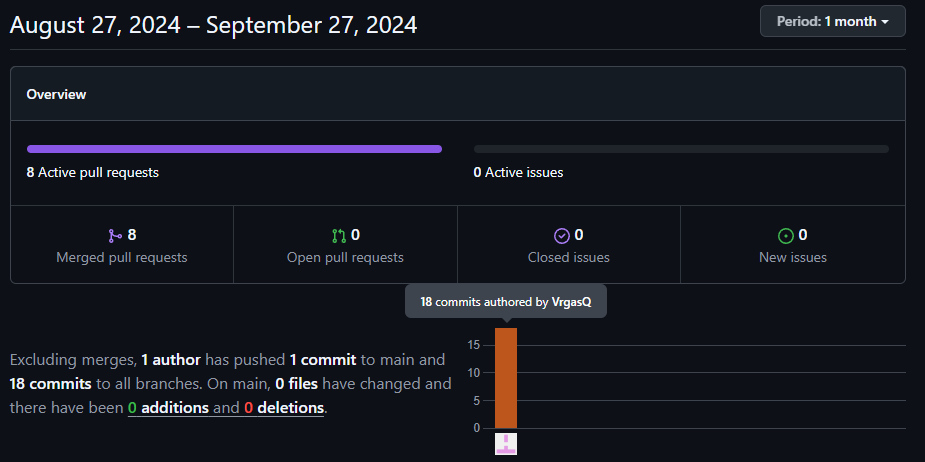
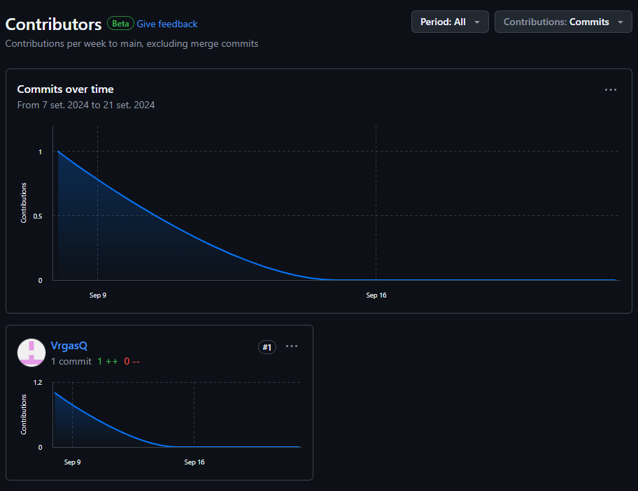

  <h1>UNIVERSIDAD PERUANA DE CIENCIAS APLICADAS</h1>
   
  
  

     
    <strong>Carrera:</strong> Ingeniería de Software
      
    <strong>Ciclo:</strong> 7° Ciclo
      
    <strong>Nombre del curso:</strong> Desarrollo de Soluciones IOT
      
    <strong>Sección:</strong> WV71
      
    <strong>Nobre del profesor:</strong> Angel Augusto Velasquez Nuñez
  

  <h3>"Informe de Trabajo Final"</h3>
  

     
    <strong>Nombre del Startup:</strong> IoTeam
      
    <strong>Nombre del Producto:</strong> ThirstySeed
      
    <strong>INTEGRANTES:</strong>
      
Shayla Lussiné Choque Puma - u20201c144
      
Giakomo Rodolfo Causso Mariano - U202118374
      
Manuel Alexis Vargas Quispe - U202113256
      
Rafael Arturo Luyo Ramirez - u201919295
      
Kurt Matthews Puican Salas - U202016643
      
  

  <h3>SETIEMBRE 2024</h3>

 

# Registro de Versiones del Informe
<table border="1" style="width: 100%; text-align: center; border-collapse: collapse;">
    <tr>
        <th style="text-align: center;"><strong>Versión</strong></th>
        <th style="text-align: center;"><strong>Fecha</strong></th>
        <th style="text-align: center;"><strong>Autor</strong></th>
        <th style="text-align: center;"><strong>Descripción de modificación</strong></th>
    </tr>
    <tr>
        <td>TP</td>
        <td>26/09/2024</td>
        <td style="text-align: center;">
            <strong>Shayla Lussiné Choque Puma</strong>
        </td>
        <td style="text-align: justify;">
            Correcciones en Software Architecture(Landscape, context, container and deployment diagrams), Ubiquitous language, Software Configuration, diseño de web app y mobile.
        </td>
    </tr>
    <tr>
        <td>TP</td>
        <td>26/09/2024</td>
        <td style="text-align: center;">
            <strong>Giakomo Rodolfo Causso Mariano</strong>
        </td>
        <td style="text-align: justify;">
            Correciones en el base diagram, conpletar el wireframes mobile, apartado en codigo en usuario y vistas de parcelas
        </td>
    </tr>
    <tr>
        <td>TP</td>
        <td>26/09/2024</td>
        <td style="text-align: center;">
            <strong>Manuel Alexis Vargas Quispe</strong>
        </td>
        <td style="text-align: justify;">
            - Realización completa del <strong>landing page</strong> 
            - Contribución con la vista “<strong>Activar-Nodos-De-Riego</strong>” 
            - <strong>MockUp</strong> y <strong>Wireframes</strong> del landing page 
            - Mejoras de la entrega pasada (TB1) 
            - <strong>Deploy</strong> landing page 
            - Sprint 1 (Todo referido al <strong>landing page</strong>) 
            - Realización del punto (5.1. Style Guidelines - 5.3.2. Landing Page Mock-up)
        </td>
    </tr>
    <tr>
        <td>TP</td>
        <td>26/09/2024</td>
        <td style="text-align: center;">
            <strong>Rafael Arturo Luyo Ramirez</strong>
        </td>
        <td style="text-align: justify;">
            - Arreglos de la entrega pasada: <strong>lean ux canvas</strong> actualizado, descripciones de <strong>eventstorming</strong> 
            - Ayuda en el tema de <strong>wireflows</strong> y mockups en <strong>figma</strong>, frontend 
            - Vista de estado de parcela y <strong>schedule irrigation</strong> 
            - <strong>Deploy</strong> de la web app
        </td>
    </tr>
    <tr>
        <td>TP</td>
        <td>26/09/2024</td>
        <td style="text-align: center;">
            <strong>Kurt Matthews Puican Salas</strong>
        </td>
        <td style="text-align: justify;">
            - Correcciones varias de la entrega pasada 
            - <strong>Us stories</strong>, <strong>product backlog</strong>, <strong>message flow</strong>, vista registrar nodo y parcela 
            - <strong>Lean ux problem statement</strong>
        </td>
    </tr>
</table>

# Project Report Collaboration # Insights
<table border="1" style="width: 100%; text-align: center;">
    <tr>
        <th colspan="2" style="text-align: center;"><strong>LANDING PAGE</strong></th>
    </tr>
    <tr>
        <td colspan="2" style="text-align: justify;">
            En esta entrega, el objetivo principal fue la implementación de las funciones para la gestión y visualización en <strong>ThirstySeed</strong>. Para cumplir con este propósito, se utilizaron herramientas como <strong>GitHub</strong> (para el <em>deployment</em> y gestión del repositorio), <strong>Visual Studio Code</strong> como entorno de desarrollo, y lenguajes como <strong>HTML, CSS,</strong> y <strong>JavaScript</strong> para la construcción de la interfaz y funcionalidad. A continuación, se presentan los diagramas de flujo que detallan los <strong>commits</strong> realizados y las contribuciones de cada miembro del equipo en el desarrollo del proyecto.
        </td>
    </tr>
    <tr>
        <td colspan="2"></td>
    </tr>
    <tr>
        <td colspan="2" style="text-align: justify;">
            En la imagen se evidencia el gráfico de barras de la cantidad de <strong>commits</strong> realizados por cada uno de los integrantes del equipo.
        </td>
    </tr>
    <tr>
        <td colspan="2"></td>
    </tr>
    <tr>
        <td colspan="2" style="text-align: justify;">
            En esta imagen, se ofrece una representación visual de las fechas en las que se llevaron a cabo cambios en el repositorio de nuestro sprint (Enfocado al <strong>Landing Page</strong>), junto con la cantidad de modificaciones realizadas en cada uno de los <strong>commits</strong>. Esta representación gráfica es una herramienta valiosa para comprender la evolución temporal del proyecto y la intensidad del desarrollo a lo largo del tiempo.
        </td>
    </tr>
    <tr>
        <td colspan="2"></td>
    </tr>
    <tr>
        <td colspan="2" style="text-align: justify;">
            Estos gráficos ofrecen una representación visual de las clonaciones registradas en nuestro repositorio, junto con la fecha en que cada una de estas acciones se llevó a cabo. Además, se presenta información sobre la cantidad de visitantes que ha tenido el repositorio de nuestro equipo a lo largo del tiempo.
        </td>
    </tr>
    <tr>
        <td colspan="2"></td>
    </tr>
</table>

# CONTENIDO
## TABLA DE CONTENIDO
# Capítulo I: Introducción
- [1.1. Startup Profile](#11-startup-profile)
  - [1.1.1. Descripción de la Startup](#111-descripción-de-la-startup)
  - [1.1.2. Perfiles de integrantes del equipo](#112-perfiles-de-integrantes-del-equipo)
- [1.2. Solution Profile](#12-solution-profile)
  - [1.2.1. Antecedentes y problemática](#121-antecedentes-y-problemática)
  - [1.2.2. Lean UX Process](#122-lean-ux-process)
    - [1.2.2.1. Lean UX Problem Statements](#1221-lean-ux-problem-statements)
    - [1.2.2.2. Lean UX Assumptions](#1222-lean-ux-assumptions)
    - [1.2.2.3. Lean UX Hypothesis Statements](#1223-lean-ux-hypothesis-statements)
    - [1.2.2.4. Lean UX Canvas](#1224-lean-ux-canvas)
- [1.3. Segmentos objetivo](#13-segmentos-objetivo)

# Capítulo II: Requirements Elicitation & Analysis
- [2.1. Competidores](#21-competidores)
  - [2.1.1. Análisis competitivo](#211-análisis-competitivo)
  - [2.1.2. Estrategias y tácticas frente a competidores](#212-estrategias-y-tácticas-frente-a-competidores)
- [2.2. Entrevistas](#22-entrevistas)
  - [2.2.1. Diseño de entrevistas](#221-diseño-de-entrevistas)
  - [2.2.2. Registro de entrevistas](#222-registro-de-entrevistas)
  - [2.2.3. Análisis de entrevistas](#223-análisis-de-entrevistas)
- [2.3. Needfinding](#23-needfinding)
  - [2.3.1. User Personas](#231-user-personas)
  - [2.3.2. User Task Matrix](#232-user-task-matrix)
  - [2.3.3. User Journey Mapping](#233-user-journey-mapping)
  - [2.3.4. Empathy Mapping](#234-empathy-mapping)
  - [2.3.5. As-is Scenario Mapping](#235-as-is-scenario-mapping)
- [2.4. Ubiquitous Language](#24-ubiquitous-language)

# Capítulo III: Requirements Specification
- [3.1. To-Be Scenario Mapping](#31-to-be-scenario-mapping)
- [3.2. User Stories](#32-user-stories)
- [3.3. Impact Mapping](#33-impact-mapping)
- [3.4. Product Backlog](#34-product-backlog)

# Capítulo IV: Solution Software Design
- [4.1. Strategic-Level Domain-Driven Design](#41-strategic-level-domain-driven-design)
  - [4.1.1. EventStorming](#411-eventstorming)
    - [4.1.1.1. Candidate Context Discovery](#4111-candidate-context-discovery)
    - [4.1.1.2. Domain Message Flows Modeling](#4112-domain-message-flows-modeling)
    - [4.1.1.3. Bounded Context Canvases](#4113-bounded-context-canvases)
  - [4.1.2. Context Mapping](#412-context-mapping)
  - [4.1.3. Software Architecture](#413-software-architecture)
    - [4.1.3.1. Software Architecture System Landscape Diagram](#4131-software-architecture-system-landscape-diagram)
    - [4.1.3.2. Software Architecture Context Level Diagrams](#4132-software-architecture-context-level-diagrams)
    - [4.1.3.3. Software Architecture Container Level Diagrams](#4133-software-architecture-container-level-diagrams)
    - [4.1.3.4. Software Architecture Deployment Diagrams](#4134-software-architecture-deployment-diagrams)
- [4.2. Tactical-Level Domain-Driven Design](#42-tactical-level-domain-driven-design)
  - [4.2.1. Bounded Context: <Bounded Context Name>](#421-bounded-context-bound-context-name)
    - [4.2.1.1. Domain Layer](#4211-domain-layer)
    - [4.2.1.2. Interface Layer](#4212-interface-layer)
    - [4.2.1.3. Application Layer](#4213-application-layer)
    - [4.2.1.4. Infrastructure Layer](#4214-infrastructure-layer)
    - [4.2.1.5. Bounded Context Software Architecture Component Level Diagrams](#4215-bounded-context-software-architecture-component-level-diagrams)
    - [4.2.1.6. Bounded Context Software Architecture Code Level Diagrams](#4216-bounded-context-software-architecture-code-level-diagrams)
    - [4.2.1.6.1. Bounded Context Domain Layer Class Diagrams](#42161-bounded-context-domain-layer-class-diagrams)
    - [4.2.1.6.2. Bounded Context Database Design Diagram](#42162-bounded-context-database-design-diagram)

# Capítulo V: Solution UI/UX Design
- [5.1. Style Guidelines](#51-style-guidelines)
  - [5.1.1. General Style Guidelines](#511-general-style-guidelines)
  - [5.1.2. Web, Mobile and IoT Style Guidelines](#512-web-mobile-and-iot-style-guidelines)
- [5.2. Information Architecture](#52-information-architecture)
  - [5.2.1. Organization Systems](#521-organization-systems)
  - [5.2.2. Labeling Systems](#522-labeling-systems)
  - [5.2.3. SEO Tags and Meta Tags](#523-seo-tags-and-meta-tags)
  - [5.2.4. Searching Systems](#524-searching-systems)
  - [5.2.5. Navigation Systems](#525-navigation-systems)
- [5.3. Landing Page UI Design](#53-landing-page-ui-design)
  - [5.3.1. Landing Page Wireframe](#531-landing-page-wireframe)
  - [5.3.2. Landing Page Mock-up](#532-landing-page-mock-up)
- [5.4. Applications UX/UI Design](#54-applications-uxui-design)
  - [5.4.1. Applications Wireframes](#541-applications-wireframes)
  - [5.4.2. Applications Wireflow Diagrams](#542-applications-wireflow-diagrams)
  - [5.4.3. Applications Mock-ups](#543-applications-mock-ups)
  - [5.4.4. Applications User Flow Diagrams](#544-applications-user-flow-diagrams)
- [5.5. Applications Prototyping](#55-applications-prototyping)

# Capítulo VI: Product Implementation, Validation & Deployment
- [6.1. Software Configuration Management](#61-software-configuration-management)
  - [6.1.1. Software Development Environment Configuration](#611-software-development-environment-configuration)
  - [6.1.2. Source Code Management](#612-source-code-management)
  - [6.1.3. Source Code Style Guide & Conventions](#613-source-code-style-guide--conventions)
  - [6.1.4. Software Deployment Configuration](#614-software-deployment-configuration)
- [6.2. Landing Page, Services & Applications Implementation](#62-landing-page-services--applications-implementation)
  - [6.2.1. Sprint 1](#621-sprint-1)
    - [6.2.1.1. Sprint Planning 1](#6211-sprint-planning-1)
    - [6.2.1.2. Sprint Backlog 1](#6212-sprint-backlog-1)
    - [6.2.1.3. Development Evidence for Sprint Review](#6213-development-evidence-for-sprint-review)
    - [6.2.1.4. Testing Suite Evidence for Sprint Review](#6214-testing-suite-evidence-for-sprint-review)
    - [6.2.1.5. Execution Evidence for Sprint Review](#6215-execution-evidence-for-sprint-review)
    - [6.2.1.6. Services Documentation Evidence for Sprint Review](#6216-services-documentation-evidence-for-sprint-review)
    - [6.2.1.7. Software Deployment Evidence for Sprint Review](#6217-software-deployment-evidence-for-sprint-review)
    - [6.2.1.8. Team Collaboration Insights during Sprint](#6218-team-collaboration-insights-during-sprint)

# Student Outcome
<table border="1" style="width: 100%; text-align: center;">
    <tr>
        <th style="text-align: center;"><strong>Criterio específico</strong></th>
        <th style="text-align: center;"><strong>Acciones realizadas</strong></th>
        <th style="text-align: center;"><strong>Conclusiones</strong></th>
    </tr>
    <tr>
        <td style="text-align: justify;" rowspan="5">
            Trabaja en equipo para proporcionar liderazgo en forma conjunta
        </td>
        <td style="text-align: center;">
            <strong>Giakomo Rodolfo Causso Mariano</strong> 
            <strong>TB1:</strong> XXXXXXXXXX 
            <strong>TP:</strong> XXXXXXXXXXX
        </td>
        <td rowspan="5" style="text-align: justify;">
            XXXXXXXXXX
        </td>
    </tr>
    <tr>
        <td style="text-align: center;">
            <strong>Kurt Matthews Puican Salas</strong> 
            <strong>TB1:</strong> XXXXXXXXXX 
            <strong>TP:</strong> XXXXXXXXXXX
        </td>
    </tr>
    <tr>
        <td style="text-align: center;">
            <strong>Manuel Alexis Vargas Quispe</strong> 
            <strong>TB1:</strong> Aporté en la ideación y definición de los requisitos del proyecto, además de realizar un seguimiento continuo para asegurar la calidad del trabajo entregado. 
            <strong>TP:</strong> Asumí un rol de coordinador técnico, asegurando que las soluciones propuestas fueran viables y que el equipo cumpliera con los estándares de calidad definidos.
        </td>
    </tr>
    <tr>
        <td style="text-align: center;">
            <strong>Rafael Arturo Luyo Ramirez</strong> 
            <strong>TB1:</strong> XXXXXXXXXX 
            <strong>TP:</strong> XXXXXXXXXXX
        </td>
    </tr>
    <tr>
        <td style="text-align: center;">
            <strong>Shayla Lussiné Choque Puma</strong> 
            <strong>TB1:</strong> Durante el desarrollo de esta entrega, contribuí en la organización del equipo y en la asignación de tareas específicas a cada miembro, aprovechando las fortalezas de cada uno. Además, apoyé y colaboré en la generación de soluciones cuando surgieron dudas. 
            <strong>TP:</strong> Durante esta entrega, he priorizado la comunicación temprana para organizar al equipo. Además, he promovido la participación activa de los miembros, asegurando que todos estemos informados sobre el estado del proyecto. Esto ha facilitado la toma de decisiones y el establecimiento de acuerdos de manera efectiva.
        </td>
    </tr>
    <tr>
        <td style="text-align: justify;" rowspan="5">
            Crea un entorno colaborativo e inclusivo, establece metas, planifica tareas y cumple objetivos
        </td>
        <td style="text-align: center;">
            <strong>Giakomo Rodolfo Causso Mariano</strong> 
            <strong>TB1:</strong> XXXXXXXXXX 
            <strong>TP:</strong> XXXXXXXXXXX
        </td>
        <td rowspan="5" style="text-align: justify;">
            XXXXXXXXXX
        </td>
    </tr>
    <tr>
        <td style="text-align: center;">
            <strong>Kurt Matthews Puican Salas</strong> 
            <strong>TB1:</strong> XXXXXXXXXX 
            <strong>TP:</strong> XXXXXXXXXXX
        </td>
    </tr>
    <tr>
        <td style="text-align: center;">
            <strong>Manuel Alexis Vargas Quispe</strong> 
            <strong>TB1:</strong>Participé activamente en la planificación de las tareas y en la asignación de roles basados en las fortalezas de cada miembro del equipo. 
            <strong>TP:</strong> Colaboré con el cumplimiento de las dist tareas para asegurar que cada objetivo se cumpliera a tiempo, fomentando la cooperación entre los miembros del equipo.
        </td>
    </tr>
    <tr>
        <td style="text-align: center;">
            <strong>Rafael Arturo Luyo Ramirez</strong> 
            <strong>TB1:</strong> XXXXXXXXXX 
            <strong>TP:</strong> XXXXXXXXXXX
        </td>
    </tr>
    <tr>
        <td style="text-align: center;">
            <strong>Shayla Lussiné Choque Puma</strong> 
            <strong>TB1:</strong> Cumplí con los acuerdos que habíamos establecido durante las primeras semanas. Gracias a ello, logré diseñar la arquitectura de nuestro proyecto. Además, colaboré activamente en la ideación y definición de requisitos a través de entrevistas y análisis. 
            <strong>TP:</strong> Cumplí con los acuerdos que habíamos establecido durante las primeras semanas. Gracias a ello, logré diseñar la arquitectura de nuestro proyecto. Además, colaboré activamente en la ideación y definición de requisitos a través de entrevistas y análisis.
        </td>
    </tr>
</table>

