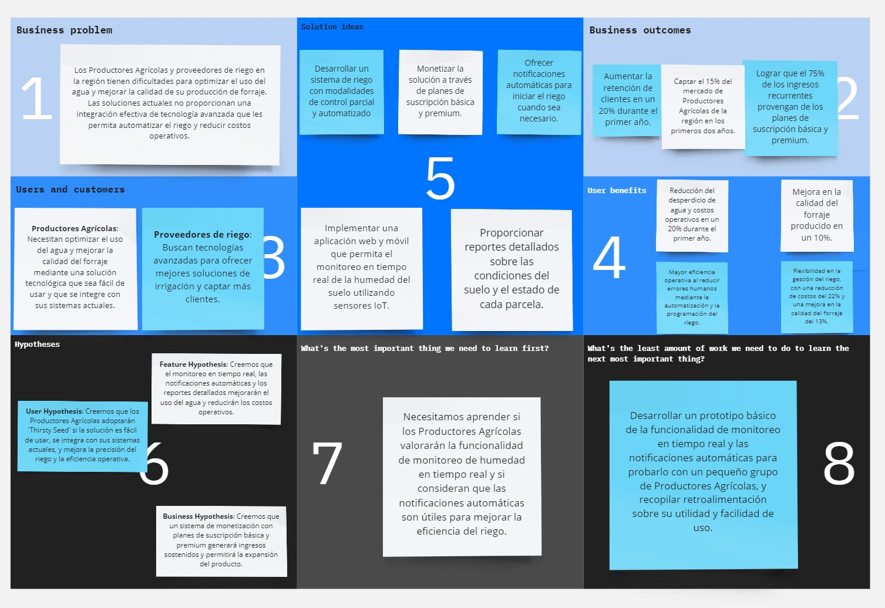

# ***CAPÍTULO I: INTRODUCCIÓN***
## 1.1. Startup Profile

En esta sección, se analiza IoTeam, una startup innovadora enfocada en optimizar el riego agrícola a través de tecnologías IoT. Se describe a la empresa y se destacan los perfiles de sus miembros clave, junto con sus conocimientos técnicos y habilidades que aportan valor al proyecto. Además, se presentan la misión y visión de IoTeam, enfatizando su compromiso con la sostenibilidad y la eficiencia en el sector agrícola.

### 1.1.1. Descripción de la Startup

 
En IoTeam, somos un grupo apasionado de ingenieros que ha unido fuerzas para transformar el sector agrícola con soluciones tecnológicas de vanguardia. Creemos en el poder de la innovación para enfrentar los desafíos más críticos de la agricultura moderna, y es por eso que hemos desarrollado <strong>"Thirsty Seed"</strong>: una aplicación de última generación que combina la inteligencia del Internet de las Cosas (IoT) con la necesidad vital de un riego eficiente y controlado.

 
<strong>"Thirsty Seed"</strong> (o "semilla sedienta" en español) no es solo una herramienta más; es la clave para que los agricultores puedan maximizar el rendimiento de sus forrajes, garantizar la calidad del alimento para sus animales y reducir costos operativos de manera significativa. Con nuestra aplicación, el riego se convierte en un proceso automatizado, eliminando la incertidumbre y asegurando que cada gota de agua se utilice de manera óptima. Además, los usuarios reciben notificaciones en tiempo real cuando es necesario rellenar sus depósitos, manteniendo el flujo de trabajo sin interrupciones.

 
Al elegir <strong>IoTeam</strong>, los agricultores acceden a una tecnología que no solo les brinda un control sin precedentes sobre sus cultivos, sino que también les permite concentrarse en lo que realmente importa: el crecimiento y la sostenibilidad de sus operaciones. Con <strong>"Thirsty Seed"</strong>, estamos redefiniendo la manera en que el sector agrícola aborda el riego, llevando la eficiencia, la precisión y la tranquilidad directamente a las manos de nuestros usuarios.

<strong>Misión:</strong> En <strong>IoTeam</strong>, nuestra misión es empoderar a los agricultores y productores agrícolas con tecnologías avanzadas de IoT a través de nuestra aplicación <strong>"Thirsty Seed"</strong>, ofreciendo soluciones que no solo mejoren la eficiencia y productividad del riego de forrajes, sino que también contribuyan al bienestar del medio ambiente y la sostenibilidad agrícola.

<strong>Visión:</strong> Convertirnos en el líder en soluciones de riego inteligente para el sector agrícola, ayudando a los agricultores de todo el mundo a optimizar el uso del agua, mejorar la calidad de sus cultivos y garantizar la sostenibilidad de sus operaciones.

        

### 1.1.2. Perfiles de integrantes del equipo
<table border="1" style="width: 100%; text-align: center;">
  <tr>
    <th style="text-align: center;">Foto</th>
    <th style="text-align: center;">Nombre completo</th>
    <th style="text-align: center;">Código de estudiante</th>
    <th style="text-align: center;">Descripción de carrera</th>
    <th style="text-align: center;">Resumen de conocimientos técnicos y habilidades</th>
  </tr>
  <tr>
    <td></td>
    <td>Manuel Alexis Vargas Quispe</td>
    <td>u202113256</td>
    <td>Ingeniería de Software</td>
    <td style="text-align: justify;">Tengo experiencia en C++, HTML, CSS, Angular, y Vue.js. He trabajado con Android Studio para el desarrollo de aplicaciones móviles y tengo conocimientos básicos de backend. También he usado Cisco Packet Tracer, y tengo conocimientos en Python y Java a nivel básico.</td>
  </tr>
  <tr>
    <td></td>
    <td>Rafael Arturo Luyo</td>
    <td>U201919295</td>
    <td>Ingeniería de Software</td>
    <td style="text-align: justify;">Mi nombre es Rafael, tengo 22 años. Me considero una persona agradable, puntual y respetuosa. Elegí mi profesión actual porque disfruto haciendo varios ejercicios o problemas relacionados con el uso de la programación, además de interesarme mucho la malla curricular. Me motiva aprender cosas nuevas y también la futura estabilidad económica.</td>
  </tr>
  <tr>
    <td></td>
    <td>Kurt Matthews Puican Salas</td>
    <td>u202016643</td>
    <td>Ingeniería de Software</td>
    <td style="text-align: justify;">A lo largo de mi carrera he adquirido diversos conocimientos en varios ámbitos como en diversos lenguajes como C++, C#, Java, HTML y MySQL. Considero que tengo los conocimientos necesarios para poder aportar a este trabajo.</td>
  </tr>
  <tr>
    <td></td>
    <td>Shayla Lussiné Choque Puma</td>
    <td>U20201C144</td>
    <td>Ingeniería de Software</td>
    <td style="text-align: justify;">Soy una persona participativa y responsable en el trabajo en equipo, con experiencia en desarrollo de software utilizando C# y .NET, Java con SpringBoot, y tecnologías frontend como Angular y Vue.js. Además, tengo habilidades en desarrollo móvil con Flutter, lo que me permite contribuir eficazmente a proyectos diversos.</td>
  </tr>
  <tr>
    <td></td>
    <td>Giakomo Rodolfo Caussco Mariano</td>
    <td>u202118374</td>
    <td>Ingeniería de Software</td>
    <td style="text-align: justify;">En el progreso que obtuve respecto a mis conocimientos académicos, pude aprender lenguajes como Java, JavaScript, C++, C#, SQL, HTML y CSS. Dentro del desarrollo de la carrera de Ingeniería de Software pude tener un mayor concepto referente a proyectos y gracias a eso he sido capaz de desarrollar habilidades como el liderazgo, compañerismo, compromiso, responsabilidad y creatividad.</td>
  </tr>
</table>

## 1.2. Solution Profile

Esta sección aborda la solución propuesta para mejorar la eficiencia del riego agrícola en Perú. Se describen los antecedentes y la problemática que enfrenta el sector, aplicando la técnica de las 5W’s y 2H’s (Who, What, Where, When, Why, How & How Much). Además, se aplica el Lean UX Process, donde se definen los segmentos de usuarios, supuestos y declaraciones de hipótesis, y se presenta el Lean UX Canvas para asegurar que la solución responda a las necesidades de los productores agrícolas y del mercado.

 <strong>Who:</strong> El sector agrícola en Perú enfrenta desafíos crecientes en la calidad de riego para mejorar la calidad de sus forrajes, un componente esencial para asegurar la calidad de sus productos. Los proveedores de agua y sistemas de riego también son actores clave, ya que suministran los recursos y tecnologías necesarias para que los Productores Agrícolas optimicen sus operaciones. 
 

 <strong>What:</strong> La principal problemática es la falta de eficiencia y control en el riego de forrajes. El riego tradicional, que a menudo se realiza de manera manual o con sistemas rudimentarios, resulta en un uso ineficiente del agua, lo que no sólo encarece los costos operativos, sino que también pone en riesgo la sostenibilidad del negocio. Esto impacta negativamente en la producción de forrajes de alta calidad, afectando la alimentación del ganado y, en consecuencia, la calidad de la carne y los productos lácteos. 
 

 <strong>Where:</strong> Esta problemática es especialmente crítica en las regiones ganaderas de Perú, como Cajamarca, Puno y Huancayo, donde la ganadería es una actividad económica fundamental. En estas áreas, el acceso al agua y la gestión eficiente del riego son determinantes para la viabilidad de las explotaciones ganaderas. 
 

 <strong>When:</strong> El problema ha sido persistente, pero se ha intensificado en los últimos años debido a factores como el cambio climático, que ha alterado los patrones de lluvia y ha hecho que el agua sea un recurso aún más escaso y valioso. La necesidad de soluciones innovadoras y eficientes ha aumentado en respuesta a estos desafíos emergentes. 
 

 <strong>Why:</strong> La falta de tecnologías avanzadas para la automatización y optimización del riego es una de las principales causas del problema. Los sistemas de riego actuales a menudo no cuentan con la capacidad de monitorear y ajustar automáticamente la cantidad de agua utilizada, lo que lleva a un desperdicio significativo de recursos. Además, la falta de información en tiempo real impide a los Productores Agrícolas tomar decisiones informadas sobre el riego, aumentando los costos y reduciendo la eficiencia. 
 

 <strong>How:</strong> La problemática afecta a los Productores Agrícolas al incrementar sus costos operativos y reducir la calidad de sus productos, lo que a su vez afecta la rentabilidad de sus negocios. Sin un riego adecuado, los forrajes pueden sufrir de sequía o sobre irrigación, lo que impacta negativamente en su calidad nutricional. Los proveedores de agua y sistemas de riego también enfrentan desafíos para ofrecer soluciones que realmente respondan a las necesidades de sus clientes en el sector Productores Agrícolas. 
 

 <strong>How Much:</strong> El impacto económico de la problemática es significativo. Los Productores Agrícolas pueden ver incrementados sus costos de producción en un 20-30% debido a la ineficiencia en el uso del agua. Además, la calidad inferior del forraje puede llevar a una disminución en la producción de carne y leche, afectando los ingresos en un 10-15%. Por otro lado, los proveedores de sistemas de riego podrían estar perdiendo una oportunidad de mercado importante al no ofrecer soluciones tecnológicas avanzadas que se alineen con las necesidades actuales de los Productores Agrícolas. 

### 1.2.2 Lean UX Process

En esta sección se detalla la aplicación del Lean UX Process, un enfoque iterativo centrado en los usuarios y sus necesidades. Este proceso integra la validación de hipótesis, el diseño y la mejora continua para asegurar que el producto desarrollado cumpla con las expectativas del mercado. Se analizan problem statements, supuestos clave y las hipótesis relacionadas con los segmentos de usuarios, además de la visión estratégica del negocio. Finalmente, se presenta el Lean UX Canvas como herramienta de visualización del proceso y alineación del equipo de desarrollo.

#### 1.2.2.1. Lean UX Problem Statements

Los productores agrícolas carecen de herramientas efectivas para gestionar de manera eficiente el riego de forrajes, especialmente durante épocas de escasez de agua o sequía. Esta falta de control en la planificación y monitoreo del riego provoca un uso ineficiente de los recursos hídricos, disminuye la calidad de los forrajes y genera pérdidas económicas significativas debido a la necesidad de renovaciones frecuentes y el aumento de costos operativos. Existe una oportunidad clara de optimizar el uso del agua y mejorar la rentabilidad mediante soluciones tecnológicas que ofrezcan monitoreo en tiempo real y automatización del riego.

#### 1.2.2.2. Lean UX Assumptions 

 1. <strong>Business Assumption:</strong> Se implementará un sistema de monetización que incluirá planes de suscripción, diferenciados en las categorías básica y premium, además de costos asociados a los artefactos IoT y su instalación. Estos planes permitirán a los usuarios acceder a todas las funcionalidades avanzadas de la aplicación, incluyendo el control automatizado y optimizado del riego de forrajes, junto con otros beneficios específicos. 
 
 2. <strong>Business Outcome Assumption:</strong> Se prevé que la implementación de la aplicación web y móvil "Thirsty Seed" incremente la retención de clientes en un 20% durante el primer año, y genere ingresos adicionales al captar al menos el 15% del mercado de productores agrícolas en la región durante los primeros dos años. Además, se proyecta que los planes de suscripción básica y premium representen el 75% de los ingresos recurrentes, estableciendo una base financiera sólida para la expansión futura del negocio. 
 
 3. <strong>User Assumption:</strong> Se asume que los usuarios objetivos, como los productores agrícolas y proveedores de sistemas de riego, buscarán soluciones tecnológicas que optimicen el uso de agua y el tiempo invertido en el riego de forrajes. Se cree que estarán dispuestos a adoptar una solución que ofrezca monitoreo en tiempo real y control automatizado del riego, siempre que esta sea intuitiva y de fácil integración con los sistemas actuales de sus operaciones. 

 <strong>User Outcome Assumption</strong> 
 
 - <strong>Monitoreo de humedad en tiempo real:</strong> Se espera que el uso del sistema de monitoreo de humedad en tiempo real de "Thirsty Seed" mejore significativamente la precisión del riego, lo que resultará en una reducción del desperdicio de agua y una disminución de los costos operativos en un 20% durante el primer año. Además, la optimización en el uso del agua contribuirá a un crecimiento más robusto de los cultivos, incrementando la calidad del forraje producido en un 10%. 
 
 - <strong>Notificaciones automáticas:</strong> Con la funcionalidad de notificaciones automáticas para iniciar el riego, se prevé una programación de riego más eficiente y consistente, minimizando errores humanos y liberando tiempo al usuario. Esto debería reducir los costos operativos relacionados con el riego en un 15% durante el primer año, mejorando la calidad del forraje en un 12%. 
 
 - <strong>Reportes detallados de parcelas:</strong> Con el uso de reportes detallados sobre el estado de cada parcela, los usuarios podrán tomar decisiones informadas y precisas sobre el riego, mejorando la eficiencia operativa y reduciendo los costos en un 18% durante el primer año. Además, la capacidad de ajustar las estrategias de riego con base en información consolidada debería incrementar la calidad del forraje en un 14%. 
 
 - <strong>Modalidades de riego parcial y completo:</strong> Al permitir a los usuarios elegir entre modalidades de riego parcial y completo, se proyecta una mayor flexibilidad en la gestión del riego, lo que podría llevar a una reducción de costos operativos del 22% en el primer año. La automatización completa permitirá a los usuarios enfocarse en otras áreas críticas de su operación, mientras que la modalidad parcial proporcionará un control preciso, mejorando la calidad del forraje en un 13%. 
 
 - <strong>Reportes mensuales de irrigación:</strong> Al analizar los reportes mensuales generados sobre las actividades de irrigación, los usuarios podrán evaluar el rendimiento del sistema y realizar ajustes que optimicen el uso del agua, reduciendo los costos operativos en un 20% durante el primer año. Además, esta información facilitará una planificación más efectiva para futuras temporadas, lo que aumentará la calidad del forraje en un 11%. 
 
 <strong>Feature Assumption</strong> 
 
 - <strong>Monitoreo de humedad en tiempo real:</strong> La aplicación "Thirsty Seed" integrará un sistema de monitoreo en tiempo real que utiliza sensores IoT para recopilar datos sobre los niveles de humedad del suelo, proporcionando esta información a los usuarios a través de una interfaz intuitiva. 
 
 - <strong>Notificaciones automáticas:</strong> La aplicación enviará notificaciones automáticas cuando los niveles de humedad indiquen la necesidad de iniciar el riego, basándose en datos de monitoreo en tiempo real y otros parámetros ambientales relevantes. 
 
 - <strong>Reportes detallados por parcela:</strong> Se proporcionarán reportes detallados sobre el estado actual de cada parcela, abarcando niveles de humedad, condiciones del suelo y requerimientos de riego, facilitando una gestión más precisa. 
 
 - <strong>Modalidades de riego parcial y completo:</strong> La aplicación permitirá a los usuarios seleccionar entre riego parcial (con mayor control manual) y riego completo (totalmente automatizado), para ajustar el sistema a sus necesidades operativas. 
 
 - <strong>Reportes mensuales de irrigación:</strong> La aplicación generará un reporte mensual con detalles sobre las actividades de irrigación, incluyendo la cantidad de agua utilizada, tiempos de riego y métricas de eficiencia operativa. 

#### 1.2.2.3. Lean UX Hypothesis Statements 
<table border="1" style="width: 100%; text-align: left;">
  <tr>
    <th style="text-align: center; background-color: #FFF2CC; color: black;">BUSINESS HYPOTHESIS</th>
  </tr>
  <tr>
    <td>
      
<strong>Creemos que</strong> implementar un sistema de monetización con planes de suscripción básica y premium, además de costos asociados con los artefactos y su instalación.

      
<strong>Para</strong> Productores Agrícolas y proveedores de riego.

      
<strong>Logrará</strong> una generación sostenida de ingresos que permitirá financiar el desarrollo continuo y la expansión del producto.

      
<strong>Sabremos que esto es cierto</strong> cuando veamos un incremento en la adopción de los planes premium y una contribución del 75% de los ingresos recurrentes provenientes de las suscripciones en el primer año.

    </td>
  </tr>
  <tr>
    <th style="text-align: center; background-color: #FFF2CC; color: black;">BUSINESS OUTCOME HYPOTHESIS</th>
  </tr>
  <tr>
    <td>
      
<strong>Creemos que</strong> la implementación de la aplicación web y móvil de "Thirsty Seed".

      
<strong>Para</strong> Productores Agrícolas que necesitan soluciones de riego eficientes y proveedores de riego que buscan integrar tecnologías avanzadas.

      
<strong>Logrará</strong> un aumento en la retención de clientes y la captación de un 15% del mercado regional en los primeros dos años.

      
<strong>Sabremos que esto es cierto</strong> cuando veamos un aumento del 20% en la retención de clientes y un crecimiento sostenido en la base de usuarios durante el primer año.

    </td>
  </tr>
  <tr>
    <th style="text-align: center; background-color: #FFF2CC; color: black;">USER HYPOTHESIS</th>
  </tr>
  <tr>
    <td>
      
<strong>Creemos que</strong> nuestros usuarios objetivo, los productores agrícolas y proveedores de riego.

      
<strong>Para</strong> buscar tecnologías que optimicen el uso del agua y el tiempo dedicado al riego de forrajes.

      
<strong>Logrará</strong> una adopción significativa de "Thirsty Seed" si el producto es fácil de usar y se integra con sus sistemas actuales.

      
<strong>Sabremos que esto es cierto</strong> cuando veamos una alta tasa de adopción en el primer año y retroalimentación positiva relacionada con la facilidad de uso e integración.

    </td>
  </tr>
  <tr>
    <th style="text-align: center; background-color: #FFF2CC; color: black;">USER OUTCOME HYPOTHESIS</th>
  </tr>
  <tr>
    <td>
      
<strong>Creemos que</strong> al implementar la función de monitoreo de humedad en tiempo real en "Thirsty Seed".

      
<strong>Para</strong> productores agrícolas que desean mejorar la precisión del riego.

      
<strong>Logrará</strong> una reducción del desperdicio de agua y una disminución de los costos operativos en un 20% durante el primer año.

      
<strong>Sabremos que esto es cierto</strong> cuando los usuarios reporten una reducción en el uso de agua y en los costos asociados al riego, así como una mejora en la calidad del forraje.

    </td>
  </tr>
  <tr>
    <td>
      
<strong>Creemos que</strong> al implementar notificaciones automáticas para iniciar el riego.

      
<strong>Para</strong> productores agrícolas que buscan una programación de riego más consistente y eficiente.

      
<strong>Logrará</strong> reducir los errores humanos y liberar tiempo para los usuarios, disminuyendo los costos operativos en un 15% durante el primer año.

      
<strong>Sabremos que esto es cierto</strong> cuando los usuarios reporten menos errores en la programación del riego y una mejora en la eficiencia, reflejada en la reducción de costos.

    </td>
  </tr>
  <tr>
    <td>
      
<strong>Creemos que</strong> al ofrecer reportes detallados sobre el estado de cada parcela.

      
<strong>Para</strong> productores agrícolas que desean tomar decisiones más informadas sobre el riego.

      
<strong>Logrará</strong> una mejora en la eficiencia operativa y una reducción de costos en un 18% durante el primer año.

      
<strong>Sabremos que esto es cierto</strong> cuando los usuarios ajustan su estrategia de riego con base en los reportes y experimentan una reducción de costos y una mejora en la calidad del forraje.

    </td>
  </tr>
  <tr>
    <td>
      
<strong>Creemos que</strong> al permitir la elección entre modalidades de riego parcial y completo.

      
<strong>Para</strong> productores agrícolas que necesitan flexibilidad en la gestión del riego.

      
<strong>Logrará</strong> una mayor flexibilidad, una reducción de los costos operativos en un 22% durante el primer año, y una mejora en la calidad del forraje en un 13%.

      
<strong>Sabremos que esto es cierto</strong> cuando los usuarios adopten las modalidades de riego y reporten mejoras en eficiencia y calidad del forraje.

    </td>
  </tr>
  <tr>
    <td>
      
<strong>Creemos que</strong> al ofrecer reportes mensuales sobre las actividades de irrigación.

      
<strong>Para</strong> productores agrícolas que desean evaluar y optimizar el uso del agua.

      
<strong>Logrará</strong> una optimización en el uso del agua y una reducción de costos operativos en un 20% durante el primer año.

      
<strong>Sabremos que esto es cierto</strong> cuando los usuarios utilizan los reportes para ajustar su estrategia de riego, resultando en una mejora en la planificación y en la calidad del forraje.

    </td>
  </tr>
  <tr>
    <th style="text-align: center; background-color: #FFF2CC; color: black;">FEATURE HYPOTHESIS</th>
  </tr>
  <tr>
    <td>
      
<strong>Creemos que</strong> al incluir un sistema de monitoreo de humedad en tiempo real para los cultivos en "Thirsty Seed".

      
<strong>Para</strong> productores agrícolas que buscan una precisión mejorada en la gestión del riego.

      
<strong>Logrará</strong> proporcionarles datos precisos y en tiempo real sobre los niveles de humedad del suelo.

      
<strong>Sabremos que esto es cierto</strong> cuando veamos que los usuarios utilizan regularmente la función de monitoreo y reportan una mejora en la eficiencia del uso del agua.

    </td>
  </tr>
  <tr>
    <td>
      
<strong>Creemos que</strong> al enviar notificaciones automáticas cuando sea necesario comenzar el proceso de riego.

      
<strong>Para</strong> productores agrícolas que buscan automatizar y optimizar el tiempo de riego.

      
<strong>Logrará</strong> que los usuarios inicien el riego de manera más eficiente, reduciendo el desperdicio de agua y los errores humanos.

      
<strong>Sabremos que esto es cierto</strong> cuando veamos que los usuarios responden rápidamente a las notificaciones y reportan una reducción en los errores de riego.

    </td>
  </tr>
  <tr>
    <td>
      
<strong>Creemos que</strong> al ofrecer reportes detallados sobre el estado actual de cada parcela.

      
<strong>Para</strong> productores agrícolas que necesitan información completa y precisa para tomar decisiones de riego.

      
<strong>Logrará</strong> que los usuarios tomen decisiones más informadas y ajusten sus estrategias de riego en consecuencia.

      
<strong>Sabremos que esto es cierto</strong> cuando veamos que los usuarios consultan los reportes regularmente y reportan mejoras en la gestión del riego.

    </td>
  </tr>
  <tr>
    <td>
      
<strong>Creemos que</strong> al permitir que los usuarios seleccionen entre modalidades de riego parcial y completo.

      
<strong>Para</strong> productores agrícolas que desean flexibilidad en la gestión del riego.

      
<strong>Logrará</strong> que los usuarios ajusten el nivel de automatización según sus necesidades específicas, mejorando la eficiencia y reduciendo costos.

      
<strong>Sabremos que esto es cierto</strong> cuando veamos que los usuarios utilizan ambas modalidades y reportan una mejora en la eficiencia operativa.

    </td>
  </tr>
  <tr>
    <td>
      
<strong>Creemos que</strong> al generar un reporte mensual sobre las actividades de irrigación.

      
<strong>Para</strong> productores agrícolas que desean evaluar el rendimiento del riego y planificar mejoras.

      
<strong>Logrará</strong> que los usuarios optimicen el uso del agua y ajusten sus estrategias de riego basándose en datos históricos.

      
<strong>Sabremos que esto es cierto</strong> cuando veamos que los usuarios revisan los reportes mensuales y reportan una mejora en la planificación y la eficiencia del riego.

    </td>
  </tr>
</table>

#### 1.2.2.4. Lean UX Canvas

El Lean UX Canvas es una herramienta que combina principios de Lean Startup y diseño centrado en el usuario. Su objetivo es alinear equipos multidisciplinarios en la creación de productos, enfocándose en aprender de los usuarios y validar suposiciones a través de experimentos

    <strong>Ver Lean UX Canvas (Miro):</strong>
    <a href="https://miro.com/app/board/uXjVLadmwMI=/?share_link_id=178475508080" target="_blank">
        https://miro.com/app/board/uXjVLadmwMI=/?share_link_id=178475508080
    </a>

## 1.3. Segmentos objetivo
A continuación se describirán los sectores objetivos de nuestro negocio.

 <strong>Segmento Productores Agrícolas:</strong> Este segmento está compuesto por Productores Agrícolas en Perú que dependen del riego de forrajes para alimentar a su ganado, esencial para la producción de carne y leche. "Thirsty Seed" es especialmente relevante para este grupo, ya que les permite optimizar el uso del agua y mejorar la calidad de los forrajes, lo que se traduce en una mayor eficiencia y rentabilidad. 
 
 <strong>Características Demográficas:</strong> - <strong>Ubicación Geográfica:</strong> Principalmente en regiones ganaderas clave como la sierra y la selva, incluyendo departamentos como Cajamarca, Puno, y Huancayo, donde la ganadería es una actividad económica vital. - <strong>Tamaño de la Empresa:</strong> Desde pequeñas explotaciones familiares hasta grandes operaciones ganaderas comerciales. - <strong>Edad y Experiencia:</strong> Adultos de mediana edad con experiencia en ganadería, aunque también se incluye a jóvenes emprendedores interesados en modernizar sus métodos. 
 
 <strong>Información Estadística:</strong> - En Perú, la ganadería representa aproximadamente el 30% del PIB agrícola, con una producción anual de carne de cerca de 500,000 toneladas y de leche de alrededor de 2 millones de toneladas. - El uso del agua en la agricultura representa más del 80% del consumo total del país, y dentro de este sector, el riego de forrajes es una de las actividades más intensivas en el uso de agua. - La implementación de tecnologías de riego eficientes, como las automatizadas por IoT, puede reducir el consumo de agua en la ganadería hasta en un 25%, lo que se traduce en ahorros significativos y una mejora en la calidad del forraje. 
 
 <strong>Segmento Proveedores de servicio de agua:</strong> Este segmento incluye a los proveedores que suministran agua y sistemas de riego a los Productores Agrícolas en Perú. Estos proveedores son cruciales en la cadena de valor agrícola y tienen la oportunidad de mejorar sus servicios mediante la adopción de tecnologías avanzadas como <strong>"Thirsty Seed"</strong>. 
 
 <strong>Características Demográficas:</strong> - <strong>Ubicación Geográfica:</strong> Concentrados en regiones agrícolas y ganaderas como la costa, la sierra y partes de la selva, donde la agricultura de riego es esencial. - <strong>Tamaño de la Empresa:</strong> Desde pequeños distribuidores locales hasta grandes empresas nacionales de sistemas de riego. - <strong>Tipo de Negocio:</strong> Proveedores de equipos de riego por aspersión y goteo, distribuidores de agua para riego agrícola, y empresas de instalación y mantenimiento de sistemas de riego. - <strong>Relación con la Tecnología:</strong> Empresas interesadas en adoptar tecnologías IoT para mejorar la eficiencia y sostenibilidad de sus operaciones y productos. 
 
 <strong>Información Estadística:</strong> - El mercado de sistemas de riego en Perú ha experimentado un crecimiento anual del 5% en los últimos años, alcanzando un valor estimado de $150 millones en 2023. - Según datos del Ministerio de Agricultura y Riego (MINAGRI), aproximadamente el 15% de las tierras agrícolas en Perú utilizan sistemas de riego tecnificado, y se espera que esta cifra crezca debido a la demanda de soluciones más eficientes y sostenibles. - Un estudio del sector en 2023 reveló que un 40% de los proveedores en Perú están buscando integrar tecnologías IoT en sus sistemas de riego para reducir el consumo de agua y mejorar la eficiencia operativa. 
